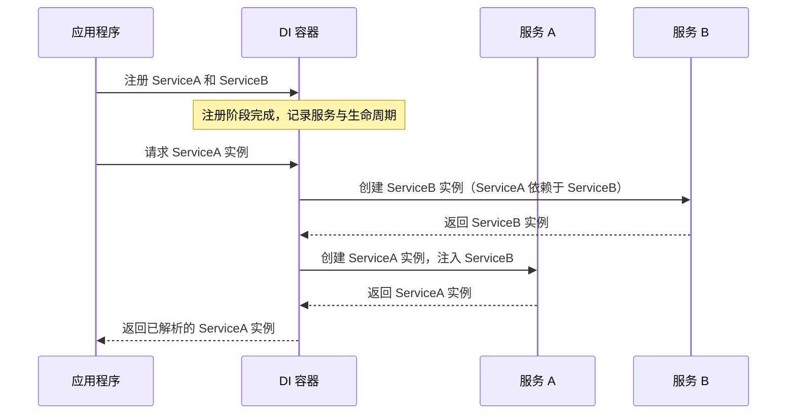

### **.NET Core 中 DI 容器的工作原理**

在 **.NET Core** 中，依赖注入（Dependency Injection, DI）是一种默认支持的设计模式，主要通过 **IoC 容器（Inversion of Control Container）** 来管理依赖的创建与生命周期。DI 容器的核心职责是：

1. 注册服务及其实现。
2. 根据依赖关系解析服务实例。
3. 管理服务的生命周期（`Transient`、`Scoped`、`Singleton`）。

---

### **DI 容器的工作流程**

1. **注册阶段**：
   - 在应用程序启动时（通常在 `Program.cs` 文件中），开发者将需要的服务及其实现注册到 DI 容器中。
   - 注册使用方法如 `AddTransient`、`AddScoped`、`AddSingleton`。

2. **解析阶段**：
   - 当系统需要某个服务时，DI 容器会根据注册信息，创建所需服务的实例。
   - 如果服务存在依赖，DI 容器会递归解析这些依赖并注入。

3. **生命周期管理**：
   - DI 容器根据服务的生命周期类型（`Transient`、`Scoped`、`Singleton`）管理实例的创建与销毁。

---

### **Mermaid 图示：DI 容器的工作流程**

以下是 DI 容器如何处理服务注册与解析的流程图：



---

### **DI 容器工作原理详解**

#### **1. 注册服务**
在应用程序启动时，使用 `IServiceCollection` 注册服务及其实现。例如：
```csharp
var builder = WebApplication.CreateBuilder(args);

// 注册服务及其生命周期
builder.Services.AddTransient<IServiceA, ServiceA>();
builder.Services.AddScoped<IServiceB, ServiceB>();
builder.Services.AddSingleton<IServiceC, ServiceC>();
```
**说明**：
- `AddTransient`：每次请求都会创建一个新实例。
- `AddScoped`：每个 HTTP 请求共享一个实例。
- `AddSingleton`：整个应用程序生命周期共享一个实例。

#### **2. 解析服务**
当需要使用服务时，DI 容器会解析并注入依赖：
- 控制器、服务等通过构造函数注入依赖。
- 使用 `IServiceProvider` 手动获取服务实例（不推荐，除非特殊场景）。

**示例：通过构造函数注入**
```csharp
public class MyController : ControllerBase
{
    private readonly IServiceA _serviceA;

    // 通过构造函数注入服务
    public MyController(IServiceA serviceA)
    {
        _serviceA = serviceA;
    }

    [HttpGet]
    public IActionResult Get()
    {
        return Ok(_serviceA.DoWork());
    }
}
```

#### **3. 管理生命周期**
DI 容器根据注册的生命周期管理服务实例：
- `Transient` 服务每次注入都会创建新实例。
- `Scoped` 服务在一个 HTTP 请求生命周期内共享。
- `Singleton` 服务在整个应用程序中共享同一个实例。

---

### **工作原理示例**

#### **服务及其依赖**
```csharp
public interface IServiceA
{
    string DoWork();
}

public class ServiceA : IServiceA
{
    private readonly IServiceB _serviceB;

    public ServiceA(IServiceB serviceB)
    {
        _serviceB = serviceB;
    }

    public string DoWork()
    {
        return $"ServiceA working with {_serviceB.GetData()}";
    }
}

public interface IServiceB
{
    string GetData();
}

public class ServiceB : IServiceB
{
    public string GetData()
    {
        return "ServiceB data";
    }
}
```

#### **服务注册与使用**
```csharp
var builder = WebApplication.CreateBuilder(args);

// 注册服务
builder.Services.AddTransient<IServiceA, ServiceA>();
builder.Services.AddScoped<IServiceB, ServiceB>();

var app = builder.Build();

// 配置路由
app.MapGet("/", (IServiceA serviceA) => serviceA.DoWork());

app.Run();
```

---

### **运行结果**
每次 HTTP 请求会通过 DI 容器解析 `ServiceA` 和 `ServiceB` 的实例，并调用它们的功能。返回结果类似：
```
ServiceA working with ServiceB data
```

---

### **DI 容器的优点**

1. **自动管理依赖关系**：
   - 避免手动创建对象，提高代码可读性和可维护性。

2. **生命周期管理**：
   - 按需创建和销毁对象，优化资源使用。

3. **模块化和测试性**：
   - 易于进行单元测试，通过注入 Mock 对象模拟服务。

---

通过 DI 容器，.NET Core 的依赖管理变得更加高效和灵活。配合生命周期控制，可以满足复杂应用的开发需求，提升代码质量和性能。
