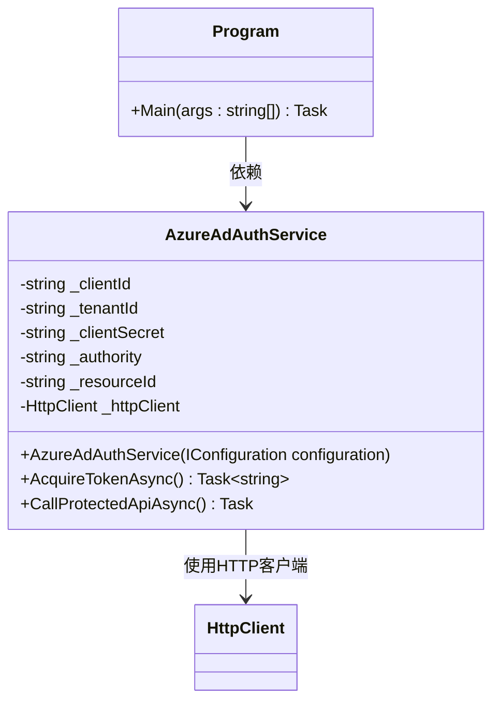

### Azure AD令牌流的流程图

此流程展示了客户端应用如何向Azure AD请求并获取访问令牌的过程。 


### 流程步骤描述

1. **开始**：客户端应用程序发起请求，想要访问受保护的资源。
2. **请求访问资源**：客户端应用向受保护资源发起请求。
3. **发送身份验证请求**：客户端应用向Azure AD发送身份验证请求，包含ClientId、TenantId和ClientSecret。
4. **Azure AD验证凭据**：Azure AD验证客户端的凭据。
   - **验证通过**：生成访问令牌。
   - **验证失败**：返回错误信息。
5. **生成并返回访问令牌**：如果验证通过，生成访问令牌并返回给客户端应用。
6. **携带令牌访问API**：客户端应用携带获取的令牌，向受保护的API资源发起请求。
7. **验证令牌**：受保护资源对令牌的有效性进行验证。
   - **令牌有效**：返回受保护的数据。
   - **令牌无效或过期**：拒绝访问。

这种流程图展示了每个步骤的顺序，更加清晰地帮助理解Azure AD认证和授权的整个流程。

---

### C#代码示例

此示例展示了如何使用Azure AD获取访问令牌，并使用该令牌访问受保护的API资源。

#### 1. 配置 `appsettings.json`

首先，在 `appsettings.json` 文件中配置Azure AD的相关信息，包括`ClientId`、`TenantId`和`ClientSecret`。

```json
{
  "AzureAd": {
    "Instance": "https://login.microsoftonline.com/",
    "Domain": "yourdomain.com",
    "TenantId": "your-tenant-id",
    "ClientId": "your-client-id",
    "ClientSecret": "your-client-secret"
  },
  "ApiSettings": {
    "BaseAddress": "https://your-protected-api.com",
    "ResourceId": "api://your-api-resource-id"
  }
}
```

#### 2. 代码实现

```csharp
using System;
using System.Net.Http;
using System.Net.Http.Headers;
using System.Threading.Tasks;
using Microsoft.Extensions.Configuration;
using Microsoft.Identity.Client;

public class AzureAdAuthService
{
    private readonly string _clientId;
    private readonly string _tenantId;
    private readonly string _clientSecret;
    private readonly string _authority;
    private readonly string _resourceId;
    private readonly HttpClient _httpClient;

    public AzureAdAuthService(IConfiguration configuration)
    {
        _clientId = configuration["AzureAd:ClientId"];
        _tenantId = configuration["AzureAd:TenantId"];
        _clientSecret = configuration["AzureAd:ClientSecret"];
        _authority = $"{configuration["AzureAd:Instance"]}{_tenantId}";
        _resourceId = configuration["ApiSettings:ResourceId"];
        _httpClient = new HttpClient { BaseAddress = new Uri(configuration["ApiSettings:BaseAddress"]) };
    }

    public async Task<string> AcquireTokenAsync()
    {
        var app = ConfidentialClientApplicationBuilder.Create(_clientId)
                    .WithClientSecret(_clientSecret)
                    .WithAuthority(new Uri(_authority))
                    .Build();

        string[] scopes = new string[] { $"{_resourceId}/.default" };

        try
        {
            var authResult = await app.AcquireTokenForClient(scopes).ExecuteAsync();
            Console.WriteLine("成功获取访问令牌！");
            return authResult.AccessToken;
        }
        catch (MsalServiceException ex)
        {
            Console.WriteLine($"获取访问令牌失败: {ex.Message}");
            return null;
        }
    }

    public async Task CallProtectedApiAsync()
    {
        string token = await AcquireTokenAsync();

        if (!string.IsNullOrEmpty(token))
        {
            _httpClient.DefaultRequestHeaders.Authorization = new AuthenticationHeaderValue("Bearer", token);

            try
            {
                var response = await _httpClient.GetAsync("/protected-endpoint");
                if (response.IsSuccessStatusCode)
                {
                    string content = await response.Content.ReadAsStringAsync();
                    Console.WriteLine($"受保护的数据: {content}");
                }
                else
                {
                    Console.WriteLine($"访问受保护的API失败: {response.StatusCode}");
                }
            }
            catch (Exception ex)
            {
                Console.WriteLine($"API调用出错: {ex.Message}");
            }
        }
    }
}

public class Program
{
    public static async Task Main(string[] args)
    {
        var config = new ConfigurationBuilder()
            .AddJsonFile("appsettings.json")
            .Build();

        var authService = new AzureAdAuthService(config);
        await authService.CallProtectedApiAsync();
    }
}
```

### 代码解释

1. **`AcquireTokenAsync` 方法**：负责通过Azure AD获取访问令牌。使用 `ClientId`、`TenantId`、`ClientSecret`等信息，向Azure AD请求令牌。成功后返回令牌，失败则输出错误信息。

2. **`CallProtectedApiAsync` 方法**：使用获取到的访问令牌，调用受保护的API端点。如果令牌有效，API返回受保护的数据，否则拒绝访问。

---

### Mermaid类图



### 类图说明

- **AzureAdAuthService**：主要服务类，包含与Azure AD交互的认证逻辑。
  - **AcquireTokenAsync**：获取访问令牌的方法。
  - **CallProtectedApiAsync**：使用令牌调用受保护API的方法。
  - **_httpClient**：HTTP客户端实例，用于发送API请求。

- **Program**：应用程序入口，通过`Main`方法实例化 `AzureAdAuthService` 并调用其方法。
