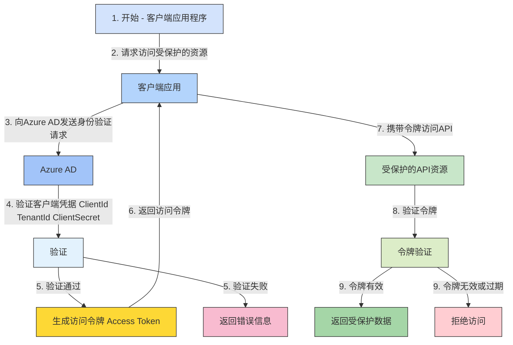

### Azure AD令牌流的流程图

此流程展示了客户端应用如何向Azure AD请求并获取访问令牌的过程。 

### 流程步骤描述

1. **开始**：客户端应用程序发起请求，想要访问受保护的资源。
2. **请求访问资源**：客户端应用向受保护资源发起请求。
3. **发送身份验证请求**：客户端应用向Azure AD发送身份验证请求，包含ClientId、TenantId和ClientSecret。
4. **Azure AD验证凭据**：Azure AD验证客户端的凭据。
   - **验证通过**：生成访问令牌。
   - **验证失败**：返回错误信息。
5. **生成并返回访问令牌**：如果验证通过，生成访问令牌并返回给客户端应用。
6. **携带令牌访问API**：客户端应用携带获取的令牌，向受保护的API资源发起请求。
7. **验证令牌**：受保护资源对令牌的有效性进行验证。
   - **令牌有效**：返回受保护的数据。
   - **令牌无效或过期**：拒绝访问。

这种流程图展示了每个步骤的顺序，更加清晰地帮助理解Azure AD认证和授权的整个流程。
