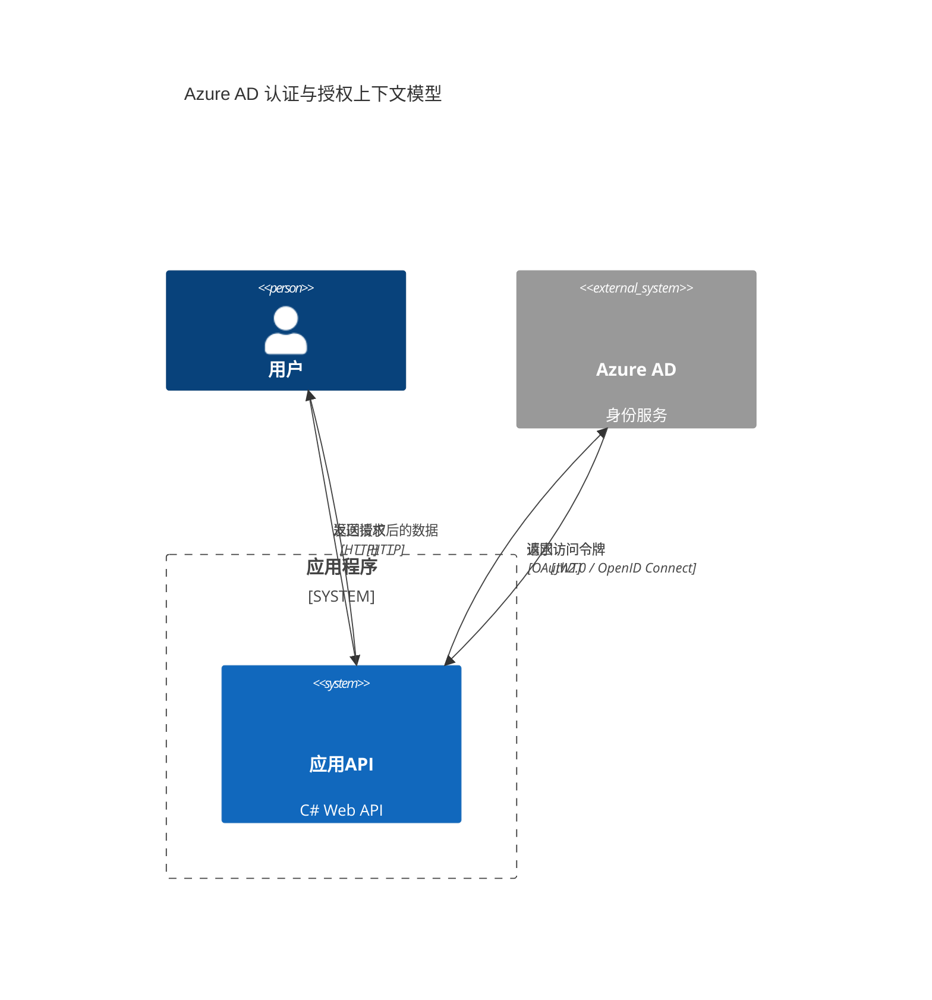

### Azure AD身份验证和授权

以下是基于Azure AD身份验证和授权的Mermaid C4上下文模型，以及C#代码示例，用于实现Azure AD在应用中的身份验证和授权。

---

### Mermaid C4上下文模型



### C4上下文模型描述

1. **用户**：发起请求的终端用户，试图访问受保护的资源。
2. **应用API**：一个C# Web API，处理用户的请求并执行Azure AD授权检查。
3. **Azure AD**：微软的身份服务，负责对用户的身份进行验证并提供授权。

#### 交互流程

- 用户向应用API发送请求。
- 应用API向Azure AD请求访问令牌，用于验证用户的身份。
- Azure AD返回访问令牌（JWT格式）。
- 应用API对令牌进行验证后，根据授权规则返回用户请求的数据。

---

### C#代码示例

以下代码示例展示了如何在C#中使用Azure AD进行身份验证和授权。

#### 1. 配置Azure AD

在Azure门户中创建一个Azure AD应用，获取`ClientId`、`TenantId`和`ClientSecret`，并确保已为API注册了Azure AD身份验证。

#### 2. 安装NuGet包

在项目中安装`Microsoft.Identity.Web`和`Microsoft.AspNetCore.Authentication.JwtBearer`。

```bash
dotnet add package Microsoft.Identity.Web
dotnet add package Microsoft.AspNetCore.Authentication.JwtBearer
```

#### 3. 配置 `appsettings.json`

在 `appsettings.json` 中配置Azure AD的相关信息：

```json
{
  "AzureAd": {
    "Instance": "https://login.microsoftonline.com/",
    "Domain": "yourdomain.com",
    "TenantId": "your-tenant-id",
    "ClientId": "your-client-id",
    "ClientSecret": "your-client-secret"
  }
}
```

#### 4. 配置身份验证和授权

在 `Startup.cs` 文件中配置Azure AD身份验证和授权。

```csharp
using Microsoft.AspNetCore.Authentication.JwtBearer;
using Microsoft.Identity.Web;

public class Startup
{
    public IConfiguration Configuration { get; }

    public Startup(IConfiguration configuration)
    {
        Configuration = configuration;
    }

    public void ConfigureServices(IServiceCollection services)
    {
        // 添加Azure AD身份验证
        services.AddAuthentication(JwtBearerDefaults.AuthenticationScheme)
                .AddMicrosoftIdentityWebApi(Configuration.GetSection("AzureAd"));

        services.AddAuthorization();

        // 添加控制器
        services.AddControllers();
    }

    public void Configure(IApplicationBuilder app, IWebHostEnvironment env)
    {
        if (env.IsDevelopment())
        {
            app.UseDeveloperExceptionPage();
        }

        app.UseHttpsRedirection();

        app.UseRouting();

        // 使用身份验证和授权中间件
        app.UseAuthentication();
        app.UseAuthorization();

        app.UseEndpoints(endpoints =>
        {
            endpoints.MapControllers();
        });
    }
}
```

#### 5. 受保护的API控制器示例

创建一个受保护的API控制器，只有经过身份验证的用户才能访问。

```csharp
using Microsoft.AspNetCore.Authorization;
using Microsoft.AspNetCore.Mvc;

[Authorize]
[ApiController]
[Route("api/[controller]")]
public class SecureDataController : ControllerBase
{
    [HttpGet]
    public IActionResult GetSecureData()
    {
        return Ok("这是一个受保护的数据，仅对已认证用户可见。");
    }
}
```

### 代码解释

1. **配置身份验证**：在 `Startup.cs` 中，配置了Azure AD的身份验证，使用JWT令牌进行验证。
2. **添加授权**：使用 `[Authorize]` 属性保护控制器中的端点，确保只有经过身份验证的用户可以访问。
3. **令牌验证**：Azure AD返回的JWT令牌包含用户的身份信息，应用程序可以通过验证令牌来识别用户的身份并执行授权检查。

---

### 总结

以上示例展示了如何在C# Web API中集成Azure AD身份验证和授权。通过Azure AD，应用程序能够验证用户的身份，并确保只有已授权的用户才能访问受保护的资源。这种方法适用于需要企业级别身份管理的应用程序，为应用提供了强大的安全性和可管理性。
