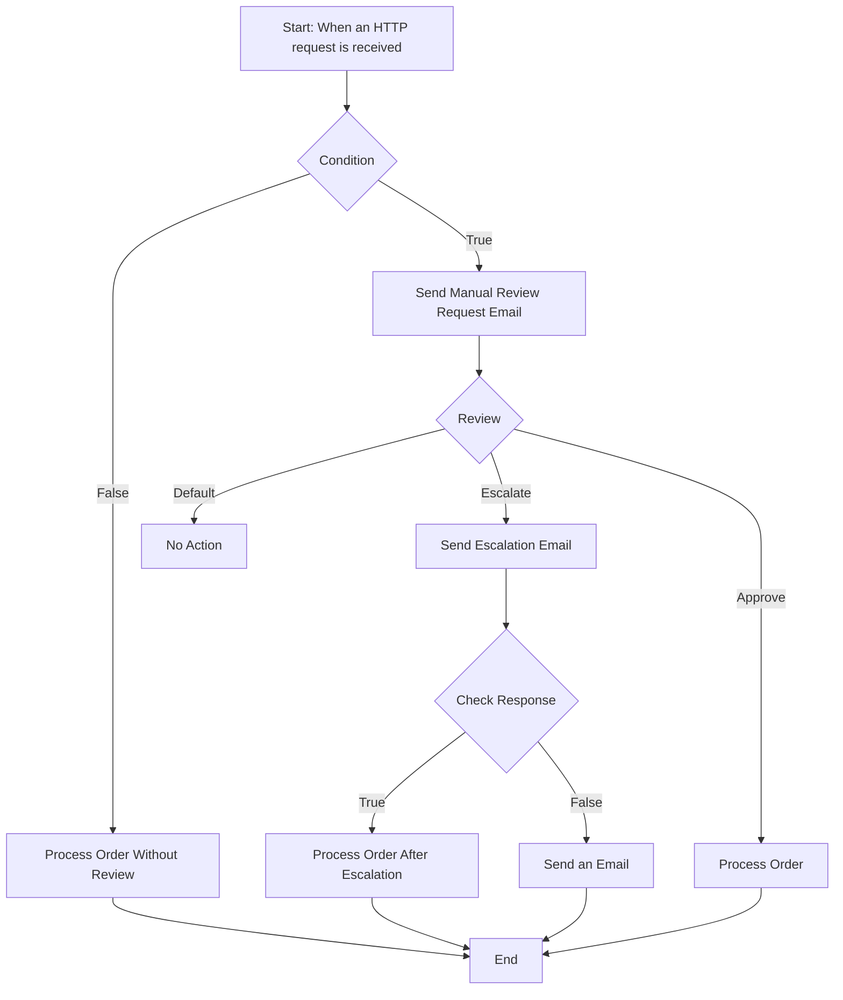

### Azure Logic App workflow

### Workflow Flowchart Steps:

1. **Start**:
   - Trigger: "When an HTTP request is received".

2. **Condition**:
   - Check if a condition is true or false.

3. **If True**:
   - **Send Manual Review Request Email**:
     - Notify someone to manually review the request.

   - **Review**:
     - Sub-options:
       - **Approve**:
         - Action: "Process order".
       - **Escalate**:
         - **Send Escalation Email**:
           - Notify about escalation.
         - **Check Response**:
           - If True:
             - Action: "Process order after escalation".
           - If False:
             - Action: "Send an email".
       - **Default**:
         - No specific action mentioned.

4. **If False**:
   - **Process Order Without Review**:
     - Skip the review process and directly process the order.

5. **End**:
   - Workflow completes.

