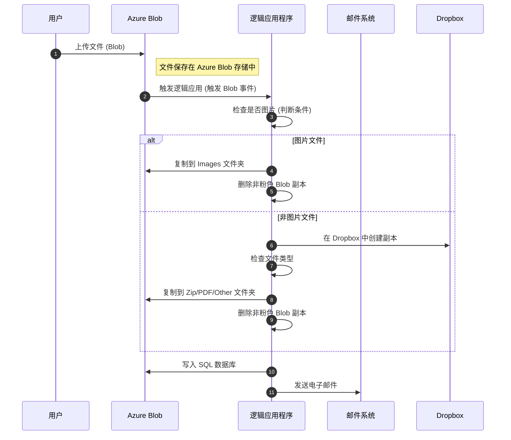

### Azure Logic Apps 简介

**Azure Logic Apps** 是一项功能强大的服务，用于构建集成解决方案，将应用程序和服务无缝连接在一起。

#### **特点和优势**：

1. **内置连接器**  
   - 提供 200+ 内置连接器，用于连接常见服务（如 Office 365、Dynamics 365、Azure 服务）以及第三方服务。
   - 无需手动配置复杂 API。

2. **无服务器架构**  
   - 逻辑应用以 **Serverless** 模式运行，用户无需担心服务器管理和扩展问题。
   - 只需专注于业务逻辑，基础设施由 Azure 全权处理。

3. **拖放式开发体验**  
   - 通过 **可视化设计器**，开发者可以使用简单的拖拽方式创建工作流，无需编写大量代码。
   - 支持开发者快速上手并简化开发流程。

4. **监控与日志记录**  
   - 提供 **实时监控** 和详细的日志记录功能，帮助开发者快速排查和解决问题。
   - 确保工作流的高可用性和可观测性。

5. **自动扩展和高可用性**  
   - 内置 **Auto Scaling** 功能，根据需求动态分配资源，避免资源浪费。
   - 提供高可用性保障，即使流量激增也能稳定运行。

6. **成本效益**  
   - 按使用量付费的定价模式，用户只需为实际执行的工作流付费。
   - 减少初始成本和运行维护费用。

#### **适用场景**：

- 自动化企业工作流（如审批流程、通知发送）。
- 数据整合（如从多个来源汇总数据并处理）。
- 与外部服务或 API 集成。
- 事件驱动型任务（如新数据到达触发操作）。

Azure Logic Apps 是企业集成和自动化的理想工具，具有简单易用、高效灵活的特点。

---

---

---

#### **流程分解:**
1. **上传 Blob 文件：**
   - 用户通过上传表单提交文件。
   - 文件保存到 Azure Blob Storage。

2. **逻辑应用触发：**
   - Blob 存储事件触发 Azure Logic App。
   - Logic App 判断文件是否为图片：
     - **如果是图片文件：**
       - 文件被复制到 Images 文件夹。
       - 删除所有非粉色（非 Images 文件夹的）Blob 副本。
     - **如果是非图片文件：**
       - 在 Dropbox 中创建文件副本。
       - 检查文件类型：
         - **zip 文件：** 复制到 Zip 文件夹。
         - **pdf 文件：** 复制到 PDF 文件夹。
         - **其他文件：** 复制到 Other 文件夹。
       - 删除所有非粉色 Blob 副本。

3. **数据写入和通知：**
   - 将文件相关元数据写入 SQL 数据库。
   - 发送电子邮件通知完成操作。
