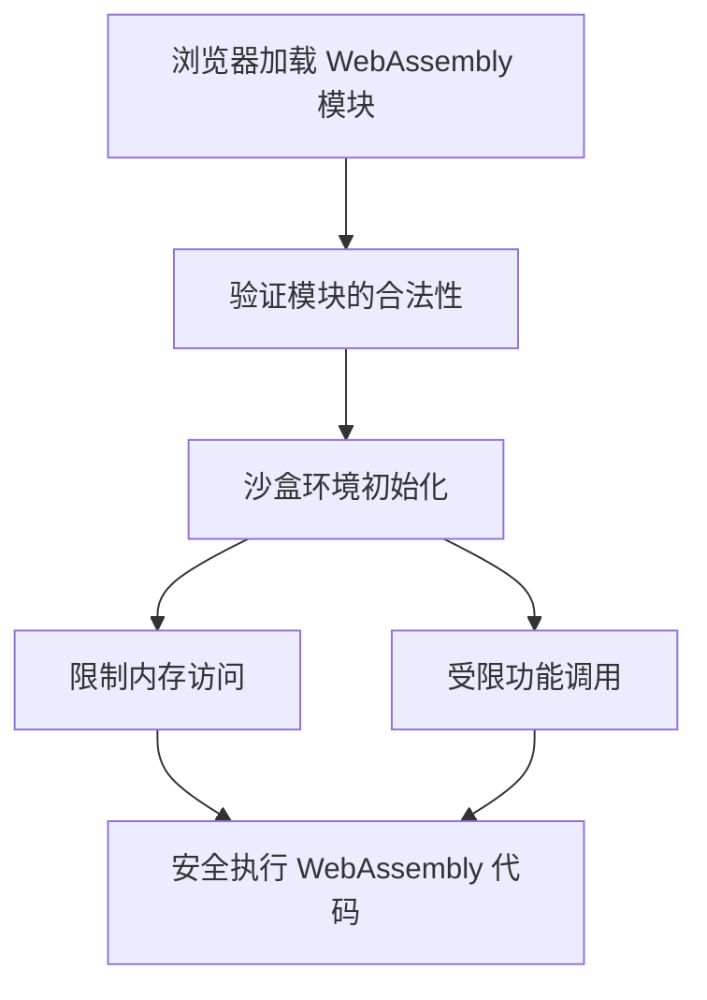
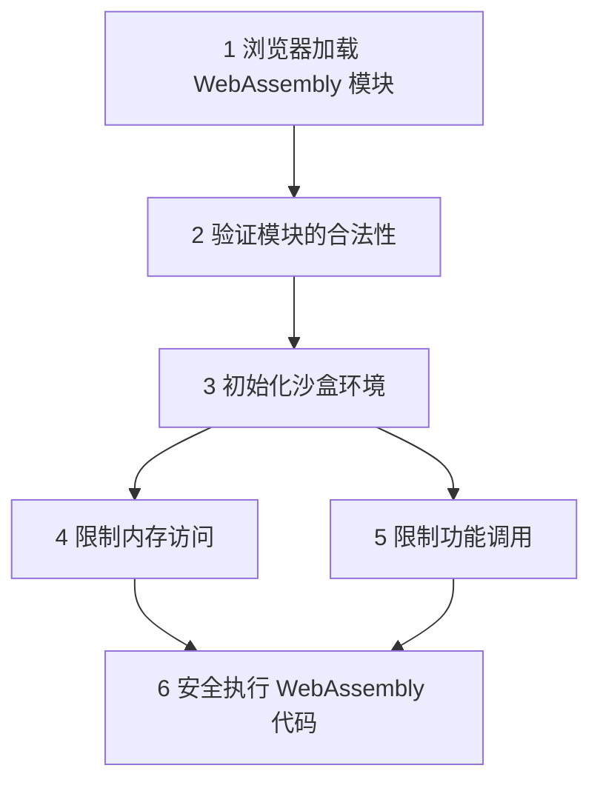
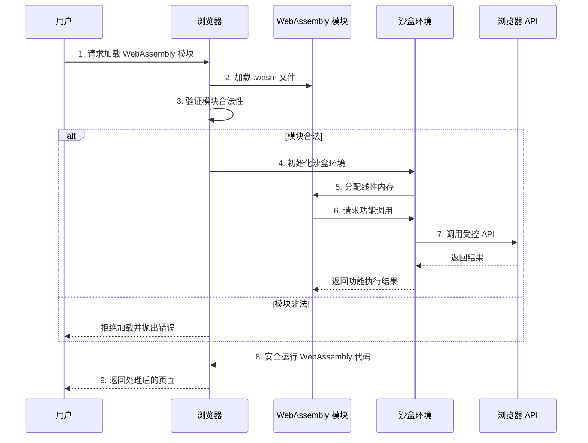

### **WebAssembly 在浏览器的沙盒环境中运行**

WebAssembly 之所以安全且可靠，核心原因在于它运行在浏览器的 **沙盒环境（Sandbox Environment）** 中。沙盒环境为 WebAssembly 提供了一个受限的执行空间，确保其不能直接访问用户设备的敏感资源，同时提供高性能和跨平台的执行能力。

---

### **沙盒环境的核心特性**

| 特性                   | 说明                                                                 |
|------------------------|----------------------------------------------------------------------|
| **隔离性**             | WebAssembly 的执行环境与浏览器主进程隔离，无法直接访问设备资源。         |
| **受限的功能访问**      | WebAssembly 只能通过浏览器暴露的 API（如 DOM 或 Web API）进行交互。      |
| **防止恶意代码**        | 代码在沙盒内运行，无法直接操作内存或访问系统级资源，减少攻击风险。         |
| **跨平台支持**          | 沙盒环境提供一致的接口，无论设备和操作系统，都能保证代码行为一致。         |
| **模块化加载**          | WebAssembly 模块以二进制格式加载，每个模块都在独立的沙盒中运行。         |

---

### **沙盒环境的运行机制**

以下是 WebAssembly 在浏览器中运行的主要机制：

1. **加载与验证**：
   - 当浏览器加载 WebAssembly 文件时，会首先对其进行验证，确保模块的代码格式正确，符合 WebAssembly 的规范。
   - 任何格式错误或不安全的代码都会被拒绝运行。

2. **隔离执行**：
   - WebAssembly 的代码被编译为浏览器内部的安全指令集。
   - 浏览器将其放入沙盒环境中运行，限制其访问硬件资源或操作系统功能。

3. **受限内存访问**：
   - WebAssembly 的内存是线性内存（Linear Memory），只能通过分配的内存空间操作，不允许直接访问设备的内存地址。
   - 所有内存读写都在沙盒中受到严格控制。

4. **与浏览器 API 的交互**：
   - WebAssembly 无法直接调用操作系统功能，只能通过 JavaScript 与浏览器的 Web API（如 DOM、Canvas）交互。

---

### **沙盒环境的安全性**

| **安全性特点**           | **具体说明**                                                       |
|--------------------------|-------------------------------------------------------------------|
| **内存安全**             | WebAssembly 不允许访问未授权的内存地址，防止缓冲区溢出等漏洞。       |
| **类型安全**             | WebAssembly 模块中的每个操作数和返回值都必须符合预定义的类型。       |
| **模块隔离**             | 每个 WebAssembly 模块相互隔离，无法干扰其他模块的运行。              |
| **受控 API 调用**        | WebAssembly 必须通过浏览器提供的 API 调用系统功能，无法直接操控设备。 |
| **验证机制**             | 浏览器在加载 WebAssembly 文件时会验证其结构和代码是否合法。           |

---

### **沙盒环境中的限制**

虽然沙盒环境增强了安全性，但它也带来了一些限制：

| 限制                   | 说明                                                                 |
|------------------------|----------------------------------------------------------------------|
| **无法直接访问 DOM**    | WebAssembly 无法直接操作 DOM，需要通过 JavaScript 间接操作。           |
| **缺乏系统权限**        | 无法直接调用操作系统级别的功能（如文件系统、硬件控制等）。              |
| **内存分配有限**        | WebAssembly 的线性内存需要预先分配，无法无限制扩展。                   |
| **不支持多线程（部分）** | 虽然 WebAssembly 支持多线程，但依赖浏览器对 Web Worker 的支持。         |

---



---

### **实际意义**

1. **增强安全性**：
   - 沙盒机制让 WebAssembly 更加安全，开发者无需担心恶意代码会影响用户设备。
   
2. **跨平台兼容**：
   - 无论用户设备的操作系统或硬件，沙盒提供一致的运行环境。

3. **高性能与安全兼顾**：
   - 虽然沙盒增加了一些运行限制，但 WebAssembly 的二进制执行速度弥补了这一影响。

---

### **WebAssembly 在浏览器的沙盒环境中运行**

**WebAssembly (WASM)** 是一种高效、安全的二进制格式，可以在浏览器的沙盒环境中运行，提供接近原生的性能，同时确保用户设备的安全。它运行在一个受限的沙盒中，避免了直接访问设备资源或操作系统功能，从而平衡了性能和安全性。

---

### **WebAssembly 的核心特性**

| 特性                   | 说明                                                                 |
|------------------------|----------------------------------------------------------------------|
| **高性能**             | 通过二进制文件直接运行，接近原生代码的执行效率。                     |
| **跨语言支持**         | 支持 C++、Rust、C# 等多种编程语言的编译运行。                         |
| **沙盒隔离**           | 模块运行在沙盒中，与浏览器和系统资源完全隔离。                         |
| **受控功能访问**        | 只能通过浏览器的 API（如 DOM 或 Web API）间接访问外部资源。            |
| **安全性高**           | 内存和执行行为受到严格控制，防止恶意代码威胁。                         |

---

### **WebAssembly 的沙盒运行机制**

1. **加载与验证**：
   - 浏览器加载 WebAssembly 文件时，首先验证其合法性，确保符合安全规范。
   - 格式或代码不合法的模块会被拒绝运行。

2. **隔离执行**：
   - WebAssembly 在沙盒中运行，与操作系统和浏览器的其他模块隔离，防止互相干扰。

3. **受限内存访问**：
   - WebAssembly 使用独立的线性内存，无法直接访问其他模块或系统内存。

4. **功能调用**：
   - WebAssembly 无法直接调用系统资源，只能通过浏览器暴露的受控 API 访问功能。

5. **安全执行**：
   - 运行时即使包含潜在的不安全代码，也会被沙盒环境限制其行为。

---

### **沙盒环境的优点**

| 优点                  | 说明                                                                 |
|-----------------------|----------------------------------------------------------------------|
| **安全性**            | 防止未经授权的内存访问或恶意操作。                                    |
| **跨平台兼容**        | 适用于所有主流浏览器和操作系统。                                       |
| **模块化支持**        | 每个 WebAssembly 模块都在独立沙盒中运行，互不影响。                     |
| **性能优化**          | 执行速度接近原生应用程序，适合高计算密集型任务。                       |

---

### **沙盒环境的限制**

| 限制                   | 说明                                                                 |
|------------------------|----------------------------------------------------------------------|
| **无法直接访问 DOM**    | 必须通过 JavaScript 间接操作 DOM。                                   |
| **缺乏系统权限**        | 无法直接调用操作系统功能（如文件系统、硬件控制等）。                   |
| **内存分配有限**        | WebAssembly 的线性内存需要预先分配，不能动态扩展。                     |
| **调试复杂**           | WebAssembly 是二进制格式，调试需要工具支持。                           |

---

### **带序号的运行流程图**

以下是 WebAssembly 在浏览器中运行沙盒环境的完整流程图：



---

### **WebAssembly 沙盒的交互序列图**

以下序列图展示了 WebAssembly 沙盒从加载到安全运行的详细交互流程：



---

### **C# 代码示例**

以下是一个使用 **Blazor WebAssembly** 的计数器示例，展示 WebAssembly 的基本交互逻辑：

#### **Counter.razor**
```csharp
@page "/counter"

<h1>计数器示例</h1>

<p>当前计数：@currentCount</p>

<button @onclick="IncrementCount">点击增加</button>

@code {
    private int currentCount = 0;

    private void IncrementCount()
    {
        currentCount++;
    }
}
```

**解释**:
- `@currentCount`: 动态绑定计数器值。
- `@onclick="IncrementCount"`: 绑定按钮点击事件，触发逻辑更新计数器。

---

#### **Program.cs**
```csharp
using Microsoft.AspNetCore.Components.Web;
using Microsoft.AspNetCore.Components.WebAssembly.Hosting;

var builder = WebAssemblyHostBuilder.CreateDefault(args);
builder.RootComponents.Add<App>("#app");

await builder.Build().RunAsync();
```

**解释**:
- `builder.RootComponents.Add<App>("#app")`: 将根组件设置为 `<div id="app">`。
- `await builder.Build().RunAsync()`: 启动 WebAssembly 应用。

---

### **总结**

- WebAssembly 的沙盒环境确保了**高安全性**，防止恶意代码影响用户设备。
- 它通过**受限内存**和**功能调用**实现了性能和安全的平衡。
- 使用 WebAssembly（如 Blazor WebAssembly）开发的应用具有**高性能**和**跨平台支持**，非常适合需要高计算性能的现代 Web 应用场景。

结合流程图和代码示例，可以更直观地理解 WebAssembly 如何运行以及沙盒环境的重要性。

### **总结**

WebAssembly 在浏览器的沙盒环境中运行，提供了高性能的同时，确保了安全性和跨平台兼容性。它无法直接操作硬件或系统资源，必须通过浏览器的 API 与外部世界交互。虽然这种沙盒机制带来了限制，但它是确保 WebAssembly 成为现代 Web 开发重要工具的关键。
