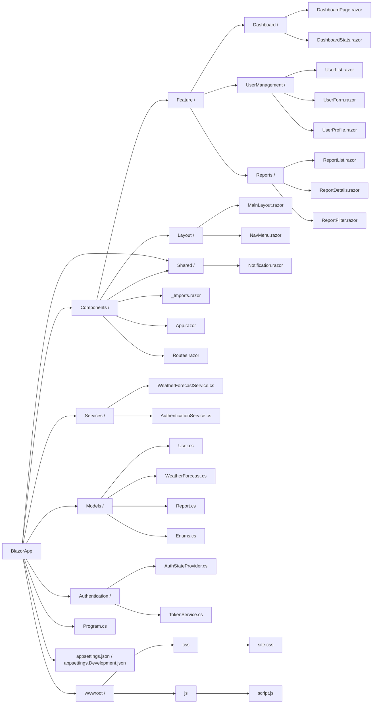

# Blazor file structure

## **Updated File Structure**

```plaintext
BlazorApp/
├── Components/
│   ├── Feature/
│   │   ├── Dashboard/
│   │   │   ├── DashboardPage.razor
│   │   │   └── DashboardStats.razor
│   │   ├── UserManagement/
│   │   │   ├── UserList.razor
│   │   │   ├── UserForm.razor
│   │   │   └── UserProfile.razor
│   │   ├── Reports/
│   │       ├── ReportList.razor
│   │       ├── ReportDetails.razor
│   │       └── ReportFilter.razor
│   ├── Layout/
│   │   ├── MainLayout.razor
│   │   └── NavMenu.razor
│   ├── Shared/
│   │   └── Notification.razor
│   ├── _Imports.razor
│   ├── App.razor
│   ├── Routes.razor
├── Services/
│   ├── WeatherForecastService.cs
│   └── AuthenticationService.cs
├── Models/
│   ├── User.cs
│   ├── WeatherForecast.cs
│   ├── Report.cs
│   └── Enums.cs
├── Authentication/
│   ├── AuthStateProvider.cs
│   └── TokenService.cs
├── wwwroot/
│   ├── css/
│   │   └── site.css
│   └── js/
│       └── script.js
├── Program.cs
├── appsettings.json
└── appsettings.Development.json
```

---

### **What Each Folder Does**

#### **1. Components/Feature/**

Organized components by **features**, allowing better modularity and scalability.

- **Dashboard/**:
  - Components related to the dashboard feature.
  - **Example Files**:
    - `DashboardPage.razor`: The main dashboard page.
    - `DashboardStats.razor`: A reusable component to display statistics on the dashboard.

- **UserManagement/**:
  - Components for managing users.
  - **Example Files**:
    - `UserList.razor`: Displays a list of users.
    - `UserForm.razor`: Handles user creation and editing.
    - `UserProfile.razor`: Displays detailed user information.

- **Reports/**:
  - Components for generating and viewing reports.
  - **Example Files**:
    - `ReportList.razor`: Shows a list of reports.
    - `ReportDetails.razor`: Displays detailed information about a specific report.
    - `ReportFilter.razor`: A reusable component for filtering reports.

---

#### **2. Components/Layout/**

Contains shared layout components used across the application.

- **MainLayout.razor**:
  - Defines the main layout of the app, wrapping the app content.
- **NavMenu.razor**:
  - Provides navigation links for the app.

---

#### **3. Components/Shared/**

Contains shared components that are not tied to any specific feature.

- **Notification.razor**:
  - A reusable notification or toast component for displaying messages across the app.

---

#### **4. Services/**

Encapsulates business logic and API interactions.

- **WeatherForecastService.cs**:
  - Example service to fetch weather data.
- **AuthenticationService.cs**:
  - Handles user authentication and session management.

---

#### **5. Models/**

Defines strongly-typed data structures.

- **User.cs**:
  - Represents user data.
- **WeatherForecast.cs**:
  - Represents weather forecast data.
- **Report.cs**:
  - Represents report-related data.
- **Enums.cs**:
  - Contains enumerations for shared values (e.g., user roles or report statuses).

---

#### **6. Authentication/**

Centralizes authentication and authorization logic.

- **AuthStateProvider.cs**:
  - Implements authentication state management for the app.
- **TokenService.cs**:
  - Handles JWT token storage, validation, and refresh logic.

---

#### **7. wwwroot/**

Contains static files served directly to the client.

- **css/site.css**:
  - Custom styles for the application.
- **js/script.js**:
  - Custom JavaScript for additional interactivity.

---

#### **8. Program.cs**

The entry point for configuring services, middleware, and the app's startup process.

---

#### **9. appsettings.json / appsettings.Development.json**

Store application configuration for different environments.

---

### **Why This Structure Works Well**

1. **Feature-Based Organization**:
   - Grouping components by features improves modularity and makes it easier to find related files.
   - Each feature is self-contained, making it easier to scale or refactor.

2. **Separation of Concerns**:
   - Services, models, authentication, and components are clearly separated, reducing coupling.

3. **Shared Components**:
   - Reusable components (e.g., `Notification.razor`) are placed in a shared folder, improving reusability across features.

4. **Static Files**:
   - Static resources are centralized in `wwwroot/`, making them easy to manage.

5. **Scalability**:
   - As the app grows, more features can be added without disrupting the overall structure.

---

### **When to Use This Structure**

- **Small to Medium Projects**: The feature-based structure provides flexibility without unnecessary complexity.
- **Large Projects**: For larger projects, this structure can be extended further by introducing subfolders (e.g., `Feature/Dashboard/Widgets/`) or grouping related services and models under feature-specific folders.

---

### **Potential Improvements for Larger Projects**

1. **Subdivide Models and Services by Feature**:
   - Move feature-specific models and services into the corresponding feature folder:

     ```plaintext
     Components/Feature/
     ├── Dashboard/
     │   ├── DashboardPage.razor
     │   ├── DashboardStats.razor
     │   └── DashboardService.cs
     │   └── DashboardModel.cs
     ```

2. **Add Feature-Specific Static Files**:
   - If features require custom CSS/JS, consider creating feature-specific static folders under `wwwroot/`.

3. **Namespace Usage**:
   - Use namespaces that align with the file structure for better code organization:

     ```csharp
     namespace BlazorApp.Components.Feature.Dashboard;
     ```

---

### **Conclusion**

This updated file structure is a **best practice** for medium to large Blazor projects, offering:

- **Modularity**: Clear separation of components by feature.
- **Scalability**: Ability to grow with the project by adding features without creating chaos.
- **Maintainability**: Logical grouping simplifies navigation and team collaboration.

---

Here’s the **Mermaid diagram** that matches the updated Blazor file structure, reflecting the feature-based organization:



---

### **What This Mermaid Diagram Represents**
- **Main Directory (`BlazorApp`)**: The root of the application.
- **Feature-Based Components (`Components/Feature`)**:
  - Organized into features (`Dashboard`, `UserManagement`, `Reports`).
  - Each feature has its own Razor components.
- **Common Layout and Shared Components (`Components/Layout`, `Components/Shared`)**:
  - Layout components like `MainLayout.razor` and `NavMenu.razor`.
  - Shared reusable components like `Notification.razor`.
- **Services (`Services/`)**:
  - Contains business logic for API communication.
- **Models (`Models/`)**:
  - Defines data structures for the application.
- **Authentication (`Authentication/`)**:
  - Handles user authentication and state management.
- **Static Files (`wwwroot/`)**:
  - CSS and JavaScript files stored for static serving.

---

### **How to Use This Structure**
- Each folder has a specific role:
  - **`Components/Feature`**: Contains feature-specific components for modularity.
  - **`Services/`**: Manages logic for interacting with APIs or external resources.
  - **`Models/`**: Houses data representations shared across the application.
  - **`Authentication/`**: Encapsulates authentication logic for better maintainability.
  - **`wwwroot/`**: Stores static resources served directly to the client.
