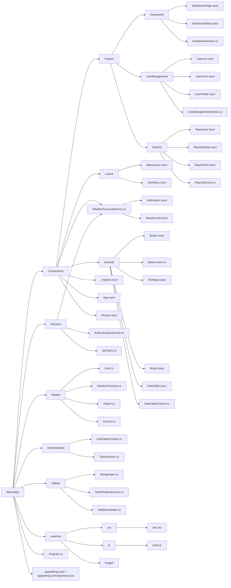

# BlazorApp

```plaintext
BlazorApp/
├── Components/
│   ├── Feature/                 # Feature-specific components
│   │   ├── Dashboard/
│   │   │   ├── DashboardPage.razor
│   │   │   ├── DashboardStats.razor
│   │   │   └── DashboardService.cs    # Feature-specific service
│   │   ├── UserManagement/
│   │   │   ├── UserList.razor
│   │   │   ├── UserForm.razor
│   │   │   ├── UserProfile.razor
│   │   │   └── UserManagementService.cs # Feature-specific service
│   │   ├── Reports/
│   │       ├── ReportList.razor
│   │       ├── ReportDetails.razor
│   │       ├── ReportFilter.razor
│   │       └── ReportService.cs       # Feature-specific service
│   ├── Layout/                   # Layout components
│   │   ├── MainLayout.razor
│   │   └── NavMenu.razor
│   ├── Shared/                   # Shared UI components
│   │   ├── Notification.razor
│   │   └── Breadcrumb.razor
│   ├── Controls/                 # Reusable UI controls
│   │   ├── Button.razor
│   │   ├── Button.razor.cs       # Code-behind for Button
│   │   ├── TextInput.razor
│   │   ├── Modal.razor
│   │   └── DataTable.razor
│   │       └── DataTableColumn.cs # Supporting class for DataTable
│   ├── _Imports.razor            # Global namespace imports
│   ├── App.razor                 # Blazor app entry point
│   ├── Routes.razor              # Centralized routing configuration (optional)
├── Services/                     # Cross-feature or app-wide services
│   ├── WeatherForecastService.cs
│   ├── AuthenticationService.cs
│   └── ApiClient.cs              # Shared API client for HTTP requests
├── Models/                       # Shared data models and enums
│   ├── User.cs                   # Represents user data
│   ├── WeatherForecast.cs        # Represents weather data
│   ├── Report.cs                 # Represents report data
│   └── Enums.cs                  # Shared enums (e.g., user roles)
├── Authentication/               # Authentication and authorization logic
│   ├── AuthStateProvider.cs      # Manages authentication state
│   └── TokenService.cs           # Handles token operations
├── Utilities/                    # General-purpose utility classes
│   ├── StringHelper.cs           # String utility methods
│   ├── DateTimeExtensions.cs     # Extensions for DateTime
│   └── ValidationHelper.cs       # Form validation helpers
├── wwwroot/                      # Static files for the app
│   ├── css/
│   │   └── site.css              # Custom application styles
│   ├── js/
│   │   └── script.js             # Custom JavaScript for client-side logic
│   └── images/                   # Image assets (optional)
├── Program.cs                    # Application startup logic
├── appsettings.json              # General application settings
└── appsettings.Development.json  # Development-specific settings
```


---

### **Folder Explanations**

#### **1. Components/**

- **Feature/**:
  - Contains components organized by feature (e.g., Dashboard, UserManagement, Reports).
  - Each feature may have its specific `.razor` components and services (e.g., `DashboardService.cs`).

- **Layout/**:
  - Contains layout components used across the app (e.g., `MainLayout.razor` for app-wide layout, `NavMenu.razor` for navigation).

- **Shared/**:
  - Contains shared UI components that are reusable across features (e.g., `Notification.razor`, `Breadcrumb.razor`).

- **Controls/**:
  - Holds **reusable, generic UI controls** (e.g., `Button.razor`, `Modal.razor`).
  - Includes code-behind files (e.g., `Button.razor.cs`) and supporting classes (e.g., `DataTableColumn.cs`).

---

#### **2. Services/**

- **Purpose**:
  - Contains **cross-feature or app-wide services**, such as `WeatherForecastService.cs` and `AuthenticationService.cs`.
  - Shared logic, such as an `ApiClient.cs` for HTTP requests, is also placed here.

---

#### **3. Models/**

- **Purpose**:
  - Defines shared data models (e.g., `User.cs`, `WeatherForecast.cs`) and enums (e.g., `Enums.cs`).
  - Models represent the structure of data shared between components and services.

---

#### **4. Authentication/**

- **Purpose**:
  - Manages authentication and authorization logic (e.g., `AuthStateProvider.cs`, `TokenService.cs`).
  - Keeps sensitive authentication logic separate from other app logic.

---

#### **5. Utilities/**

- **Purpose**:
  - Contains general-purpose helper classes and extensions (e.g., `StringHelper.cs`, `ValidationHelper.cs`).
  - These utilities are reusable throughout the app but not tied to any specific feature.

---

#### **6. wwwroot/**

- **Purpose**:
  - Serves static files like CSS, JavaScript, images, and fonts.
  - Subfolders:
    - **css/**: Custom styles (`site.css`).
    - **js/**: Custom JavaScript logic (`script.js`).
    - **images/**: Static image assets (optional).

---

### **Key Features of This Structure**

1. **Feature-Based Organization**:
   - Components are grouped by features in `Components/Feature`, making the structure scalable and intuitive.

2. **Separation of Concerns**:
   - **Reusable controls** are isolated in `Components/Controls`.
   - **Feature-specific services** are kept in their respective feature folders.
   - **App-wide services** are centralized in `Services/`.

3. **Reusability and Modularity**:
   - Shared components (e.g., `Notification.razor`) and reusable controls (e.g., `Button.razor`) enhance reusability.

4. **Extensibility**:
   - New features can be added easily by creating new folders under `Feature/`.

5. **Maintainability**:
   - Clear separation of logic (UI in `Components/`, logic in `Services/`, data in `Models/`) makes the codebase easier to maintain and scale.

---

### **When to Use This Structure**

- **Ideal for Medium to Large Projects**:
  - This structure is designed for scalable Blazor apps with multiple features and reusable components.

- **Overhead for Small Projects**:
  - For small projects, this structure might be overly complex. A simpler version without `Feature/` subdivisions or a flat `Components/` folder might suffice.

---

### **Conclusion**

This structure strikes a balance between modularity, scalability, and maintainability. It keeps the app cleanly organized, making it easy to add features, reuse controls, and manage shared resources. 

Let me know if you'd like more detailed examples for specific folders or further refinements! 😊
