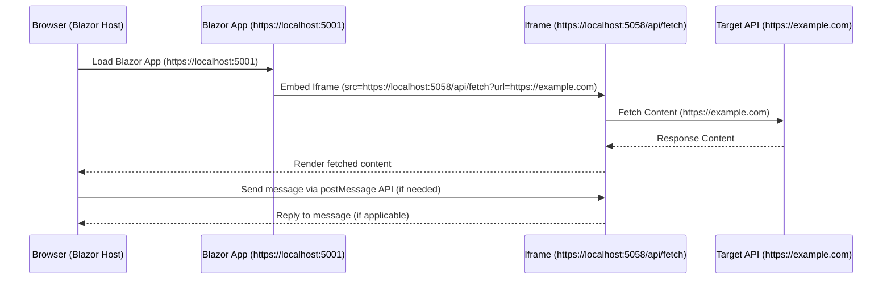

### **.NET Core Web API project** as a reverse proxy to bypass **Same-Origin Policy** (CORS) issues. 

Here’s how you can set this up:

---

### **Key Setup**
1. **Blazor App**:
   - Runs on `https://localhost:5001`.
   - Communicates with the Web API proxy for cross-origin requests.
2. **Web API Proxy**:
   - Runs on a separate port (e.g., `https://localhost:7001`).
   - Acts as a reverse proxy, fetching content from external sources and returning it to the Blazor app.

---

### **Step-by-Step Guide**

#### **1. Create a New .NET Core Web API Project**

1. Open a terminal and create a new Web API project:
   ```bash
   dotnet new webapi -n ReverseProxyAPI
   cd ReverseProxyAPI
   ```

2. Install required dependencies:
   ```bash
   dotnet add package Microsoft.AspNetCore.Cors
   ```

3. Open the `Program.cs` file and set up CORS:

   ```csharp
   var builder = WebApplication.CreateBuilder(args);

   // Add services to the container
   builder.Services.AddCors(options =>
   {
       options.AddPolicy("AllowBlazor", policy =>
       {
           policy.WithOrigins("https://localhost:5001")  // Blazor app origin
                 .AllowAnyHeader()
                 .AllowAnyMethod();
       });
   });

   builder.Services.AddControllers();
   builder.Services.AddHttpClient();  // Add HttpClient for proxy functionality

   var app = builder.Build();

   // Enable CORS for the Blazor app
   app.UseCors("AllowBlazor");

   // Configure the HTTP request pipeline
   app.UseHttpsRedirection();
   app.UseAuthorization();
   app.MapControllers();

   app.Run();
   ```

---

#### **2. Add the Proxy Logic**

1. Create a `ProxyController`:

   - Navigate to the `Controllers` folder.
   - Create a new file called `ProxyController.cs`.

   ```csharp
   using Microsoft.AspNetCore.Mvc;
   using System.Net.Http;
   using System.Threading.Tasks;

   namespace ReverseProxyAPI.Controllers
   {
       [ApiController]
       [Route("api/[controller]")]
       public class ProxyController : ControllerBase
       {
           private readonly HttpClient _httpClient;

           public ProxyController(HttpClient httpClient)
           {
               _httpClient = httpClient;
           }

           [HttpGet("fetch")]
           public async Task<IActionResult> Fetch([FromQuery] string url)
           {
               if (string.IsNullOrEmpty(url))
                   return BadRequest("URL is required.");

               try
               {
                   // Fetch the content from the external URL
                   var response = await _httpClient.GetAsync(url);
                   response.EnsureSuccessStatusCode();

                   // Read and return the response content
                   var content = await response.Content.ReadAsStringAsync();
                   return Content(content, response.Content.Headers.ContentType?.ToString() ?? "text/html");
               }
               catch (HttpRequestException ex)
               {
                   return BadRequest($"Error fetching the URL: {ex.Message}");
               }
           }
       }
   }
   ```

---

#### **3. Run the Web API Proxy**

1. Run the Web API project:
   ```bash
   dotnet run
   ```

2. Verify it runs on `https://localhost:7001` (or another port, as displayed in the terminal).

---

#### **4. Configure the Blazor App**

In your Blazor Server app:

1. **Set up the iframe** in a Razor page (e.g., `ProxyPage.razor`):

   ```razor
   @page "/proxy"
   <h3>Cross-Origin Proxy Example</h3>

   <!-- Use the proxy API to fetch external content -->
   <iframe src="https://localhost:7001/api/proxy/fetch?url=https://example.com" 
           width="800" 
           height="600" 
           style="border: 1px solid black;">
   </iframe>
   ```

2. **Run your Blazor app**:
   - The iframe will load content from the Web API proxy (`https://localhost:7001`), which in turn fetches content from `https://example.com`.

---

### **How It Works**
1. The Blazor app (`https://localhost:5001`) makes a request to the proxy (`https://localhost:7001`).
2. The proxy (`ProxyController`) fetches content from the external site (`https://example.com`).
3. The proxy returns the content to the Blazor app as if it originated from the proxy, bypassing Same-Origin Policy.

---

### **Important Notes**
1. **CORS Configuration**:
   - The Web API proxy explicitly allows the Blazor app’s origin (`https://localhost:5001`).
   - Adjust the `WithOrigins` value in `Program.cs` if your Blazor app uses a different URL in production.

2. **Security**:
   - Validate the incoming `url` parameter to prevent misuse of the proxy.
   - Add a whitelist for allowed domains to ensure only trusted sources can be proxied.

   Example:
   ```csharp
   private readonly List<string> _allowedDomains = new List<string>
   {
       "example.com",
       "another-domain.com"
   };

   private bool IsUrlAllowed(string url)
   {
       var uri = new Uri(url);
       return _allowedDomains.Contains(uri.Host);
   }
   ```

   Validate the URL in the `Fetch` method:
   ```csharp
   if (!IsUrlAllowed(url))
       return BadRequest("This URL is not allowed.");
   ```

3. **Performance**:
   - If the external content doesn’t change often, implement caching in the proxy to reduce load.

---

### **Summary**
This approach creates a secure and flexible reverse proxy with a separate .NET Core Web API project. The Web API handles the cross-origin communication, while the Blazor app focuses on rendering the content seamlessly.

---

### **Scenario: Does the iframe with a reverse proxy API work?**

**Blazor Host:** `https://localhost:5001`  
**iframe Source:** `https://localhost:5058/api/fetch?url=https://example.com`  
**Reverse Proxy API:** `https://localhost:5058/api/fetch`

---

### **Answer**

**It depends.**

The iframe can successfully load content from the reverse proxy **if certain conditions are met**. However, there are several important considerations related to **Same-Origin Policy**, **CORS**, and **Content-Security-Policy (CSP)**.

---

### **Key Points**

#### **1. Same-Origin Policy**
- Browsers enforce the **Same-Origin Policy**, which restricts interactions between documents (e.g., iframes) from different origins.
- **Origin = Protocol + Domain + Port**.
- In this case:
  - Parent (Blazor) page: `https://localhost:5001`.
  - iframe source: `https://localhost:5058`.
  - **Different port numbers mean different origins**, so the iframe is considered cross-origin.

The iframe will **load** if the server at `https://localhost:5058` allows it, but parent-to-iframe interactions (e.g., JavaScript communication) are restricted by the Same-Origin Policy.

#### **2. CORS (Cross-Origin Resource Sharing)**
- The **reverse proxy API (`https://localhost:5058`)** must handle requests properly to support cross-origin iframe embedding.
- If the `api/fetch` endpoint forwards requests to `https://example.com`, the following must be true:
  - `https://localhost:5058` **must allow cross-origin requests** by enabling CORS for the Blazor host (`https://localhost:5001`).
  - `https://example.com` must allow cross-origin requests to be proxied.

#### **3. Content-Security-Policy (CSP)**
- The Blazor application may have a **Content-Security-Policy (CSP)** that restricts iframe sources.
- To allow embedding `https://localhost:5058`, ensure the CSP includes:
  ```http
  Content-Security-Policy: frame-src 'self' https://localhost:5058;
  ```

#### **4. HTTPS and Mixed Content**
- Both `https://localhost:5001` (Blazor host) and `https://localhost:5058` (reverse proxy) use HTTPS, which avoids mixed content issues.
- If either endpoint were HTTP, modern browsers would block the iframe in a secure context.

---

### **Does It Work?**
Here’s a checklist to determine if the iframe works:

| **Requirement**                                 | **Details**                                                                                           | **Does it Work?** |
|-------------------------------------------------|-------------------------------------------------------------------------------------------------------|-------------------|
| **Reverse proxy allows iframe embedding**       | Ensure `https://localhost:5058` does not restrict iframe embedding via `X-Frame-Options`.             | Required          |
| **CORS on reverse proxy**                       | The reverse proxy (`https://localhost:5058`) must allow requests from `https://localhost:5001`.       | Required          |
| **CORS on target API (`https://example.com`)**  | If the reverse proxy forwards requests, `https://example.com` must allow it (or proxy should hide CORS issues). | Required          |
| **CSP on Blazor host**                          | The Blazor host (`https://localhost:5001`) must include `frame-src` to allow embedding `https://localhost:5058`. | Required          |

If all these conditions are met, the iframe will work and display the proxied content.

---

### **Steps to Ensure Compatibility**

#### **1. Configure the Reverse Proxy**
- Ensure the reverse proxy allows requests from the Blazor application (`https://localhost:5001`).
- Enable CORS in the reverse proxy API:
  ```csharp
  services.AddCors(options =>
  {
      options.AddPolicy("AllowBlazorHost", builder =>
      {
          builder.WithOrigins("https://localhost:5001")
                 .AllowAnyHeader()
                 .AllowAnyMethod();
      });
  });

  app.UseCors("AllowBlazorHost");
  ```

#### **2. Set Content-Security-Policy on Blazor Host**
- Modify `Program.cs` or `Startup.cs` in the Blazor host to include the proper CSP:
  ```csharp
  app.Use(async (context, next) =>
  {
      context.Response.Headers.Add("Content-Security-Policy", "frame-src 'self' https://localhost:5058;");
      await next();
  });
  ```

#### **3. Validate the Target API (`https://example.com`)**
- If the reverse proxy forwards requests to `https://example.com`, check whether `https://example.com` allows CORS for the reverse proxy.

---

### **What Happens if Any Condition Fails?**

1. **CORS Issues**:
   - If `https://localhost:5058` or `https://example.com` blocks cross-origin requests, the iframe may fail to display the content or throw CORS errors in the browser console.

2. **CSP Restrictions**:
   - If the CSP of `https://localhost:5001` blocks `https://localhost:5058`, the iframe will not load.

3. **X-Frame-Options Header**:
   - If `https://localhost:5058` sends `X-Frame-Options: DENY` or `X-Frame-Options: SAMEORIGIN`, the iframe embedding will fail.

4. **Mixed Content**:
   - If either the Blazor host or the reverse proxy uses HTTP, browsers will block the iframe due to mixed content restrictions.

---

### **Recommendation**
- Use the **same domain and port** for the Blazor host and reverse proxy when possible, as this avoids cross-origin issues entirely. For example, proxy `https://localhost:5058/api/fetch` to `https://localhost:5001/api/fetch` using the Blazor application itself.

#### Example Reverse Proxy in Blazor:
```csharp
app.Map("/api/fetch", proxyApp =>
{
    proxyApp.RunProxy(async context =>
    {
        var targetUri = new Uri("https://localhost:5058" + context.Request.Path + context.Request.QueryString);
        return await context.ForwardTo(targetUri).Send();
    });
});
```

---

### **Conclusion**
Yes, the iframe can work under `https://localhost:5001` if:
1. Proper CORS is configured for `https://localhost:5058` and (optionally) `https://example.com`.
2. The Blazor host (`https://localhost:5001`) allows embedding `https://localhost:5058` via CSP.
3. The reverse proxy (`https://localhost:5058`) allows iframe embedding and does not block it using `X-Frame-Options`.

If these conditions are not met, you may encounter issues, and the recommended solution is to use the **same origin** for the Blazor host and the reverse proxy.

---

### **Does it Work?**

Your setup might work **partially** or fail depending on certain conditions. Here's an analysis:

---

### **1. Cross-Origin Restrictions**

**Key Point**: 
- Your Blazor app (`https://localhost:5001`) and reverse proxy API (`https://localhost:5058`) are on different origins because they have different **ports**.
- This triggers **Same-Origin Policy** restrictions:
  - The iframe can **load** the content from `https://localhost:5058/api/fetch`, but interaction between the parent page (Blazor) and the iframe is restricted (e.g., JavaScript calls to the iframe's content).

---

### **2. Does the iframe Load the Content?**

For the iframe to successfully load the content from `https://localhost:5058`, these conditions must be met:

#### **Condition 1: X-Frame-Options Header**
- If your reverse proxy (API at `https://localhost:5058`) returns an `X-Frame-Options` header like `DENY` or `SAMEORIGIN`, the browser will block the iframe.

To allow embedding, ensure the API does **not** set restrictive `X-Frame-Options`, or set it explicitly to allow:
```http
X-Frame-Options: ALLOW-FROM https://localhost:5001
```
Alternatively, remove the header altogether.

#### **Condition 2: Content-Security-Policy (CSP)**
- If the Blazor app (`https://localhost:5001`) or the reverse proxy (`https://localhost:5058`) sets a restrictive `Content-Security-Policy`, the iframe might fail to load.
- Ensure the CSP on the Blazor app allows embedding:
  ```http
  Content-Security-Policy: frame-src 'self' https://localhost:5058;
  ```

#### **Condition 3: HTTPS**
- Both your Blazor app (`https://localhost:5001`) and the reverse proxy (`https://localhost:5058`) use HTTPS, which avoids mixed content issues. This is already correct.

---

### **3. Interaction Between Parent and iframe**

Even if the iframe loads successfully, communication between the Blazor app and the iframe content is **restricted** by the Same-Origin Policy. For example:
- JavaScript running in the Blazor app cannot access the DOM inside the iframe.
- This is a browser security feature and cannot be bypassed unless both apps share the **same origin** (protocol, domain, and port).

---

### **4. Recommendations**

#### **Option 1: Use Reverse Proxy in Blazor Host**
To avoid cross-origin issues entirely, configure a reverse proxy in the Blazor app (`https://localhost:5001`) to proxy requests to `https://localhost:5058`. This makes everything appear as if it comes from the same origin.

**Steps:**
1. Modify the Blazor app's `Program.cs` to include a reverse proxy:
   ```txt
   dotnet add package Yarp.ReverseProxy
   ```

   ```csharp
   app.Map("/api/fetch", proxyApp =>
   {
       proxyApp.RunProxy(async context =>
       {
           var targetUri = new Uri("https://localhost:5058" + context.Request.Path + context.Request.QueryString);
           return await context.ForwardTo(targetUri).Send();
       });
   });
   ```
#### Configuration Issues
If you encounter runtime issues with RunProxy, the YARP Forwarder might not be correctly configured. Try this alternate configuration using the HttpForwarder class:

Replace RunProxy with HttpForwarder:
```csharp
var forwarder = app.Services.GetRequiredService<HttpForwarder>();

app.Map("/api/fetch", async context =>
{
    var targetUri = new Uri("https://localhost:5058" + context.Request.Path + context.Request.QueryString);

    // Prepare forwarder options
    var requestOptions = new ForwarderRequestConfig
    {
        ActivityTimeout = TimeSpan.FromSeconds(100)
    };

    // Forward the request
    await forwarder.SendAsync(context, targetUri.ToString(), httpClient => { }, requestOptions);
});
```

```csharp
using Microsoft.AspNetCore.Builder;
using Microsoft.AspNetCore.Hosting;
using Microsoft.Extensions.DependencyInjection;
using Microsoft.Extensions.Hosting;
using Yarp.ReverseProxy;
using Yarp.ReverseProxy.Forwarder;

var builder = WebApplication.CreateBuilder(args);

// Add services to the container
builder.Services.AddReverseProxy(); // Add YARP reverse proxy services

// Build the app
var app = builder.Build();

// Middleware pipeline
app.UseRouting();

// Example reverse proxy using RunProxy
app.Map("/api/fetch", proxyApp =>
{
    // Use RunProxy to forward requests
    proxyApp.RunProxy(async context =>
    {
        // Construct the target URI by appending path and query
        var targetUri = new Uri("https://localhost:5058" + context.Request.Path + context.Request.QueryString);

        // Forward the request to the target URI
        return await context.ForwardTo(targetUri).Send();
    });
});

// Optional: Example using HttpForwarder directly
var forwarder = app.Services.GetRequiredService<HttpForwarder>();
app.Map("/api/forward", async context =>
{
    var targetUri = new Uri("https://localhost:5058" + context.Request.Path + context.Request.QueryString);

    // Forwarder configuration
    var requestOptions = new ForwarderRequestConfig
    {
        ActivityTimeout = TimeSpan.FromSeconds(30)
    };

    // Forward the request
    await forwarder.SendAsync(context, targetUri.ToString(), httpClient => { }, requestOptions);
});

// Default fallback route
app.MapFallback(() => Results.Text("Reverse proxy is running!"));

// Run the app
app.Run();

```


3. Change the iframe source in your Blazor app to:
   ```html
   <iframe src="https://localhost:5001/api/fetch?url=https://example.com" width="600" height="400"></iframe>
   ```

This ensures both the Blazor app and the iframe content appear to come from `https://localhost:5001`, avoiding cross-origin restrictions.

---

#### **Option 2: Configure CORS and Headers**
If you prefer to keep the current setup (Blazor app on `https://localhost:5001` and reverse proxy on `https://localhost:5058`):

1. **Enable CORS in the API (`https://localhost:5058`)**:
   Allow the Blazor host (`https://localhost:5001`) to make requests:
   ```csharp
   builder.Services.AddCors(options =>
   {
       options.AddPolicy("AllowBlazorHost", builder =>
       {
           builder.WithOrigins("https://localhost:5001")
                  .AllowAnyMethod()
                  .AllowAnyHeader();
       });
   });

   app.UseCors("AllowBlazorHost");
   ```

2. **Set Headers for iframe Embedding**:
   Ensure the API does not block embedding:
   ```csharp
   app.Use(async (context, next) =>
   {
       context.Response.Headers.Add("X-Frame-Options", "ALLOW-FROM https://localhost:5001");
       context.Response.Headers.Add("Content-Security-Policy", "frame-src 'self' https://localhost:5058;");
       await next();
   });
   ```

3. **Keep the iframe Source**:
   ```html
   <iframe src="https://localhost:5058/api/fetch?url=https://example.com" width="600" height="400"></iframe>
   ```

This allows the iframe to load, but cross-origin restrictions will still prevent parent-to-iframe interactions.

---

#### **Option 3: Use PostMessage for iframe Communication**
If you need parent-to-iframe communication, you can use the `window.postMessage` API to safely pass messages between the two.

**iframe Page (API Response):**
Include JavaScript to listen for messages:
```javascript
window.addEventListener("message", (event) => {
    if (event.origin === "https://localhost:5001") {
        console.log("Received from parent:", event.data);
    }
});
```

**Blazor App (Parent Page):**
Send messages to the iframe:
```javascript
const iframe = document.querySelector("iframe");
iframe.contentWindow.postMessage("Hello from Blazor!", "https://localhost:5058");
```

This approach works even across different origins.

---

### **5. Summary**

- **Does it work?**
  - The iframe will load the content if:
    1. `X-Frame-Options` and CSP headers allow embedding.
    2. HTTPS is used for both origins.
  - Parent-to-iframe interaction (JavaScript) will fail due to cross-origin restrictions.

- **Best Solution:**
  - Configure a reverse proxy in the Blazor app (`https://localhost:5001`) to forward requests to the API (`https://localhost:5058`). This ensures everything is served from the same origin.

- **Alternative Solution:**
  - Use `postMessage` for cross-origin communication if you want to keep separate origins.

This ensures the functionality works while maintaining security and avoiding Same-Origin Policy issues.



---

### **Explanation of Each Step**

1. **Blazor App Load**:
   - The browser requests the Blazor app from `https://localhost:5001`.
   - The Blazor app is loaded, including the iframe with the `src` set to `https://localhost:5058/api/fetch?url=https://example.com`.

2. **Iframe Initialization**:
   - The iframe is loaded by the browser and starts fetching content from the reverse proxy (`https://localhost:5058/api/fetch`).

3. **Reverse Proxy Fetches Target Content**:
   - The reverse proxy forwards the request to the target API (`https://example.com`).
   - The target API responds with the requested content.

4. **Iframe Renders Content**:
   - The reverse proxy returns the fetched content to the iframe.
   - The iframe renders the content in the browser.

5. **Optional: Parent-to-Iframe Communication**:
   - If the parent Blazor app needs to interact with the iframe (e.g., to send or receive data), it uses the `postMessage` API for secure cross-origin communication.

---

### **Key Takeaways from the Diagram**

- **Separate Origins**:
  - The Blazor app (`https://localhost:5001`) and the iframe (`https://localhost:5058`) have different origins, triggering cross-origin restrictions for JavaScript interaction.

- **Reverse Proxy Role**:
  - The reverse proxy fetches data from `https://example.com` on behalf of the iframe and ensures no direct CORS issues between the iframe and the target API.

- **Cross-Origin Messaging**:
  - If interaction between the parent and the iframe is required, `postMessage` provides a secure way to communicate across origins.
