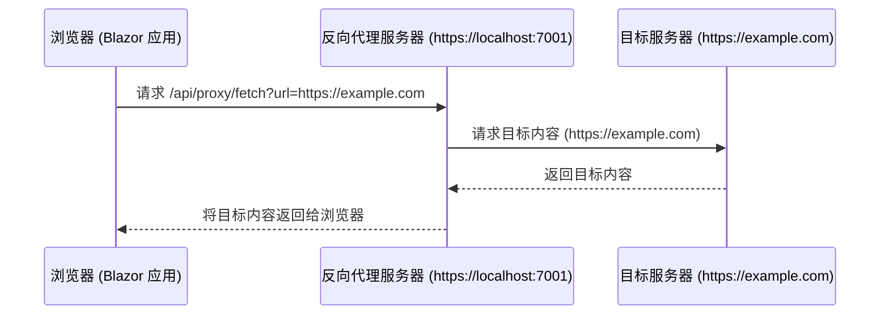

### 为什么反向代理可以解决 Same-Origin Policy 问题？

#### **1. 什么是 Same-Origin Policy（同源策略）？**
同源策略是浏览器的一种安全机制，用于防止不同源之间的页面进行不受限制的访问。它要求：
- **协议**、**域名**、**端口号**必须完全一致，才能共享资源。

例如：
- 页面 `https://example.com` 可以访问 `https://example.com/api/data`。
- 页面 `https://example.com` **不能直接访问** `https://another-domain.com/api/data`，因为它们的域名不同。

#### **2. 反向代理的原理**
反向代理是一种服务器功能，它作为客户端和目标服务器之间的中间层，接收客户端请求后，代替客户端向目标服务器发起请求，然后将目标服务器的响应返回给客户端。

使用反向代理时：
1. **浏览器的请求发给反向代理**，而不是直接发送给目标服务器。
2. **反向代理和目标服务器交互**，获取数据后再返回给浏览器。
3. 从浏览器的角度看，所有请求都是来自反向代理的域，因此浏览器认为这些请求是同源的。

#### **3. 为什么反向代理可以解决同源问题？**

**关键点：反向代理改变了请求的来源。**

举个例子：
- **正常请求**：
  - Blazor App：`https://localhost:5001`
  - 目标服务器：`https://another-domain.com`
  - 请求会触发同源策略限制，因为域名不同。

- **使用反向代理**：
  - 反向代理：`https://localhost:7001`
  - 目标服务器：`https://another-domain.com`
  - 浏览器向反向代理发起请求（同源：`localhost:7001`）。
  - 反向代理代替浏览器向目标服务器请求数据，然后将数据返回。
  - 浏览器认为数据来自 `localhost:7001`，绕过了同源策略。

---

#### **4. 反向代理的工作流程**
1. **客户端（Blazor 应用）发送请求**：
   - 用户在 Blazor 应用中访问 `https://localhost:7001/api/proxy/fetch?url=https://example.com`。

2. **反向代理接收请求**：
   - `ProxyController` 获取目标 URL (`https://example.com`) 的内容。

3. **反向代理向目标服务器发起请求**：
   - 使用服务器端的 `HttpClient` 向目标服务器 (`https://example.com`) 请求数据。

4. **返回数据给客户端**：
   - 将目标服务器返回的数据通过反向代理发送给客户端。

---

#### **5. 为什么浏览器不会阻止反向代理的响应？**
浏览器只检查请求的最终来源，而不关心反向代理的内部工作。
- 对于浏览器：
  - **请求发往：`https://localhost:7001`**（与 Blazor 应用同源）。
  - **响应来自：`https://localhost:7001`**，同样是同源的。

因此，反向代理在服务器端处理跨域问题，客户端完全透明。

---

#### **6. 反向代理的优势**
1. **解决跨域问题**：
   - 将跨域请求转换为同源请求。
2. **隐藏目标服务器**：
   - 客户端无法直接访问目标服务器，增加了一层安全性。
3. **灵活控制**：
   - 可以对目标服务器的响应进行修改、过滤或缓存。
4. **支持复杂场景**：
   - 即使目标服务器需要 VPN 访问，反向代理也可以通过服务器配置解决。

---

### **反向代理的工作流程**

### **图解说明**
1. **浏览器请求反向代理**：
   - 用户通过 iframe 或 API 请求，访问反向代理服务器的 `/api/proxy/fetch` 接口。
   - 请求包含 `url` 参数，指定目标服务器的地址。

2. **反向代理向目标服务器发起请求**：
   - 反向代理服务器使用 `HttpClient` 代替浏览器访问目标服务器（`https://example.com`）。
   - 由于此请求由服务器发出，不受浏览器同源策略的限制。

3. **目标服务器返回响应**：
   - 目标服务器处理请求，并将响应数据返回给反向代理。

4. **反向代理将响应传递给浏览器**：
   - 反向代理将目标服务器的数据传递回浏览器，浏览器认为数据来源于同源的反向代理。

#### **7. 总结**
反向代理通过充当中间层，将跨域请求转化为同源请求，从而绕过了浏览器的同源策略限制。这种方法安全、高效，并且在现代 Web 开发中非常常见。只要正确配置，反向代理可以在保持安全性的同时提供强大的跨域能力。
