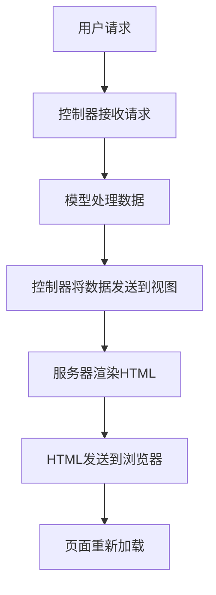
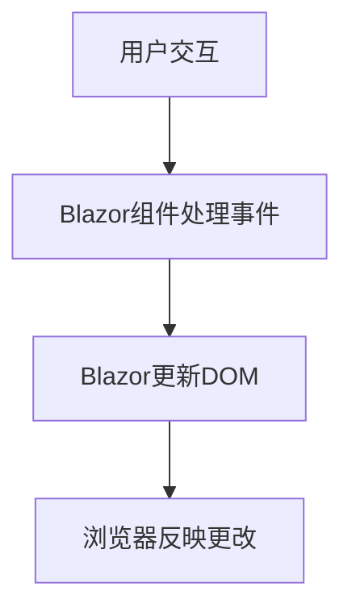

### MVC与Blazor的比较

以下是**C# .NET MVC（模型-视图-控制器）**与**C# .NET Blazor**的详细比较。

#### C# .NET MVC工作流程：

#### C# .NET Blazor工作流程：

---

### **比较表**

| **方面**                  | **C# .NET MVC**                                   | **C# .NET Blazor**                               |
|-----------------------------|-------------------------------------------------|-------------------------------------------------|
| **架构**                    | 遵循模型-视图-控制器模式。                       | 基于组件的架构（类似于单页应用）。               |
| **渲染**                    | 服务器端渲染HTML。                               | 客户端渲染（Blazor WebAssembly）或服务器端渲染（Blazor Server）。 |
| **使用的技术**              | 主要使用HTML、Razor视图和JavaScript。            | 使用C#进行逻辑和UI更新的Razor组件。            |
| **页面交互**                | 每次交互都需要服务器往返。                       | DOM实时更新，最小化服务器交互。                 |
| **性能**                    | 由于更新需要全页重新加载，性能较慢。             | 只应用必要的DOM更改，性能更快。                 |
| **客户端支持**              | 需要JavaScript进行客户端逻辑。                   | 可以使用C#处理客户端逻辑（减少JavaScript依赖）。 |
| **开发重点**                | 服务器端（C#）和前端（HTML/JavaScript）分离。   | 前端和后端统一使用C#开发。                       |
| **状态管理**                | 在服务器上管理或使用自定义解决方案。             | 内置状态管理（例如，`@State`和SignalR用于实时更新）。 |
| **可扩展性**                | 适合传统的服务器渲染应用。                       | 更适合现代、交互式单页应用（SPA）。              |
| **实时更新**                | 需要额外的框架，如SignalR或WebSockets。          | Blazor内置实时DOM更新（Blazor Server中集成SignalR）。 |
| **学习曲线**                | 对于熟悉MVC模式的人来说较容易。                 | 需要理解基于组件的架构和生命周期。               |

---

### **详细说明**

#### **C# .NET MVC**
1. **请求-响应模型**：
   - 用户请求通过控制器触发服务器端处理。
   - 数据通过模型获取/处理。
   - 服务器将HTML页面发送回浏览器，需要全页重新加载。

2. **关键特性**：
   - 结构化程度高，关注点分离明确。
   - 主要依赖服务器端逻辑。
   - 适合传统的基于表单的Web应用。

3. **挑战**：
   - 频繁的服务器往返增加延迟。
   - 没有JavaScript的情况下交互性有限。

---

#### **C# .NET Blazor**
1. **基于组件的开发**：
   - Blazor允许开发者使用C#和Razor语法构建可重用的UI组件。
   - 组件管理自己的状态和生命周期。

2. **实时更新**：
   - Blazor动态更新DOM，无需重新加载页面。
   - 使用Blazor WebAssembly时，逻辑完全在浏览器中运行。
   - Blazor Server使用SignalR进行客户端与服务器之间的实时通信。

3. **关键特性**：
   - 大多数客户端交互无需JavaScript。
   - 实现类似SPA的功能，使用全栈C#。

4. **挑战**：
   - Blazor Server需要持久的服务器连接（可能影响可扩展性）。
   - Blazor WebAssembly初始负载较大，因为它需要将.NET运行时下载到浏览器。

---

### **使用案例**

| **框架**               | **最适合的场景**                                                                  |
|------------------------|----------------------------------------------------------------------------------|
| **C# .NET MVC**        | 传统的、服务器驱动的Web应用，SEO和全页渲染很重要的场景。                        |
| **C# .NET Blazor**     | 现代的、交互式Web应用，具有SPA功能或实时更新的需求。                            |

---

### **结论**
- 使用**C# .NET MVC**的场景：
  - 需要高SEO支持的应用。
  - 更简单的服务器驱动架构。
- 使用**C# .NET Blazor**的场景：
  - 具有实时交互的单页应用（SPA）。
  - 需要客户端和服务器统一C#代码的应用。

Blazor非常适合现代化应用，而MVC仍然是传统Web开发的可靠选择。
