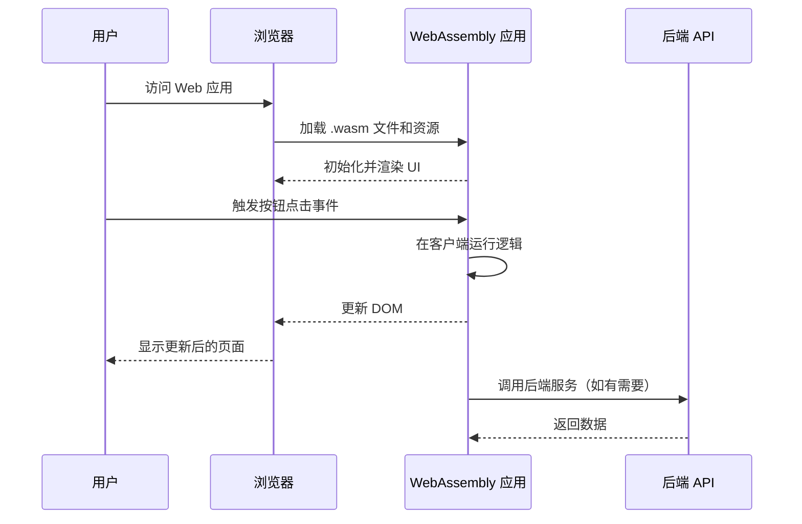

### **什么是 WebAssembly?**

**WebAssembly (缩写为 WASM)** 是一种现代的二进制格式，可用于在浏览器中运行高性能的代码。它被设计为跨平台的、紧凑的，并且支持多种编程语言（如 C、C++ 和 C#）的编译，从而在浏览器内执行接近本地性能的应用程序。

---

### **WebAssembly 的特点**

| 特点                | 说明                                                                 |
|---------------------|----------------------------------------------------------------------|
| **高性能**          | WebAssembly 通过二进制格式直接运行，速度接近原生应用程序的性能。         |
| **跨语言支持**      | 可通过多种语言（如 C、C++、Rust、C# 等）编译成 WebAssembly。            |
| **安全性**          | WebAssembly 在浏览器的沙盒环境中运行，具有较高的安全性。                |
| **可移植性**        | 支持主流浏览器（Chrome、Firefox、Safari、Edge）和多种操作系统。          |
| **与 JavaScript 互操作** | 可以与 JavaScript 紧密集成，共享数据和功能。                             |

---

### **WebAssembly 的工作流程**

1. **编译阶段**:
   - 开发者使用支持的编程语言（如 C++ 或 C#）编写代码。
   - 通过编译器（如 Emscripten 或 Blazor WebAssembly）将代码编译成 WebAssembly 二进制文件（`.wasm` 文件）。
   
2. **加载与执行**:
   - 浏览器加载 `.wasm` 文件，将其翻译成机器代码。
   - WebAssembly 代码运行在浏览器的沙盒环境中，并通过 JavaScript 调用或独立执行。

3. **与 DOM 和 JavaScript 交互**:
   - WebAssembly 可以调用 JavaScript 的功能，与 DOM 进行交互，从而完成前端功能。

---

### **WebAssembly 的优点**

| 优点               | 说明                                                                 |
|--------------------|----------------------------------------------------------------------|
| **性能优化**       | WebAssembly 是编译好的二进制文件，执行速度比 JavaScript 更快。          |
| **多语言支持**     | 支持将多种编程语言编译为 WebAssembly，方便开发者迁移现有代码。           |
| **低负载**         | 二进制文件比文本文件小，减少了网络传输的负载。                          |
| **易于集成**       | 与 JavaScript 无缝集成，可以复用现有的前端生态。                        |
| **跨平台性强**     | 只要是支持 WebAssembly 的浏览器或环境，就能运行相同的 `.wasm` 文件。     |

---

### **WebAssembly 的缺点**

| 缺点                  | 说明                                                                 |
|-----------------------|----------------------------------------------------------------------|
| **首次加载时间较长**  | 因为需要下载和编译 `.wasm` 文件，可能增加首次加载时间。                |
| **不支持复杂 DOM 操作**| WebAssembly 不擅长直接操作 DOM，需要通过 JavaScript 进行间接调用。       |
| **开发工具较少**       | 虽然生态在快速发展，但相比 JavaScript 的工具链仍然不够成熟。             |
| **调试困难**          | WebAssembly 是二进制格式，调试比直接调试 JavaScript 更复杂。            |

---

### **WebAssembly 的典型使用场景**

1. **性能关键型应用**:
   - 游戏引擎：高性能的 3D 游戏（如 Unity、Unreal）。
   - 视频编辑：基于浏览器的视频或音频处理。
   - 数据分析：运行复杂的算法或机器学习模型。
   
2. **现代 Web 应用**:
   - 使用 Blazor WebAssembly 的 C# 应用程序。
   - 替代 JavaScript 进行高性能计算部分。

3. **迁移遗留系统**:
   - 将现有 C++ 或 Java 程序迁移到 Web 端。

---

### **WebAssembly 和 JavaScript 的比较**

| 特性                  | **WebAssembly**                          | **JavaScript**                            |
|-----------------------|------------------------------------------|-------------------------------------------|
| **执行速度**          | 快（接近原生性能）。                     | 较慢（解释执行，依赖 JIT）。                 |
| **语言支持**          | 支持多种语言（C++、Rust、C# 等）。         | 仅支持 JavaScript。                        |
| **文件大小**          | 二进制文件，文件较小。                   | 文本文件，通常比 WebAssembly 文件大。        |
| **DOM 操作**          | 需要通过 JavaScript 间接操作。            | 原生支持 DOM 操作。                        |
| **调试**              | 较复杂（需要工具支持）。                  | 调试友好，浏览器内置开发工具支持。           |

---

### **WebAssembly 的未来**

随着 WebAssembly 的发展，它正在改变 Web 开发的格局。其潜力体现在：
1. **增强 Web 应用性能**：
   - 使 Web 应用在性能要求更高的场景下与原生应用竞争。
   
2. **拓展应用领域**：
   - 提供更多的语言选择，支持在浏览器中运行复杂的业务逻辑。

3. **与现有技术的协同**：
   - 与 JavaScript 和前端框架（如 React、Blazor）无缝结合，进一步丰富 Web 开发生态。

---

### **WebAssembly 的 C# 代码示例**

以下是使用 **Blazor WebAssembly** 的一个简单示例，展示如何构建一个计数器应用程序。

#### **代码示例**

1. **Counter.razor**  
   在 Blazor WebAssembly 中，每个页面都是一个 Razor 组件。

   ```csharp
   @page "/counter"

   <h1>计数器示例</h1>

   <p>当前计数：@currentCount</p>

   <button @onclick="IncrementCount">点击增加</button>

   @code {
       private int currentCount = 0;

       private void IncrementCount()
       {
           currentCount++;
       }
   }
   ```

   **解释**:
   - `@page "/counter"`: 定义该组件的 URL 路径。
   - `@currentCount`: 使用 C# 变量动态更新 UI。
   - `@onclick="IncrementCount"`: 绑定按钮点击事件，调用 `IncrementCount` 方法。

---

2. **Program.cs**  
   配置 Blazor WebAssembly 的入口点。

   ```csharp
   using Microsoft.AspNetCore.Components.Web;
   using Microsoft.AspNetCore.Components.WebAssembly.Hosting;
   using BlazorApp;

   var builder = WebAssemblyHostBuilder.CreateDefault(args);
   builder.RootComponents.Add<App>("#app");

   await builder.Build().RunAsync();
   ```

   **解释**:
   - `builder.RootComponents.Add<App>("#app")`: 将 `App.razor` 设置为应用的根组件。
   - `await builder.Build().RunAsync()`: 启动应用程序。

---

3. **App.razor**  
   定义应用程序的根组件，并设置路由。

   ```csharp
   <Router AppAssembly="@typeof(Program).Assembly">
       <Found Context="routeData">
           <RouteView RouteData="@routeData" DefaultLayout="@typeof(MainLayout)" />
       </Found>
       <NotFound>
           <h1>页面未找到</h1>
       </NotFound>
   </Router>
   ```

   **解释**:
   - `<Router>`: 定义路由规则，用于根据 URL 加载对应的组件。
   - `<NotFound>`: 处理未找到的页面。

---

### **WebAssembly 的交互流程**

以下是 WebAssembly 在浏览器中的交互流程，用于处理用户事件并更新 UI。



---

### **Mermaid 图解说明**

1. **加载过程**:
   - 用户访问应用时，浏览器加载 WebAssembly 二进制文件（`.wasm`）。
   - WebAssembly 初始化后，渲染初始的用户界面。

2. **用户交互**:
   - 用户触发事件（如点击按钮）。
   - WebAssembly 在浏览器中运行逻辑，处理事件，并通过 DOM 更新 UI。

3. **后端交互（可选）**:
   - 如果需要，WebAssembly 可调用后端 API 以获取或更新数据。
   - API 返回的数据被处理后，应用进一步更新用户界面。

---

### **总结**

通过以上代码示例和流程图可以看到，**Blazor WebAssembly** 应用的核心在于将应用逻辑和渲染过程移至客户端，从而实现高性能的用户交互。其特点包括：
1. **无需依赖 JavaScript**：C# 直接控制 DOM 更新。
2. **快速交互**：由于逻辑运行在客户端，用户体验流畅。
3. **与后端协同**：仅在必要时调用后端，减少服务器负载。

WebAssembly 是构建现代 Web 应用的重要工具，特别是在需要高性能和复杂业务逻辑的场景下。

### **总结**

WebAssembly 是一种高效、安全、跨平台的技术，特别适合需要高性能和多语言支持的 Web 应用。尽管它目前还有一些限制，但随着工具链的完善和生态的扩展，WebAssembly 将成为现代 Web 开发的重要组成部分。
