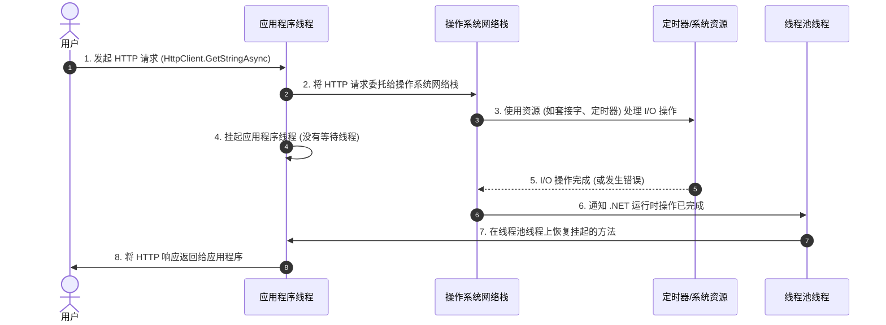

### **解释以下内容：**

> *"HTTP 请求由操作系统的网络栈处理。一旦请求完成，执行将在线程池线程上恢复。"*

---

### **这句话的含义**

1. **HTTP 请求由操作系统处理**：
   - 当你使用异步方法（如 `HttpClient.GetStringAsync`）发起 HTTP 请求时，实际的请求处理并不是由你的应用程序线程负责。
   - **操作系统的网络栈**（如低级网络 API）负责发送请求并等待响应。
   - 在此期间，没有任何 .NET 线程处于等待状态，这极大地减少了资源占用。

2. **异步 I/O 操作**：
   - I/O 操作（如发送 HTTP 请求并接收响应）是异步的，由操作系统通过网络栈完成。
   - 这种机制依赖于系统资源（如套接字和定时器），而不是占用线程。

3. **在线程池线程上恢复**：
   - 当请求完成（或者发生错误）时，操作系统会通知 .NET 运行时操作已完成。
   - 被挂起的异步方法将通过 **线程池线程** 恢复执行。

---

### **为什么这样设计效率高？**

- 线程是**昂贵的**系统资源。
- 在等待 HTTP 响应期间：
  - **没有线程被阻塞**，因为异步操作不会占用线程。
  - 被释放的线程池线程可以处理其他任务，从而提高应用程序的并发能力和性能。

---



---

### **流程说明**

1. **步骤 1**：
   - 用户通过异步方法（如 `HttpClient.GetStringAsync`）发起 HTTP 请求。
   - 应用线程开始处理此操作。

2. **步骤 2**：
   - 应用线程将 HTTP 请求交给 **操作系统网络栈**。
   - 网络栈接管发送请求和等待响应的工作。

3. **步骤 3**：
   - **操作系统网络栈** 使用资源（如套接字和定时器）异步管理 I/O 操作。

4. **步骤 4**：
   - 应用线程在 `await` 处被 **挂起**，不再占用线程。
   - 这大幅减少资源消耗，线程被释放供其他任务使用。

5. **步骤 5**：
   - 定时器或系统资源完成 I/O 操作后，通知操作系统网络栈响应已准备好或出现错误。

6. **步骤 6**：
   - 操作系统网络栈通知 .NET 运行时，异步操作已完成。

7. **步骤 7**：
   - 被挂起的异步方法通过 **线程池线程** 恢复执行。

8. **步骤 8**：
   - 应用线程继续处理响应并将结果返回给用户。

---

### **关键点**

- **操作系统负责处理请求**：
  - HTTP 请求由 **操作系统网络栈** 处理，而不是 .NET 应用程序线程。

- **资源效率**：
  - 在等待期间，没有 .NET 线程被阻塞。

- **线程池恢复**：
  - 请求完成后，挂起的异步方法通过线程池中的线程恢复执行。

---

此时序图展示了 C# 中使用 **`async/await`** 处理 HTTP 请求时的高效机制，以及如何通过操作系统和线程池协同工作来减少资源消耗，提高应用程序性能。

---
### **代码示例**

```csharp
using System;
using System.Net.Http;
using System.Threading;
using System.Threading.Tasks;

class Program
{
    static async Task Main(string[] args)
    {
        Console.WriteLine($"1. 主线程开始执行，线程ID: {Thread.CurrentThread.ManagedThreadId}");

        using var client = new HttpClient();

        // 发起异步 HTTP 请求
        var result = await client.GetStringAsync("https://www.example.com");

        Console.WriteLine($"2. 响应收到，线程ID: {Thread.CurrentThread.ManagedThreadId}");
    }
}
```

---

### **背后的工作原理**

1. **步骤 1**：
   - 方法在 **主线程**（例如线程 ID: 1）上启动。
   - 调用 `HttpClient.GetStringAsync` 发起 HTTP 请求。

2. **步骤 2**：
   - HTTP 请求被交给操作系统的 **网络栈** 处理。
   - 方法在 `await` 处被挂起，主线程被**释放回线程池**，以供其他任务使用。

3. **步骤 3**：
   - 网络栈处理请求，例如建立连接、发送数据和等待响应。

4. **步骤 4**：
   - 当响应准备好时，操作系统网络栈通知 .NET 运行时操作完成。
   - .NET 在 **线程池线程**（例如线程 ID: 4）上恢复挂起的异步方法。

---

### **示例输出**

```
1. 主线程开始执行，线程ID: 1
2. 响应收到，线程ID: 4
```

---

### **为什么会发生线程切换**

- 在 `await` 期间，任务被挂起并释放当前线程。
- 当操作完成时，.NET 不一定需要恢复到原线程，除非存在同步上下文（例如 UI 应用程序）。
- 任务恢复时，会分配线程池中的可用线程（例如线程 ID: 4）继续执行，优化资源利用。

---

### **可视化流程**

| **步骤**                       | **处理方**                  | **线程使用**                              |
|--------------------------------|----------------------------|-------------------------------------------|
| 发起 HTTP 请求                 | .NET 和操作系统网络栈       | 主线程启动任务，然后释放回线程池。         |
| 等待 HTTP 响应                 | 操作系统网络栈              | 等待期间没有线程被占用。                   |
| HTTP 响应准备就绪（完成）      | 操作系统通知 .NET 运行时    | 线程池线程继续执行异步方法。               |

---

### **关键点总结**

1. **没有线程阻塞**：
   - 在处理 HTTP 请求时，没有线程被阻塞，异步 I/O 操作完全由操作系统管理。

2. **资源高效利用**：
   - 在异步等待期间，线程被释放，提升了程序的扩展能力。

3. **线程池恢复**：
   - 请求完成后，.NET 使用线程池中的线程恢复执行挂起的任务。

这种设计使得 C# 应用程序能够高效处理大量 I/O 任务，提升了应用程序的响应能力和性能。
