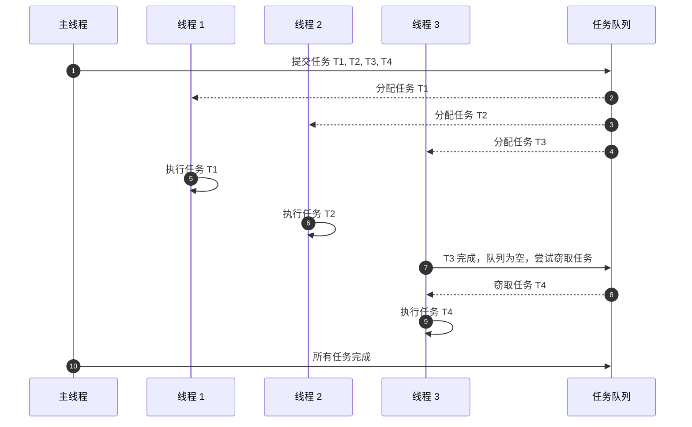

### **TPL 使用线程池 (ThreadPool) 和工作窃取算法 (Work-Stealing Algorithm)**

---

### **为什么 TPL 使用线程池和工作窃取算法**

#### **1. 线程池的优势**
- **线程复用**：
  - 创建和销毁线程的开销很高。线程池通过复用线程避免频繁的线程创建和销毁，提高性能。
- **自动管理**：
  - 线程池根据系统资源（如 CPU 核心数）动态调整线程数量，避免线程过多导致系统负载过高。
- **任务调度**：
  - 线程池通过任务队列和调度器优化线程分配，确保高效利用资源。

#### **2. 工作窃取算法的优势**
- **负载平衡**：
  - 如果某些线程处理的任务较少，而其他线程任务繁重，工作窃取算法允许空闲线程“窃取”其他线程的任务，避免资源浪费。
- **提高并行效率**：
  - 通过动态调整任务分配，减少线程等待时间，提高整体并行效率。

---

### **工作原理：线程池和工作窃取算法**

#### **1. 线程池的工作机制**
1. **任务队列**：
   - 所有提交到 TPL 的任务会先放入一个任务队列。
   - 线程池中的线程从任务队列中取出任务并执行。
2. **动态线程管理**：
   - 根据任务负载和系统资源（如 CPU 核心数），线程池动态增加或减少线程数量。
3. **线程复用**：
   - 线程完成任务后不会销毁，而是等待新的任务，提高性能。

#### **2. 工作窃取算法的工作机制**
1. **每个线程有自己的任务队列**：
   - 每个线程从自己的任务队列中取出任务进行处理。
2. **空闲线程会“窃取”任务**：
   - 如果某个线程完成了自己的任务且队列为空，它会从其他线程的任务队列中“窃取”任务。
3. **任务分配动态调整**：
   - 被窃取的任务通常是较轻的任务，确保负载均衡。

---

### **使用线程池和工作窃取算法的场景**

- **CPU 密集型任务**：
  - 如数学计算或数据处理，利用多核 CPU 提高处理速度。
- **I/O 密集型任务**：
  - 如文件读写或网络请求，线程池可以减少线程阻塞，提高任务吞吐量。
- **高并发任务**：
  - 同时处理大量独立的任务（如 Web 请求或批量任务处理）。

---

### **Mermaid 时序图：线程池和工作窃取算法的工作流程**

以下时序图展示了线程池如何处理任务，并在需要时通过工作窃取算法实现负载均衡。



---

### **代码示例：演示线程池和工作窃取的行为**

```csharp
using System;
using System.Threading;
using System.Threading.Tasks;

class Program
{
    static void Main()
    {
        Parallel.For(0, 10, i =>
        {
            Console.WriteLine($"任务 {i} 由线程 {Thread.CurrentThread.ManagedThreadId} 执行");
            Thread.Sleep(500); // 模拟工作
        });

        Console.WriteLine("所有任务完成");
    }
}
```

**示例输出**（线程可能会变化）：
```
任务 0 由线程 4 执行
任务 1 由线程 5 执行
任务 2 由线程 6 执行
任务 3 由线程 7 执行
任务 4 由线程 4 执行
...
所有任务完成
```

**解释**：
1. 任务被线程池中的线程分配执行。
2. 线程复用：完成一个任务后线程继续处理新的任务。
3. 工作窃取：如果某些线程空闲，会从其他线程的任务队列中窃取任务。

---

### **总结**

1. **线程池的作用**：
   - 高效地管理和复用线程，减少线程创建和销毁的开销。
2. **工作窃取算法的作用**：
   - 动态平衡负载，确保所有线程均匀分配任务，提高并行效率。
3. **优势**：
   - 自动化管理，开发者无需手动控制线程，减少编程复杂性。
   - 提高多核 CPU 的利用率，提升程序性能。

通过了解线程池和工作窃取算法的原理，可以更好地利用 TPL 编写高效的并行程序。
