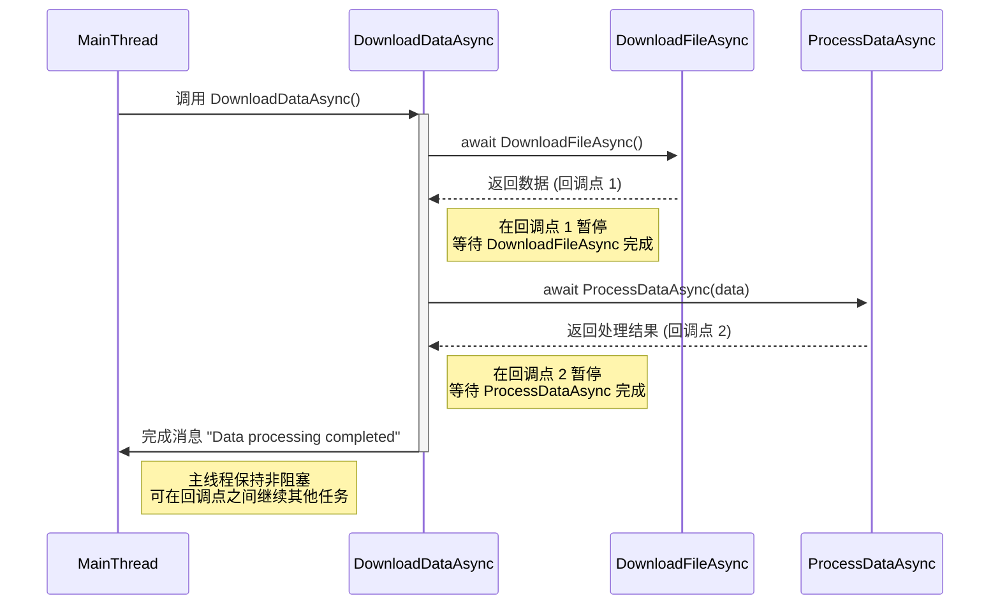

### Task-Based Asynchronous Programming

**Task-Based Asynchronous Programming (TAP)** is a programming model in C# that uses `Task` and `Task<TResult>` to represent asynchronous operations. TAP simplifies handling of asynchronous programming by providing a structure for non-blocking operations using `async` and `await` keywords.

#### TAP 基本概念
1. **Task**：`Task` 是异步操作的核心对象，用于表示操作的结果，成功时包含执行结果，失败时包含异常信息。
2. **async / await**：`async` 标记一个方法为异步方法，`await` 用于等待异步操作完成。使用这两个关键字可以让异步代码更简洁易读。

#### TAP 的优点
- **易读性**：异步代码结构上类似于同步代码，使代码更加直观、易于维护。
- **性能**：通过非阻塞方式执行任务，可以减少上下文切换，适合 I/O 密集型任务。
- **异常处理**：TAP 提供了良好的异常处理机制，异常会被传递到 `Task` 中，可以在调用方捕获。

#### 示例：使用 Task-Based Asynchronous Programming
```csharp
using System;
using System.Net.Http;
using System.Threading.Tasks;

class Program
{
    static async Task Main()
    {
        Console.WriteLine("Fetching data...");
        string result = await FetchDataAsync("https://jsonplaceholder.typicode.com/posts/1");
        Console.WriteLine($"Fetched data: {result}");
    }

    static async Task<string> FetchDataAsync(string url)
    {
        using HttpClient client = new HttpClient();
        HttpResponseMessage response = await client.GetAsync(url);
        response.EnsureSuccessStatusCode();
        return await response.Content.ReadAsStringAsync();
    }
}
```

**解释**：
1. `FetchDataAsync` 方法定义为异步方法，通过 `HttpClient` 异步请求数据。
2. `await client.GetAsync(url)` 让程序在请求未完成时继续执行其他任务，避免阻塞主线程。
3. 最终返回的 `result` 在 `Main` 方法中被打印。

#### TAP 的工作原理
- **异步链式调用**：每个 `await` 调用会创建一个回调点，将方法分成多个执行阶段，不会阻塞主线程。
- **任务完成时**：程序继续执行下一步，形成“异步任务链”，可以高效处理 I/O 操作。

#### 使用场景
1. **I/O 密集型任务**：如文件读写、网络请求等，适合使用异步编程提高性能。
2. **用户界面程序**：在 UI 程序中避免阻塞主线程，保证界面响应性。
3. **并行处理**：多个独立的异步任务可以并行处理，提高处理效率。

#### 任务并行示例
TAP 支持任务的并行执行，可以通过 `Task.WhenAll` 或 `Task.WhenAny` 等方法来管理多个异步任务。

```csharp
using System;
using System.Threading.Tasks;

class Program
{
    static async Task Main()
    {
        Task<int> task1 = DoWorkAsync(1, 1000);
        Task<int> task2 = DoWorkAsync(2, 2000);
        Task<int> task3 = DoWorkAsync(3, 3000);

        int[] results = await Task.WhenAll(task1, task2, task3);

        Console.WriteLine("All tasks completed:");
        foreach (var result in results)
        {
            Console.WriteLine($"Task result: {result}");
        }
    }

    static async Task<int> DoWorkAsync(int id, int delay)
    {
        Console.WriteLine($"Task {id} starting...");
        await Task.Delay(delay); // 模拟耗时操作
        Console.WriteLine($"Task {id} completed.");
        return id;
    }
}
```

**解释**：
- 通过 `Task.WhenAll` 并行执行多个任务，使 `task1`、`task2` 和 `task3` 同时运行。
- `await Task.WhenAll(task1, task2, task3)` 等待所有任务完成后返回结果。

#### 总结
Task-Based Asynchronous Programming 是 C# 中强大且灵活的异步编程模型，通过 `async` 和 `await` 简化了异步代码的编写，减少了传统回调嵌套的问题，使代码更易于阅读和维护。

---

**深入理解**：

在异步编程中，`await` 的作用是暂停方法的执行，等待异步操作完成再继续往下执行。具体来说，`await` 调用时会创建一个 **回调点**，将整个方法划分成多个 **执行阶段**。这种划分的关键在于不阻塞主线程的运行，从而实现程序的流畅和高效。

### 详细解释
1. **创建回调点**：
   - 当程序遇到 `await` 时，异步方法并不会立即继续执行，而是会在当前的执行位置创建一个“回调点”。这个回调点相当于一个“标记”，表示程序在此等待异步操作完成。
   - 回调点记录了当前方法的执行状态、变量等信息，以便异步操作完成后可以回到这个点继续执行。

2. **分成多个执行阶段**：
   - 一个方法在遇到 `await` 时会暂停下来，等待异步任务完成。当异步任务完成后，程序会回到该回调点并继续执行剩余的代码。这种暂停与继续的机制实际上将一个方法分割成了多个“执行阶段”。
   - 每个 `await` 语句使得程序可以在不阻塞其他代码的情况下暂停执行，而这种分阶段的执行能够避免复杂的线程管理问题。

3. **不阻塞主线程**：
   - 因为 `await` 是非阻塞的，当一个方法暂停在某个 `await` 调用时，主线程可以继续执行其他任务，不会因为等待而卡住。
   - 这意味着异步方法的等待时间不会占用主线程资源，尤其适合于需要处理大量 I/O 操作的场景，比如网络请求和文件读写。

### 实例理解

假设有一个异步方法 `DownloadDataAsync()`，它包含两个 `await` 操作来分别下载数据并进行处理：

```csharp
async Task DownloadDataAsync()
{
    var data = await DownloadFileAsync(); // 第一个 await 创建回调点 1
    var result = await ProcessDataAsync(data); // 第二个 await 创建回调点 2
    Console.WriteLine("Data processing completed.");
}
```

- **回调点 1**：`await DownloadFileAsync()` 处创建第一个回调点，方法暂停执行，等待文件下载完成。此时，主线程不会阻塞，可以继续处理其他任务。
- **回调点 2**：当文件下载完成后，`DownloadDataAsync` 方法从回调点 1 恢复执行，进入下一步的 `await ProcessDataAsync(data)`。此时又创建了回调点 2，方法再次暂停等待数据处理完成。
- **继续执行**：当所有异步操作完成后，程序回到最后一个回调点，执行 `Console.WriteLine("Data processing completed.");` 打印消息。

### 深入理解的好处
这种分阶段执行方式能够让方法像处理同步代码一样编写和读取，而不需要繁杂的回调嵌套。`await` 的回调机制让代码结构更加清晰，同时提升了程序的响应性，是 C# 异步编程中的重要机制。

### 总结
`await` 通过创建回调点实现了非阻塞的异步处理，将方法分割为多个执行阶段，确保主线程可以继续执行其他任务，提高了程序的性能与可读性。

---

一个 ** 序列图**可以很好地展示 `await` 如何创建回调点以及方法如何分阶段恢复执行，让主线程可以继续处理其他任务。



### 图解说明

1. **方法开始**：
   - `主线程`调用 `DownloadDataAsync`。方法开始在一个独立的线程上执行，但在每个 `await` 点暂停，以便主线程保持非阻塞。

2. **第一个回调点**：
   - `DownloadDataAsync` 在调用 `DownloadFileAsync()` 时遇到第一个 `await`，此时创建**回调点 1**。
   - 此时，方法等待 `DownloadFileAsync` 完成，但不会阻塞 `主线程`。

3. **恢复执行**：
   - 当 `DownloadFileAsync` 完成后，`DownloadDataAsync` 从**回调点 1**恢复执行，继续调用 `ProcessDataAsync`。

4. **第二个回调点**：
   - `DownloadDataAsync` 遇到另一个 `await`，即 `ProcessDataAsync(data)`，创建了**回调点 2**。
   - 方法再次暂停，等待 `ProcessDataAsync` 完成，同时 `主线程`仍可处理其他任务。

5. **最终完成**：
   - 在 `ProcessDataAsync` 完成后，`DownloadDataAsync` 从**回调点 2**恢复，打印“Data processing completed.”，标志方法的完成。

### 总结
此序列图展示了 `await` 的**非阻塞**行为，显示了每个 `await` 点如何创建一个回调阶段。分阶段的非阻塞执行使主线程能够继续处理其他任务，突显了基于任务的异步编程 (TAP) 的效率和响应性。
