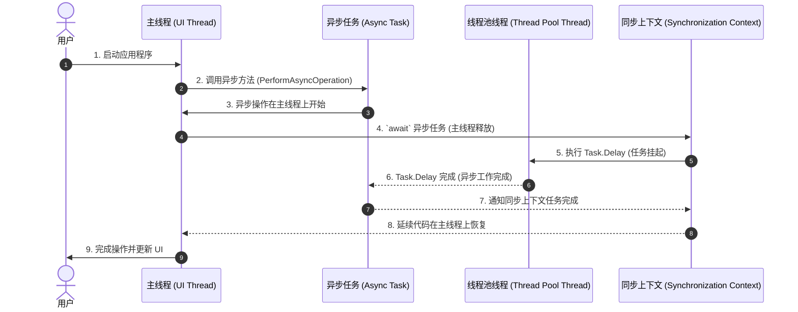
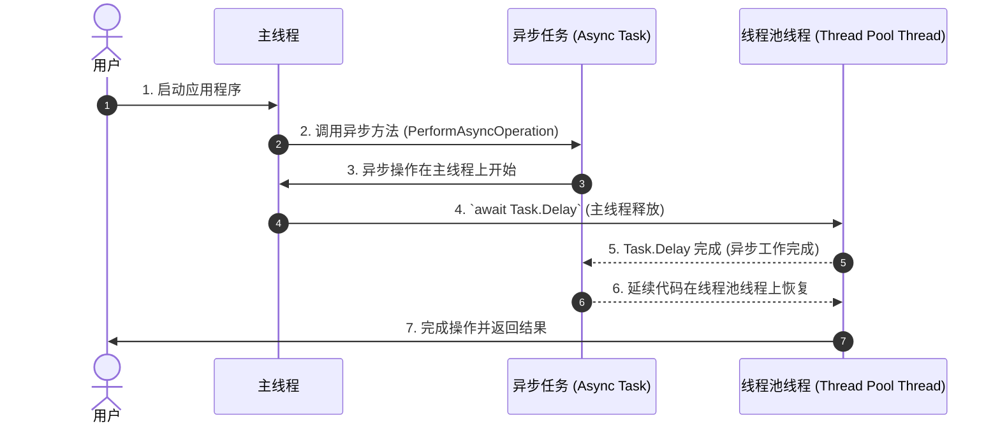
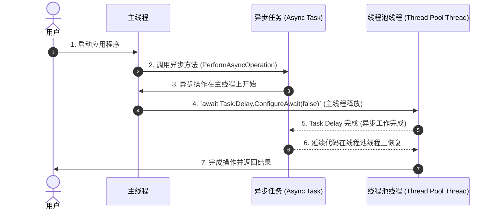

### **`Await` 和同步上下文（Synchronization Context）**

在 C# 中，**`await`** 会与 **同步上下文（Synchronization Context）** 交互，决定 `await` 之后的代码（即**延续代码**）在哪个线程上执行。这种机制对于需要线程关联的应用（如 WPF、Windows Forms 或 ASP.NET）非常重要，因为它确保在正确的线程上更新 UI 或处理请求。

---

### **什么是同步上下文？**

- **同步上下文** 是一种抽象，它管理代码的执行位置（线程）。
- 它可以确保延续代码在特定的线程或上下文中执行，例如：
  - 在 UI 应用程序中，确保延续代码在 UI 线程上运行。
  - 在 ASP.NET 中，确保延续代码在处理请求的同一线程上运行。

---

### **`Await` 和同步上下文的交互方式**

1. **UI 应用程序（WPF、Windows Forms）**：
   - 当 `await` 一个任务时，**同步上下文** 确保延续代码在原始线程（例如 UI 线程）上运行。
   - 这样可以安全地更新 UI 组件。

2. **ASP.NET 应用程序**：
   - **同步上下文** 确保延续代码在处理相同请求的线程上运行。

3. **控制台应用程序**：
   - 默认情况下，没有 **同步上下文**，延续代码会在线程池线程上执行。

---

### **示例：同步上下文的作用**

#### **WPF 示例（UI 同步上下文）**

```csharp
using System;
using System.Threading;
using System.Threading.Tasks;

class Program
{
    static async Task Main()
    {
        Console.WriteLine($"Main started on thread {Thread.CurrentThread.ManagedThreadId}");

        await PerformAsyncOperation();

        // 延续代码在 UI 线程上执行
        Console.WriteLine($"Continuation on thread {Thread.CurrentThread.ManagedThreadId}");
    }

    static async Task PerformAsyncOperation()
    {
        Console.WriteLine($"PerformAsyncOperation started on thread {Thread.CurrentThread.ManagedThreadId}");

        await Task.Delay(1000); // 模拟异步操作

        Console.WriteLine($"PerformAsyncOperation resumed on thread {Thread.CurrentThread.ManagedThreadId}");
    }
}
```

---

### **输出说明**

```
Main started on thread 1
PerformAsyncOperation started on thread 1
PerformAsyncOperation resumed on thread 1
Continuation on thread 1
```

- **线程 1（UI 线程）**：
  - 方法在 UI 线程上开始执行。
  - `await Task.Delay` 后，由于存在同步上下文，方法恢复并在相同线程（线程 ID: 1）上继续执行。

---

### **控制台应用程序和线程池线程**

在控制台应用程序中，没有同步上下文，因此 `await` 后的延续代码可能在线程池线程上执行。

#### **示例：没有同步上下文**

```csharp
using System;
using System.Threading;
using System.Threading.Tasks;

class Program
{
    static async Task Main()
    {
        Console.WriteLine($"Main started on thread {Thread.CurrentThread.ManagedThreadId}");

        await PerformAsyncOperation();

        // 延续代码在线程池线程上执行
        Console.WriteLine($"Continuation on thread {Thread.CurrentThread.ManagedThreadId}");
    }

    static async Task PerformAsyncOperation()
    {
        Console.WriteLine($"PerformAsyncOperation started on thread {Thread.CurrentThread.ManagedThreadId}");

        await Task.Delay(1000); // 模拟异步操作

        Console.WriteLine($"PerformAsyncOperation resumed on thread {Thread.CurrentThread.ManagedThreadId}");
    }
}
```

---

### **输出说明**

```
Main started on thread 1
PerformAsyncOperation started on thread 1
PerformAsyncOperation resumed on thread 4
Continuation on thread 4
```

- **线程 1**：
  - 方法在主线程上启动。
- **线程 4**：
  - `await Task.Delay` 后，延续代码在线程池线程上恢复执行。

---

### **使用 `ConfigureAwait(false)`**

- 在库代码中，或者在不需要线程关联的场景下，可以使用 **`ConfigureAwait(false)`**，以避免捕获同步上下文。
- 这样可以减少返回到原始上下文的开销，从而提高性能。

#### **示例：使用 `ConfigureAwait(false)`**

```csharp
using System;
using System.Threading;
using System.Threading.Tasks;

class Program
{
    static async Task Main()
    {
        Console.WriteLine($"Main started on thread {Thread.CurrentThread.ManagedThreadId}");

        await PerformAsyncOperation().ConfigureAwait(false);

        // 延续代码在线程池线程上执行
        Console.WriteLine($"Continuation on thread {Thread.CurrentThread.ManagedThreadId}");
    }

    static async Task PerformAsyncOperation()
    {
        Console.WriteLine($"PerformAsyncOperation started on thread {Thread.CurrentThread.ManagedThreadId}");

        await Task.Delay(1000).ConfigureAwait(false);

        Console.WriteLine($"PerformAsyncOperation resumed on thread {Thread.CurrentThread.ManagedThreadId}");
    }
}
```

---

### **输出说明**

```
Main started on thread 1
PerformAsyncOperation started on thread 1
PerformAsyncOperation resumed on thread 4
Continuation on thread 4
```

- 使用 `ConfigureAwait(false)` 后，`await` 之后的代码不会捕获同步上下文，因此延续代码在线程池线程上执行，而不是原始线程。

---

### **最佳实践**

| **场景**                | **建议**                                                                    |
|-------------------------|-----------------------------------------------------------------------------|
| **UI 应用程序**         | 避免使用 `ConfigureAwait(false)`，以确保延续代码在原始线程上运行，安全更新 UI。 |
| **库代码**              | 使用 `ConfigureAwait(false)`，避免不必要的上下文捕获，提高性能。              |
| **ASP.NET 应用程序**    | 尽量减少上下文切换以提高性能。                                               |

---

### **关键点总结**

1. **同步上下文**：
   - 确保延续代码在特定的上下文（如 UI 线程或请求处理线程）中执行。

2. **控制台应用程序**：
   - 没有同步上下文，延续代码通常在线程池线程上执行。

3. **`ConfigureAwait(false)`**：
   - 可选择不捕获同步上下文，在不需要线程关联的场景下使用。

---

以下是基于 **`await`**、**同步上下文（Synchronization Context）** 和线程交互。

### **同步上下文存在（UI 应用程序）**



---

### **流程说明**

1. **步骤 1**：
   - 用户启动应用程序，程序在 **主线程（UI 线程）** 上运行。

2. **步骤 2**：
   - 主线程调用异步方法 (`PerformAsyncOperation`)。

3. **步骤 3**：
   - 异步任务开始在主线程上执行，输出当前线程 ID。

4. **步骤 4**：
   - 遇到 `await Task.Delay`，主线程被 **释放**，用于处理其他任务，避免线程阻塞。

5. **步骤 5**：
   - 同步上下文将延迟操作分配给 **线程池线程**，模拟异步操作。

6. **步骤 6**：
   - **线程池线程** 完成延迟操作并通知异步任务。

7. **步骤 7**：
   - 异步任务通过 **同步上下文** 通知主线程延续代码可以恢复。

8. **步骤 8**：
   - 同步上下文将延续代码分配回 **主线程（UI 线程）**，确保线程安全。

9. **步骤 9**：
   - 主线程完成操作，例如更新 UI，并将控制权交还给用户。

---

### **没有同步上下文（控制台应用程序）**



---

### **关键区别**

| **场景**                   | **延续代码执行位置**                | **线程行为**                           |
|----------------------------|-------------------------------------|----------------------------------------|
| **UI 应用程序**            | 在 **主线程** (UI Thread) 上恢复       | 确保线程关联以安全更新 UI。             |
| **控制台应用程序**          | 在线程池线程 (Thread Pool Thread) 上恢复 | 无同步上下文，无线程关联性。             |
| **使用 `ConfigureAwait(false)`** | 在线程池线程 (Thread Pool Thread) 上恢复 | 避免捕获同步上下文，优化性能。           |

---

### **`ConfigureAwait(false)` 示例**



- **特点**：
  - 使用 `ConfigureAwait(false)` 避免捕获同步上下文。
  - 延续代码在线程池线程上执行，而不是返回原始线程。

---

### **总结**

这些时序图展示了 **`await`** 与 **同步上下文** 和线程交互的工作机制：

- 在 UI 应用程序中，**同步上下文** 确保延续代码安全地在原始线程上运行。
- 在没有同步上下文（如控制台应用程序）时，延续代码通常在线程池线程上执行。
- 使用 **`ConfigureAwait(false)`** 可以避免上下文捕获，从而优化性能，但应谨慎使用于需要线程关联的场景（如 UI 应用程序）。

理解这些交互对编写高效、线程安全的异步代码至关重要。

---

### **总结**

`Await` 和 **同步上下文** 在异步编程中起到了关键作用：
- 确保线程安全和上下文关联性（如 UI 更新）。
- 在不需要上下文的场景中，可以通过 `ConfigureAwait(false)` 提升性能。

理解其工作机制有助于编写高效且可维护的异步代码。
