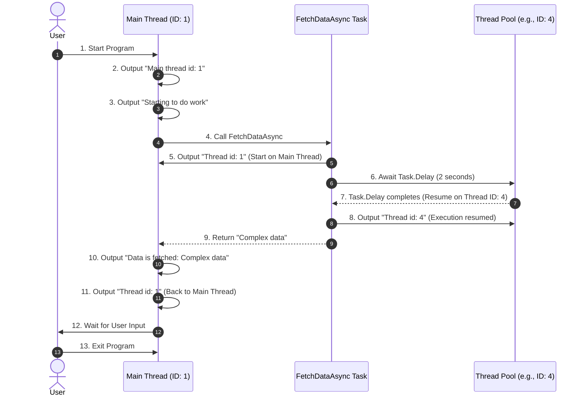

### **代码逐行注释（中文）**
以下代码展示了一个异步操作流程，并分析了执行线程的变化。代码的输出反映了异步任务的运行机制。

```csharp
using System;
using System.Threading;
using System.Threading.Tasks;

class Program
{
    // 程序的入口点
    static async Task Main(string[] args)
    {
        // 输出主线程的 ID，表明主线程启动了程序
        Console.WriteLine($"1. Main thread id:{Thread.CurrentThread.ManagedThreadId}");

        // 表示任务开始
        Console.WriteLine("Starting to do work.");
        
        // 异步调用 FetchDataAsync 方法，等待其完成
        var data = await FetchDataAsync();

        // 当 FetchDataAsync 完成后，继续执行并输出获取到的数据
        Console.WriteLine($"Data is fetched: {data}");

        // 再次输出当前线程的 ID，观察线程是否发生变化
        Console.WriteLine($"2. Thread id:{Thread.CurrentThread.ManagedThreadId}");

        // 提示用户按回车键退出程序
        Console.WriteLine("Press enter to exit.");
        Console.ReadLine();
    }

    // 一个异步方法，模拟数据的获取
    static async Task<string> FetchDataAsync()
    {
        // 输出当前线程的 ID，表明方法运行时的线程
        Console.WriteLine($"3. Thread id:{Thread.CurrentThread.ManagedThreadId}");

        // 异步等待 2 秒，模拟耗时操作
        await Task.Delay(2000);

        // 输出当前线程的 ID，观察异步等待后是否切换了线程
        Console.WriteLine($"4. Thread id:{Thread.CurrentThread.ManagedThreadId}");

        // 返回一个字符串，表示获取到的数据
        return "Complex data";
    }
}
```

---

### **代码执行结果及原因分析**

#### **代码执行结果（输出可能会有所不同，线程 ID 是动态分配的）：**
```
1. Main thread id:1
Starting to do work.
3. Thread id:1
4. Thread id:4
Data is fetched: Complex data
2. Thread id:1
Press enter to exit.
```

#### **结果分析：**

1. **`Main` 方法的执行**：
   - 程序开始时，`Main` 方法运行在主线程（线程 ID 为 1）。
   - 输出了 `1. Main thread id:1` 和 `Starting to do work.`。

2. **调用 `FetchDataAsync`**：
   - `FetchDataAsync` 方法在主线程中启动，输出 `3. Thread id:1`。
   - 遇到 `await Task.Delay(2000)` 后，任务被挂起，主线程被释放以执行其他任务。

3. **异步恢复**：
   - `Task.Delay(2000)` 模拟异步等待 2 秒，此时线程池可能分配一个不同的线程（例如线程 ID 为 4）来恢复任务。
   - 输出 `4. Thread id:4` 表明恢复后的任务在不同的线程中运行。

4. **返回主线程**：
   - `FetchDataAsync` 返回结果后，程序回到 `Main` 方法的上下文。
   - 输出 `Data is fetched: Complex data` 和 `2. Thread id:1`，显示程序继续运行在主线程中。

5. **程序结束**：
   - 等待用户输入，程序结束。

---



### **Explanation of the Sequence Diagram**

1. **Initialization**:
   - The program starts on the main thread (Thread ID: 1), and outputs the thread ID and the start message.

2. **Asynchronous Call**:
   - The `Main` method calls `FetchDataAsync`, which starts on the main thread and outputs `Thread id: 1`.

3. **Task Suspension**:
   - The `await Task.Delay(2000)` suspends the task, releasing the main thread.
   - The delay is handled by the thread pool, and the main thread is free to handle other operations.

4. **Task Resumption**:
   - After the delay, the task resumes on a thread from the thread pool (Thread ID: 4).
   - It outputs the resumed thread ID before returning the result (`Complex data`).

5. **Return to Main Context**:
   - The program resumes execution in the `Main` method’s original context (Main Thread ID: 1).
   - It outputs the fetched data and the current thread ID.

6. **Program Exit**:
   - The program waits for user input before exiting.

This sequence highlights **how asynchronous tasks work, suspend, resume, and return to their original context** in C#.

---

### **关键点总结**

1. **异步与线程切换**：
   - `await` 使任务可以暂停并释放线程。
   - 等待操作完成后，任务可能会在同一线程或线程池的另一个线程上恢复。

2. **主线程上下文**：
   - `await` 之后会尝试返回原来的同步上下文（如 UI 线程或主线程），因此 `2. Thread id:1` 表明程序回到主线程。

3. **线程 ID 的变化**：
   - 异步任务的恢复可能在不同的线程上运行（如 `4. Thread id:4`）。
   - 这体现了 C# 中线程池的灵活性，提升了并发效率。

---

### **总结**

这段代码展示了 C# 中异步操作的基本机制。通过异步方法 `FetchDataAsync` 的执行，体现了 `await` 的特点：
- **释放主线程资源**。
- **在不同线程中恢复异步任务**。
- **最终返回调用方法的原始上下文**。

这种异步模式适用于需要处理 I/O 操作或长时间计算的场景，能够提高程序的响应能力和性能。
