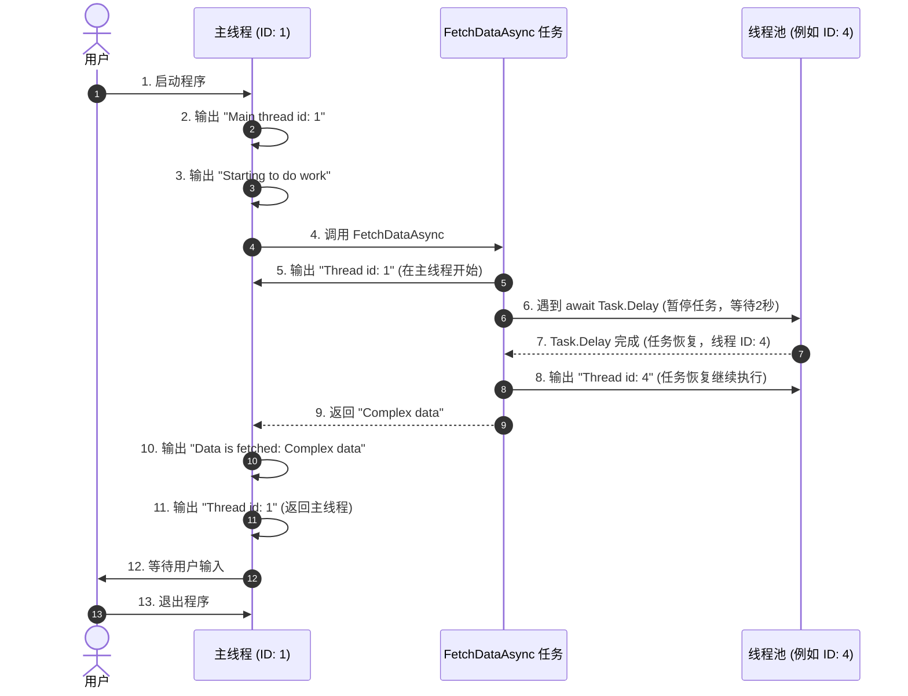

### **代码逐行注释（中文）**
以下代码展示了一个异步操作流程，并分析了执行线程的变化。代码的输出反映了异步任务的运行机制。

```csharp
using System;
using System.Threading;
using System.Threading.Tasks;

class Program
{
    // 程序的入口点
    static async Task Main(string[] args)
    {
        // 输出主线程的 ID，表明主线程启动了程序
        Console.WriteLine($"1. Main thread id:{Thread.CurrentThread.ManagedThreadId}");

        // 表示任务开始
        Console.WriteLine("Starting to do work.");
        
        // 异步调用 FetchDataAsync 方法，等待其完成
        var data = await FetchDataAsync();

        // 当 FetchDataAsync 完成后，继续执行并输出获取到的数据
        Console.WriteLine($"Data is fetched: {data}");

        // 再次输出当前线程的 ID，观察线程是否发生变化
        Console.WriteLine($"2. Thread id:{Thread.CurrentThread.ManagedThreadId}");

        // 提示用户按回车键退出程序
        Console.WriteLine("Press enter to exit.");
        Console.ReadLine();
    }

    // 一个异步方法，模拟数据的获取
    static async Task<string> FetchDataAsync()
    {
        // 输出当前线程的 ID，表明方法运行时的线程
        Console.WriteLine($"3. Thread id:{Thread.CurrentThread.ManagedThreadId}");

        // 异步等待 2 秒，模拟耗时操作
        await Task.Delay(2000);

        // 输出当前线程的 ID，观察异步等待后是否切换了线程
        Console.WriteLine($"4. Thread id:{Thread.CurrentThread.ManagedThreadId}");

        // 返回一个字符串，表示获取到的数据
        return "Complex data";
    }
}
```

---

### **代码执行结果及原因分析**

#### **代码执行结果（输出可能会有所不同，线程 ID 是动态分配的）：**
```
1. Main thread id:1
Starting to do work.
3. Thread id:1
4. Thread id:4
Data is fetched: Complex data
2. Thread id:1
Press enter to exit.
```

#### **结果分析：**

1. **`Main` 方法的执行**：
   - 程序开始时，`Main` 方法运行在主线程（线程 ID 为 1）。
   - 输出了 `1. Main thread id:1` 和 `Starting to do work.`。

2. **调用 `FetchDataAsync`**：
   - `FetchDataAsync` 方法在主线程中启动，输出 `3. Thread id:1`。
   - 遇到 `await Task.Delay(2000)` 后，任务被挂起，主线程被释放以执行其他任务。

3. **异步恢复**：
   - `Task.Delay(2000)` 模拟异步等待 2 秒，此时线程池可能分配一个不同的线程（例如线程 ID 为 4）来恢复任务。
   - 输出 `4. Thread id:4` 表明恢复后的任务在不同的线程中运行。

4. **返回主线程**：
   - `FetchDataAsync` 返回结果后，程序回到 `Main` 方法的上下文。
   - 输出 `Data is fetched: Complex data` 和 `2. Thread id:1`，显示程序继续运行在主线程中。

5. **程序结束**：
   - 等待用户输入，程序结束。

---



---

### **时序图说明**

1. **程序启动**：
   - 程序在主线程（线程 ID: 1）中启动，并输出线程 ID 和任务开始的信息。

2. **异步调用**：
   - `Main` 方法调用 `FetchDataAsync`，任务在主线程上运行并输出线程 ID。

3. **任务挂起**：
   - `await Task.Delay(2000)` 暂停任务，释放主线程资源。
   - 延迟操作由线程池处理，主线程可继续执行其他操作。

4. **任务恢复**：
   - 2秒后，`Task.Delay` 完成，任务恢复并可能使用线程池中的线程（线程 ID: 4）。
   - 任务继续执行并输出新的线程 ID。

5. **返回主线程**：
   - `FetchDataAsync` 返回结果后，程序回到 `Main` 方法的原始上下文（主线程）。
   - 输出获取的数据以及当前线程 ID，确认返回主线程。

6. **程序结束**：
   - 程序等待用户输入后退出。

---

### **关键点总结**

1. **异步与线程切换**：
   - `await` 暂停任务，释放线程资源。
   - 任务完成后可能在不同的线程中恢复（如线程池中的线程）。

2. **返回原始上下文**：
   - 异步任务完成后，会尝试回到原始的同步上下文（例如 UI 线程或主线程）。

3. **线程池优化**：
   - 任务恢复可能分配新的线程（如线程 ID: 4），展示了 .NET 的线程池高效管理。

---

### **完整流程描述**

这段代码展示了 C# 异步编程的基本机制：
- 异步任务在 `await` 处释放线程资源。
- 任务恢复可能使用线程池中的不同线程继续执行。
- 最终回到调用方法的原始上下文，确保流程一致。

这种设计适用于 I/O 操作或长时间运行的任务场景，可以显著提高程序的性能和响应能力。
---

### **关键点总结**

1. **异步与线程切换**：
   - `await` 使任务可以暂停并释放线程。
   - 等待操作完成后，任务可能会在同一线程或线程池的另一个线程上恢复。

2. **主线程上下文**：
   - `await` 之后会尝试返回原来的同步上下文（如 UI 线程或主线程），因此 `2. Thread id:1` 表明程序回到主线程。

3. **线程 ID 的变化**：
   - 异步任务的恢复可能在不同的线程上运行（如 `4. Thread id:4`）。
   - 这体现了 C# 中线程池的灵活性，提升了并发效率。

---

### **总结**

这段代码展示了 C# 中异步操作的基本机制。通过异步方法 `FetchDataAsync` 的执行，体现了 `await` 的特点：
- **释放主线程资源**。
- **在不同线程中恢复异步任务**。
- **最终返回调用方法的原始上下文**。

这种异步模式适用于需要处理 I/O 操作或长时间计算的场景，能够提高程序的响应能力和性能。
