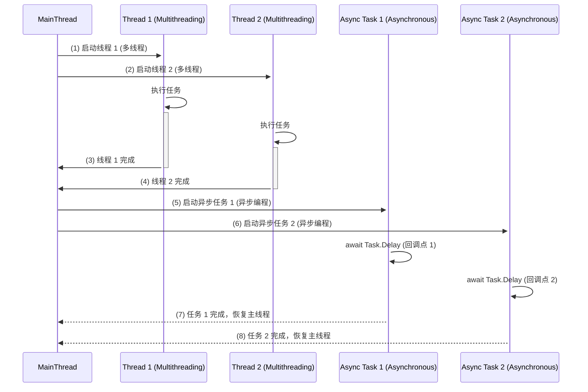

### 多线程 vs. 异步编程

**多线程** 和 **异步编程** 是在 C# 中提升应用性能和响应速度的两种方式。它们看似相似，但各自具有独特的特点，并适用于不同的场景。

#### 多线程和异步编程的关键概念

1. **多线程**：
   - 多线程通过创建多个线程并行执行任务，可以提高程序的响应性。
   - 线程共享内存，这可能会带来线程安全和同步方面的复杂性。
   
2. **异步编程**：
   - 异步编程使用非阻塞操作，允许其他任务在长时间运行的任务完成前继续执行。
   - 在 C# 中使用 `async` 和 `await` 来实现异步编程，不会创建新线程，除非明确要求。

#### 两种方法的优点

| 特性                 | 多线程                                        | 异步编程                                      |
|----------------------|-----------------------------------------------|------------------------------------------------|
| **并行执行**         | 通过创建多个线程实现并行                      | 通过非阻塞调用而不是多个线程实现                 |
| **内存管理**         | 线程共享内存，需要同步                        | 不涉及内存共享，减少了线程安全问题                |
| **最佳应用场景**     | 适用于 CPU 密集型任务（如计算）                | 适用于 I/O 密集型任务（如文件操作、网络请求）      |
| **上下文切换**       | 涉及线程切换开销                              | 最小化上下文切换以提高效率                       |
| **复杂性**           | 较高，需要同步处理                            | 较低，代码更简洁易于维护                         |

#### 示例：C# 中的多线程
```csharp
using System;
using System.Threading;

class Program
{
    static void Main()
    {
        Thread thread1 = new Thread(PrintNumbers);
        Thread thread2 = new Thread(PrintLetters);

        thread1.Start();
        thread2.Start();

        thread1.Join();
        thread2.Join();

        Console.WriteLine("主线程完成");
    }

    static void PrintNumbers()
    {
        for (int i = 1; i <= 5; i++)
        {
            Console.WriteLine($"数字: {i}");
            Thread.Sleep(500); // 模拟耗时操作
        }
    }

    static void PrintLetters()
    {
        for (char c = 'A'; c <= 'E'; c++)
        {
            Console.WriteLine($"字母: {c}");
            Thread.Sleep(500); // 模拟耗时操作
        }
    }
}
```

**解释**：
1. 创建了两个线程 `thread1` 和 `thread2`，分别并行执行 `PrintNumbers` 和 `PrintLetters`。
2. 每个线程通过 `Thread.Sleep(500)` 模拟一个耗时操作。
3. 主线程使用 `Join` 等待子线程完成。

#### 示例：C# 中的异步编程
```csharp
using System;
using System.Threading.Tasks;

class Program
{
    static async Task Main()
    {
        Task task1 = PrintNumbersAsync();
        Task task2 = PrintLettersAsync();

        await Task.WhenAll(task1, task2);

        Console.WriteLine("主程序完成");
    }

    static async Task PrintNumbersAsync()
    {
        for (int i = 1; i <= 5; i++)
        {
            Console.WriteLine($"数字: {i}");
            await Task.Delay(500); // 模拟异步延迟
        }
    }

    static async Task PrintLettersAsync()
    {
        for (char c = 'A'; c <= 'E'; c++)
        {
            Console.WriteLine($"字母: {c}");
            await Task.Delay(500); // 模拟异步延迟
        }
    }
}
```

**解释**：
1. `PrintNumbersAsync` 和 `PrintLettersAsync` 是异步方法，带有延迟地打印数字和字母。
2. `Task.WhenAll` 让两个任务并行运行，而不会阻塞主线程。
3. 每个任务在 `await` 延迟完成后继续执行。

#### 多线程和异步编程的工作原理

1. **多线程**：
   - 多个线程并行运行，它们共享内存，因此需要同步以防止数据冲突。
   - 线程调度和上下文切换会引入开销，但它适合用于 CPU 密集型任务。

2. **异步编程**：
   - 任务以非阻塞的阶段方式执行，使用 `await` 创建回调点。
   - 它最小化了开销，使主线程可以继续处理其他操作，非常适合 I/O 密集型任务。

#### 各自适用的场景

1. **多线程**：
   - 适用于 CPU 密集型任务，在这种场景中，使用多线程进行并行计算可以提升性能。
   - 例如，数学计算、仿真和其他 CPU 密集型操作。

2. **异步编程**：
   - 非常适合 I/O 密集型任务，如文件 I/O、数据库访问和网络调用。
   - 异步编程无需多线程即可提高效率和响应性。

#### 异步编程中的任务并行示例

在异步编程中，可以不依赖多线程来实现任务并行。例如：

```csharp
using System;
using System.Threading.Tasks;

class Program
{
    static async Task Main()
    {
        Task<int> task1 = DoWorkAsync(1, 1000);
        Task<int> task2 = DoWorkAsync(2, 2000);
        Task<int> task3 = DoWorkAsync(3, 3000);

        int[] results = await Task.WhenAll(task1, task2, task3);

        Console.WriteLine("所有任务完成:");
        foreach (var result in results)
        {
            Console.WriteLine($"任务结果: {result}");
        }
    }

    static async Task<int> DoWorkAsync(int id, int delay)
    {
        Console.WriteLine($"任务 {id} 开始...");
        await Task.Delay(delay); // 模拟耗时操作
        Console.WriteLine($"任务 {id} 完成。");
        return id;
    }
}
```

**解释**：
- `Task.WhenAll` 并行运行 `task1`、`task2` 和 `task3`，在不阻塞主线程的情况下让每个任务继续执行。
- 每个 `await` 创建一个回调点，在任务完成时恢复方法的执行。

---

### 深入理解：`await` 和线程如何处理执行阶段

1. **多线程中的线程**：
   - 每个线程独立运行，共享资源，因此需要同步来避免冲突。
   - 线程允许真正的并行执行，但引入了上下文切换的开销。

2. **异步编程中的回调点**：
   - 每个 `await` 创建一个回调点，将方法分成多个阶段，而不会阻塞主线程。
   - 这种阶段式的执行提升了程序的响应性和效率，特别适用于 I/O 操作。

---

### 序列图：多线程 vs. 异步编程

以下是一个 **Mermaid 序列图**，展示了两种方法的执行流程差异。



### 流程说明

1. **多线程步骤**：
   - **(1)** 主线程启动线程 1，线程独立执行任务。
   - **(2)** 主线程启动线程 2，另一任务并行运行。
   - **(3) 和 (4)** 两个线程完成任务后返回控制权给主线程。

2. **异步编程步骤**：
   - **(5)** 主线程启动异步任务 1，

遇到 `await` 并在回调点暂停。
   - **(6)** 主线程启动异步任务 2，同样创建一个回调点。
   - **(7) 和 (8)** 每个异步任务完成时恢复主线程，而不会阻塞。

### 总结

此序列图展示了多线程和异步编程的不同机制。在 **多线程** 中，独立的线程并行处理任务，共享内存且需要同步。在 **异步编程** 中，`await` 创建非阻塞的回调点，避免创建新线程，实现了高效的任务管理，非常适合 I/O 密集型任务。
