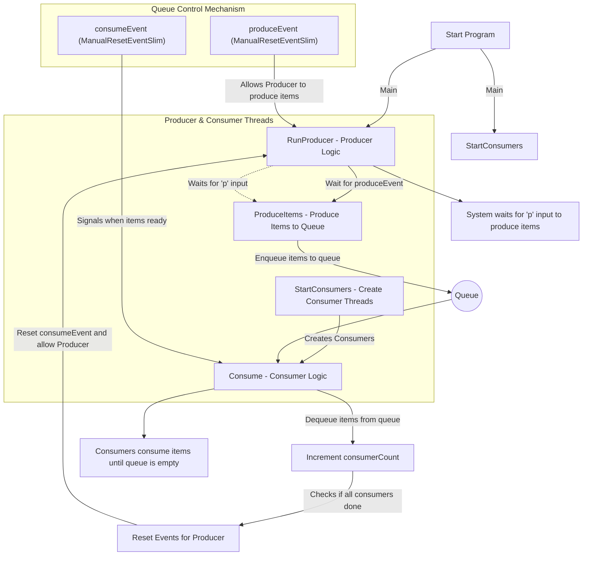

### 


```csharp
using System;
using System.Collections.Generic;
using System.Threading;

public class Program
{
    // 队列，用于存储生产者生成的项目
    private static readonly Queue<int> queue = new Queue<int>();

    // ManualResetEventSlim 控制消费者的等待
    private static readonly ManualResetEventSlim consumeEvent = new ManualResetEventSlim(false);

    // ManualResetEventSlim 控制生产者的等待
    private static readonly ManualResetEventSlim produceEvent = new ManualResetEventSlim(true);

    // 记录已完成消费的消费者数量
    private static int consumerCount = 0;

    // 锁对象，用于同步更新 consumerCount
    private static readonly object lockConsumerCount = new object();

    public static void Main()
    {
        // 启动消费者线程
        StartConsumers();

        // 启动生产者逻辑
        RunProducer();
    }

    // 启动消费者线程的方法
    private static void StartConsumers()
    {
        for (int i = 0; i < 3; i++)
        {
            Thread consumerThread = new Thread(Consume)
            {
                Name = $"Consumer {i + 1}", // 设置消费者线程名称
                IsBackground = true // 设置为后台线程
            };
            consumerThread.Start();
        }
    }

    // 生产者逻辑方法
    private static void RunProducer()
    {
        while (true)
        {
            // 等待生产者事件信号
            produceEvent.Wait();

            // 重置生产事件，防止过多生产
            produceEvent.Reset();

            Console.WriteLine("输入 'p' 以生产新项目");

            // 等待用户输入控制生产
            var input = Console.ReadLine() ?? "";

            // 当用户输入 'p' 时，触发生产操作
            if (input.ToLower() == "p")
            {
                ProduceItems(); // 调用生产项目的方法
                consumeEvent.Set(); // 设置消费事件，通知消费者开始消费
            }
        }
    }

    // 生成项目的方法
    private static void ProduceItems()
    {
        for (int i = 1; i <= 10; i++)
        {
            queue.Enqueue(i); // 将项目加入队列
            Console.WriteLine($"Produced: {i}");
        }
    }

    // 消费者的逻辑
    private static void Consume()
    {
        while (true)
        {
            // 等待消费事件的信号
            consumeEvent.Wait();

            // 从队列中取出项目进行消费
            while (queue.TryDequeue(out int item))
            {
                Thread.Sleep(500); // 模拟消费时间
                Console.WriteLine($"Consumed: {item} from thread: {Thread.CurrentThread.Name}");
            }

            // 更新消费者计数，检查是否所有消费者已完成消费
            lock (lockConsumerCount)
            {
                consumerCount++;

                if (consumerCount == 3)
                {
                    // 当所有消费者完成消费时，重置消费事件，允许生产者继续生产
                    consumeEvent.Reset();
                    produceEvent.Set();
                    consumerCount = 0; // 重置计数器

                    Console.WriteLine("****************");
                    Console.WriteLine("**** More Please! *****");
                    Console.WriteLine("****************");
                }
            }
        }
    }
}
```

### 代码逐行解释

1. **`private static void Main()`**  
   - 主方法，程序的入口，启动消费者线程并运行生产者逻辑。

2. **`private static void StartConsumers()`**
   - 用于启动消费者线程的辅助方法。创建 3 个消费者线程，并将它们设为后台线程，以确保主线程结束后程序能正常退出。

3. **`private static void RunProducer()`**
   - 生产者的主逻辑。等待用户输入 `'p'` 来生成新项目，当输入匹配时调用 `ProduceItems()` 方法生成项目。

4. **`private static void ProduceItems()`**
   - 生成项目的辅助方法。循环生成 10 个项目并将它们添加到队列中，便于消费者消费。

5. **`private static void Consume()`**
   - 消费者线程的工作方法。等待消费事件的信号（`consumeEvent.Wait()`），在信号为有信号状态时从队列中取出项目进行消费。每个线程消费一个项目后，检查是否所有消费者都已完成消费。

6. **`lock (lockConsumerCount)`**
   - 使用锁保护 `consumerCount` 变量，确保多个消费者线程同步更新计数。当所有消费者完成时，重置 `consumeEvent` 并允许生产者继续生产新项目。

### 最佳实践总结

- **逻辑分离**：将生产者逻辑和消费者线程的启动分离到单独的方法 `RunProducer()` 和 `StartConsumers()` 中，增强代码的可读性和维护性。
- **后台线程**：设置消费者线程为后台线程，以确保主线程结束时可以自动终止，避免阻塞程序退出。
- **线程安全**：使用锁对象 `lockConsumerCount` 来保护 `consumerCount`，确保多线程环境下的线程安全。
- **事件控制**：`ManualResetEventSlim` 的 `Set` 和 `Reset` 控制线程的同步，确保生产和消费的有序进行，避免资源浪费。
