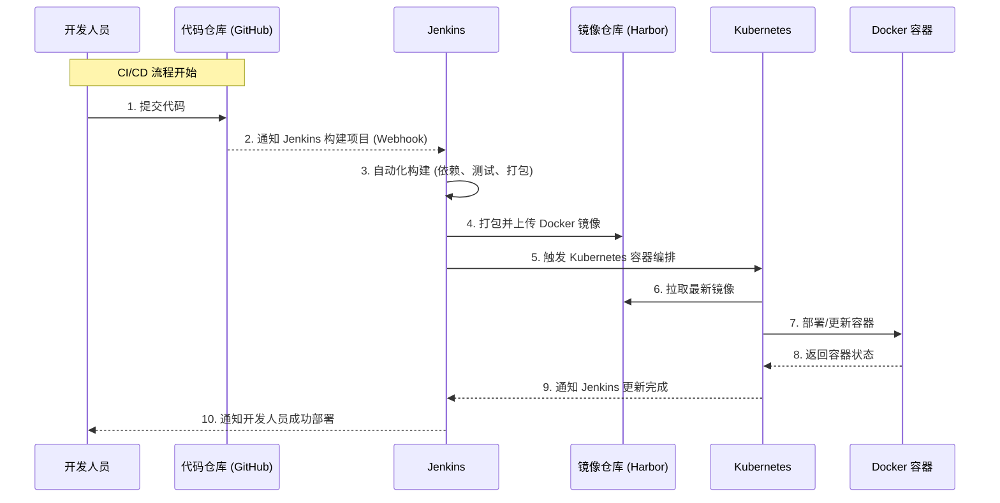

###  CI/CD 流程

1. **开发人员提交代码**：开发人员将代码推送到代码仓库（例如 GitHub）。
2. **触发 Jenkins**：代码仓库通过 Webhook 通知 Jenkins，有代码提交。
3. **自动化构建**：Jenkins 拉取代码，执行构建流水线任务，包括依赖管理、测试和打包。
4. **上传 Docker 镜像**：Jenkins 将打包好的 Docker 镜像上传到镜像仓库（如 Harbor）。
5. **触发 Kubernetes**：Jenkins 通过触发 Kubernetes 部署配置文件（如 `yaml` 文件），开始容器编排。
6. **拉取最新镜像**：Kubernetes 节点从镜像仓库拉取最新镜像。
7. **部署容器**：Kubernetes 更新容器或启动新版本容器。
8. **返回容器状态**：容器运行完成后，将运行状态返回给 Kubernetes。
9. **通知 Jenkins**：Kubernetes 将部署结果通知 Jenkins。
10. **通知开发人员**：Jenkins 通知开发人员部署完成的结果。
