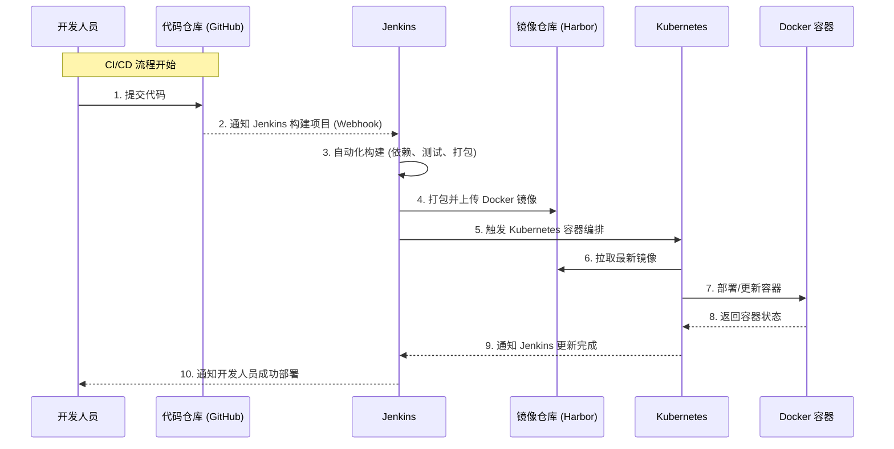

###  CI/CD 流程


1. **开发人员提交代码**：开发人员将代码推送到代码仓库（例如 GitHub）。
2. **触发 Jenkins**：代码仓库通过 Webhook 通知 Jenkins，有代码提交。
3. **自动化构建**：Jenkins 拉取代码，执行构建流水线任务，包括依赖管理、测试和打包。
4. **上传 Docker 镜像**：Jenkins 将打包好的 Docker 镜像上传到镜像仓库（如 Harbor）。
5. **触发 Kubernetes**：Jenkins 通过触发 Kubernetes 部署配置文件（如 `yaml` 文件），开始容器编排。
6. **拉取最新镜像**：Kubernetes 节点从镜像仓库拉取最新镜像。
7. **部署容器**：Kubernetes 更新容器或启动新版本容器。
8. **返回容器状态**：容器运行完成后，将运行状态返回给 Kubernetes。
9. **通知 Jenkins**：Kubernetes 将部署结果通知 Jenkins。
10. **通知开发人员**：Jenkins 通知开发人员部署完成的结果。

---

### **Step 1: 开发人员提交代码 (Bash)**
```bash
# 提交代码到 GitHub 仓库
git add .
git commit -m "提交代码"
git push origin main
echo "代码已提交到 GitHub 仓库"
```

---

### **Step 2: Jenkins Webhook (Jenkinsfile)**
使用 Jenkins 的 Pipeline 功能创建以下 `Jenkinsfile`：

```groovy
pipeline {
    agent any
    stages {
        stage('Checkout Code') {
            steps {
                echo '1. 从 GitHub 拉取代码'
                checkout scm
            }
        }
        stage('Build Project') {
            steps {
                echo '2. 构建项目'
                sh './build.sh' // 执行构建脚本
            }
        }
        stage('Test') {
            steps {
                echo '3. 运行单元测试'
                sh './test.sh' // 执行测试脚本
            }
        }
        stage('Package and Push Docker Image') {
            steps {
                echo '4. 打包 Docker 镜像并推送到 Harbor'
                sh './docker-build-and-push.sh'
            }
        }
        stage('Deploy to Kubernetes') {
            steps {
                echo '5. 部署到 Kubernetes 集群'
                sh './deploy-k8s.sh'
            }
        }
    }
    post {
        always {
            echo 'CI/CD 流程结束'
        }
    }
}
```

---

### **Step 3: 打包和上传 Docker 镜像 (Bash)**
```bash
#!/bin/bash
# docker-build-and-push.sh

# 定义 Docker 镜像名称
IMAGE_NAME="harbor.mycompany.com/myproject/app:latest"

echo "开始构建 Docker 镜像..."
docker build -t $IMAGE_NAME .

echo "将镜像推送到 Harbor..."
docker push $IMAGE_NAME
echo "Docker 镜像推送成功"
```

---

### **Step 4: Kubernetes 配置部署 (Bash + YAML)**
#### 部署脚本 (`deploy-k8s.sh`)
```bash
#!/bin/bash
# deploy-k8s.sh

echo "使用 Kubernetes 配置部署最新镜像..."
kubectl apply -f k8s-deployment.yaml
echo "Kubernetes 部署完成"
```

#### Kubernetes 部署文件 (`k8s-deployment.yaml`)
```yaml
apiVersion: apps/v1
kind: Deployment
metadata:
  name: myapp-deployment
  labels:
    app: myapp
spec:
  replicas: 3
  selector:
    matchLabels:
      app: myapp
  template:
    metadata:
      labels:
        app: myapp
    spec:
      containers:
      - name: myapp
        image: harbor.mycompany.com/myproject/app:latest
        ports:
        - containerPort: 8080
```

---

### **Step 5: 拉取和部署容器 (C#)**
以下是通过 Kubernetes API 在 C# 中检查和管理容器状态的代码：
```csharp
using k8s;
using k8s.Models;
using System;
using System.Threading.Tasks;

namespace KubernetesDeployment
{
    class Program
    {
        static async Task Main(string[] args)
        {
            var config = KubernetesClientConfiguration.BuildConfigFromConfigFile();
            IKubernetes client = new Kubernetes(config);

            var deployment = new V1Deployment
            {
                Metadata = new V1ObjectMeta
                {
                    Name = "myapp-deployment"
                },
                Spec = new V1DeploymentSpec
                {
                    Replicas = 3,
                    Selector = new V1LabelSelector
                    {
                        MatchLabels = new System.Collections.Generic.Dictionary<string, string>
                        {
                            { "app", "myapp" }
                        }
                    },
                    Template = new V1PodTemplateSpec
                    {
                        Metadata = new V1ObjectMeta
                        {
                            Labels = new System.Collections.Generic.Dictionary<string, string>
                            {
                                { "app", "myapp" }
                            }
                        },
                        Spec = new V1PodSpec
                        {
                            Containers = new[]
                            {
                                new V1Container
                                {
                                    Name = "myapp",
                                    Image = "harbor.mycompany.com/myproject/app:latest",
                                    Ports = new[]
                                    {
                                        new V1ContainerPort { ContainerPort = 8080 }
                                    }
                                }
                            }
                        }
                    }
                }
            };

            Console.WriteLine("正在创建/更新 Kubernetes 部署...");
            await client.CreateNamespacedDeploymentAsync(deployment, "default");
            Console.WriteLine("Kubernetes 部署成功");
        }
    }
}
```

---

### **Step 6: Jenkins 通知开发人员 (Bash)**
```bash
#!/bin/bash
# 假设 Jenkins 通过 Webhook 或 Slack 通知开发人员

echo "Jenkins 通知开发人员：部署完成，服务已上线！"
curl -X POST -H 'Content-type: application/json' --data '{"text":"部署完成！镜像已上线至 Kubernetes 集群。"}' \
https://hooks.slack.com/services/YOUR_SLACK_WEBHOOK
```

---

### 流程总结
1. **开发人员**提交代码后触发 Jenkins CI/CD 流程。
2. Jenkins 自动化完成代码构建、测试、打包。
3. Docker 镜像通过 Bash 脚本推送到 Harbor。
4. 使用 Kubernetes YAML 配置文件部署至集群。
5. C# 代码监控和管理容器状态，保证高可用性。
6. Jenkins 通知开发人员，流程完成。
7. 
