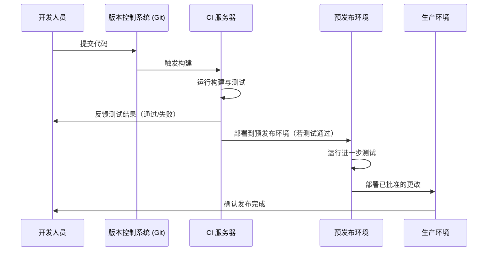

### **理解 SDLC 与 CI/CD 的结合：全面指南**

现代软件开发高度依赖于自动化和迭代过程，以快速交付高质量、可靠的产品。在这个过程中，**SDLC**（软件开发生命周期，Software Development Life Cycle）和 **CI/CD**（持续集成/持续交付或持续部署，Continuous Integration/Continuous Delivery/Deployment）发挥了重要作用。本文将详细探讨 SDLC 的阶段、CI 与 CD 的区别，以及典型的 CI/CD 流水线工作原理。

---

### **第一部分：SDLC 与 CI/CD 的结合**

**软件开发生命周期 (SDLC)** 包括以下关键阶段：
1. **开发 (Development)**：编写和优化代码。
2. **测试 (Testing)**：验证代码的功能和性能。
3. **部署 (Deployment)**：将代码发布到预发布或生产环境。
4. **维护 (Maintenance)**：更新并监控生产环境中的软件。

**CI/CD** 在 SDLC 的各个阶段中引入了自动化和集成，能够实现**更快、更可靠的软件发布**。其工作流程如下：

- **代码提交**：当开发人员将代码推送到版本控制系统（如 Git）时，会触发 CI/CD 流程。
- **自动构建与测试**：系统自动编译代码并运行测试（包括 **端到端 (e2e)** 测试用例）以验证功能。
- **部署或反馈**：  
  - 如果测试通过，代码会自动部署到预发布或生产环境。  
  - 如果测试失败，代码会返回开发团队进行问题修复。

#### **优势**：
- **快速反馈**：开发人员能迅速收到错误提示，便于快速修复。
- **降低生产风险**：自动化测试在早期捕获问题，减少生产环境中出现的错误。

---

### **第二部分：CI 与 CD 的区别**

**持续集成 (Continuous Integration, CI)** 和 **持续交付 (Continuous Delivery, CD)** 是 CI/CD 的两个核心部分，但它们的重点和功能有所不同。

| **方面**            | **持续集成 (CI)**                                      | **持续交付 (CD)**                                      |
|---------------------|-------------------------------------------------------|-------------------------------------------------------|
| **核心功能**        | 自动化构建、测试和代码集成                              | 自动化部署和发布流程                                  |
| **关键操作**        | - 在每次提交代码时运行测试                              | - 将代码部署到预发布或生产环境                        |
|                     | - 及早发现集成问题                                     | - 自动化基础设施变更与发布审批                        |
| **目标**            | 确保代码库始终处于可用状态                              | 确保软件可以随时可靠地发布                            |
| **手动步骤**        | 无，完全自动化                                         | 可包括生产发布前的手动测试或审批                      |
| **促进的行为**      | 频繁提交代码并快速反馈                                  | 提供可靠且可重复的发布流程                            |

#### **CI 示例**：
- 开发人员提交代码到代码库。
- CI 服务器自动运行单元测试和集成测试。
- 测试结果立即反馈给开发人员。

#### **CD 示例**：
- 在 CI 测试通过后，CD 流水线将代码部署到预发布环境。
- 在生产发布前可能执行手动或自动检查。

---

### **第三部分：CI/CD 流水线**

**CI/CD 流水线** 是将代码从开发阶段推送到生产环境的一系列自动化步骤。它确保高效、一致且无错误的软件交付。

#### **典型 CI/CD 流水线的阶段**：
1. **代码提交**：  
   - 开发人员将代码更改提交到版本控制系统（如 Git）。
2. **触发构建**：  
   - CI 服务器检测到提交并触发流水线。
3. **构建与测试**：  
   - 编译代码并运行自动化测试（单元测试、集成测试等）。
4. **反馈**：  
   - 测试结果反馈给开发人员。
   - 如果测试失败，开发人员修复代码，重新提交。
5. **工件部署**：  
   - 测试通过后，构建的工件被部署到预发布环境。
6. **预发布环境测试**：  
   - 在预发布环境中进行进一步测试（如性能测试或端到端测试）。
7. **生产环境部署**：  
   - 在获得批准后，CD 系统将代码部署到生产环境。

#### **CI/CD 流水线的优势**：
- **自动化**：减少人为错误并加快开发速度。
- **早期发现问题**：在开发阶段就解决问题。
- **一致性**：提供可重复和可靠的发布流程。

---

### **CI/CD 流水线时序图**

---

### **总结**

通过将 **SDLC** 与 **CI/CD** 相结合，现代开发团队可以实现：
- **更快的反馈周期**：自动化测试和构建确保错误被快速发现。
- **更高的可靠性**：在早期解决问题，减少生产环境中的错误。
- **流程简化**：自动化流水线使发布过程可预测且可重复。

理解 **CI** 和 **CD** 的区别以及它们如何在 CI/CD 流水线中协作，有助于企业快速、安全地交付高质量的软件，同时降低开发和运维的复杂性。
