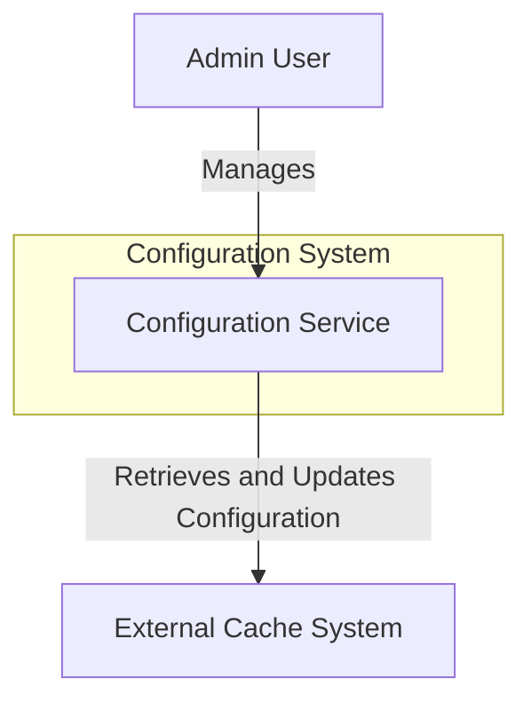
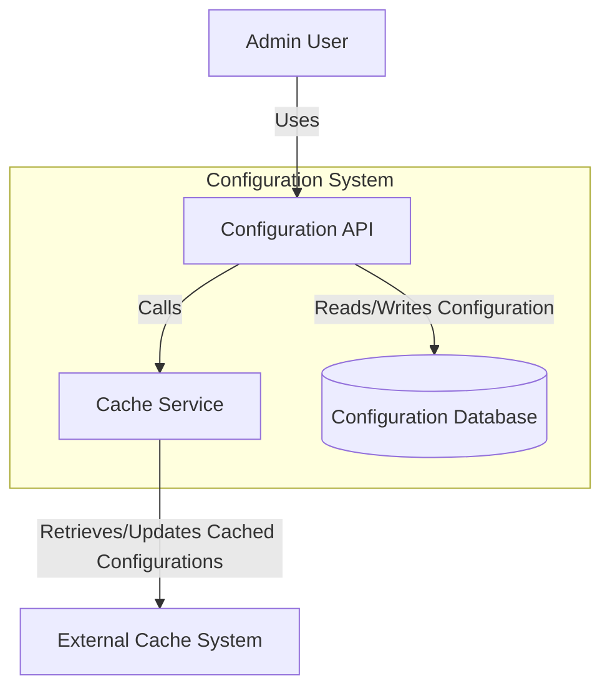
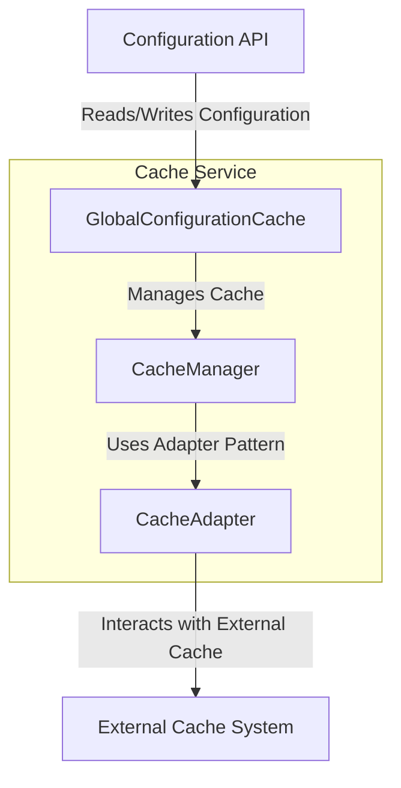
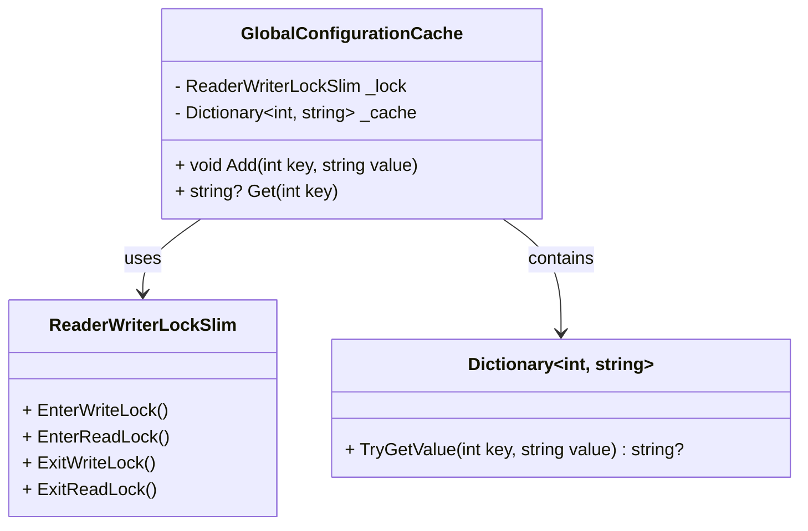

### 使用 Mermaid 绘制 C4 模型的类图

**C4 模型** 提供了一种标准化的方式，用四个层级的图来描述软件系统的架构：

1. **上下文图（Context Diagram）**：显示系统的高层次视图，包含系统、外部用户和交互的其他系统。
2. **容器图（Container Diagram）**：详细展示系统内的容器（如应用程序、数据库等）。
3. **组件图（Component Diagram）**：展示特定容器中的组件。
4. **代码/类图（Code/Classes）**：展示单个组件的详细内部结构（通常 C4 模型不展示代码，但可以用类图表示）。

使用 **Mermaid** 创建这些 C4 图，以下将以 `GlobalConfigurationCache` 系统为例演示每一层次图的构建。

---

### 1. **上下文图**

**上下文图** 显示了主系统（`Configuration System`）与外部系统（如 `Admin User`，`External Cache System`）的交互。



```markdown

```

### 说明
- **`Configuration System`**：主系统边界，包含 `Configuration Service`。
- **`Admin User`**：表示与系统交互以管理配置的用户。
- **`External Cache System`**：存储或检索配置数据的外部系统。

### 2. **容器图**

**容器图** 展示 `Configuration System` 中的容器，包括应用程序、数据库或微服务。



```markdown

```

### 说明
- **`Configuration API`**：为用户提供配置管理功能。
- **`Cache Service`**：与外部缓存系统交互。
- **`Configuration Database`**：用于持久存储配置数据。
- **`External Cache System`**：用于缓存配置数据的外部系统。

### 3. **组件图**

**组件图** 进一步细化 `Cache Service` 容器，展示其内部组件。



```markdown

```
### 说明
- **`GlobalConfigurationCache`**：主要组件，负责管理配置缓存。
- **`CacheManager`**：处理缓存相关操作。
- **`CacheAdapter`**：提供接口以便与 `External Cache System` 交互。

### 4. **代码级别的类图**

类图（如之前提供的示例）可用于展示 `GlobalConfigurationCache` 组件内部的代码细节。



```markdown

```

### 说明
- **`GlobalConfigurationCache`**：管理配置数据，包含添加和检索缓存项的方法。
- **`ReaderWriterLockSlim` 和 `Dictionary`**：辅助类，确保线程安全和数据存储。

---

### 如何在 Visual Studio Code 中使用 C4 模型进行文档编写

1. **安装 VS Code 和扩展**：
   - 使用 **Mermaid** 扩展支持语法高亮和预览。
   - 为更丰富的预览效果，建议安装 **Markdown Preview Enhanced** 扩展。

2. **创建 Markdown 文件**：
   - 新建一个 `.md` 文件（例如 `C4Model.md`），使用 `mermaid` 语言在其中添加代码块，以展示每一级的图形。

3. **添加 Mermaid 代码**：
   - 使用上述 Mermaid 语法构建 C4 模型的每一级，从上下文图开始，逐步深入到类图（如需要）。

4. **预览和导出**：
   - 在 VS Code 中选择 **Preview Mermaid** 或 **Markdown Preview Enhanced** 来预览每个图。
   - 如需在外部文档中使用，可以将图导出为 PNG 或 SVG 格式。

本指南帮助您在 VS Code 中使用 Mermaid 创建和记录 C4 模型的图形，直观地展示系统架构的每个层级。
