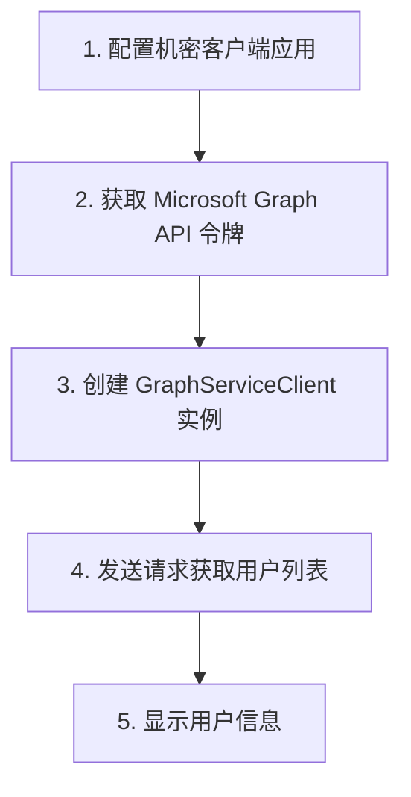

### Microsoft Graph API 

下面是使用 C# 和 Azure 配合 Microsoft Graph API 获取用户数据的详细步骤以及代码示例。这个过程包括 Azure 应用程序注册、权限配置、获取访问令牌、调用 Microsoft Graph API 和处理数据的具体实现。

### 使用 Microsoft Graph API 的步骤（使用 C#）

1. **注册 Azure 应用程序**：首先，需要在 Azure 中注册应用程序，使其能够进行身份验证并访问 Microsoft Graph。
2. **设置 API 权限**：为应用程序分配所需的权限，以便其可以访问特定的数据（如用户列表、邮件等）。
3. **获取访问令牌**：使用应用程序的凭据从 Azure AD 获取访问令牌。
4. **调用 Microsoft Graph API**：使用访问令牌通过 Microsoft Graph API 请求数据，比如获取组织中的用户列表。
5. **处理和展示数据**：将从 Microsoft Graph API 获取的数据进行处理，并在控制台显示。

### C# 代码示例

以下代码演示了如何使用 C# 通过 Azure AD 身份验证，并获取 Microsoft Graph API 的用户列表：

```csharp
using Microsoft.Graph;
using Microsoft.Identity.Client;
using System;
using System.Threading.Tasks;

namespace GraphApiExample
{
    class Program
    {
        // 配置应用程序的基本信息
        private static readonly string clientId = "Your_Client_Id";        // 应用程序 ID
        private static readonly string tenantId = "Your_Tenant_Id";        // 租户 ID
        private static readonly string clientSecret = "Your_Client_Secret"; // 客户端机密

        static async Task Main(string[] args)
        {
            // 1. 配置机密客户端应用
            IConfidentialClientApplication confidentialClient = ConfidentialClientApplicationBuilder.Create(clientId)
                .WithTenantId(tenantId)
                .WithClientSecret(clientSecret)
                .Build();

            // 2. 获取 Microsoft Graph API 令牌
            string[] scopes = { "https://graph.microsoft.com/.default" };
            AuthenticationResult authResult = await confidentialClient.AcquireTokenForClient(scopes).ExecuteAsync();

            // 3. 创建 GraphServiceClient 实例
            GraphServiceClient graphClient = new GraphServiceClient(new DelegateAuthenticationProvider((requestMessage) =>
            {
                requestMessage.Headers.Authorization = new System.Net.Http.Headers.AuthenticationHeaderValue("Bearer", authResult.AccessToken);
                return Task.CompletedTask;
            }));

            // 4. 发送请求获取用户列表
            var users = await graphClient.Users.Request().GetAsync();

            // 5. 显示用户信息
            foreach (var user in users)
            {
                Console.WriteLine($"User: {user.DisplayName}, Email: {user.Mail}");
            }
        }
    }
}
```

### 代码详细说明（逐步解释）

1. **配置机密客户端应用** - 初始化一个机密客户端应用，配置客户端 ID、租户 ID 和客户端机密。
   - `clientId` 是应用程序的唯一标识符，用于区分不同的应用。
   - `tenantId` 是 Azure AD 中租户的唯一标识符，表示用户所属的 Azure AD。
   - `clientSecret` 是应用的机密，用于身份验证。

2. **获取 Microsoft Graph API 令牌** - 获取用于访问 Microsoft Graph API 的身份验证令牌。
   - `AcquireTokenForClient(scopes).ExecuteAsync()` 方法用于获取访问令牌，其中 `scopes` 是权限范围，用于限定该令牌的权限。
   - `https://graph.microsoft.com/.default` 表示我们要访问 Microsoft Graph 的数据。

3. **创建 GraphServiceClient 实例** - 创建一个 `GraphServiceClient` 对象，用于与 Microsoft Graph 进行通信。
   - `GraphServiceClient` 是 Microsoft 提供的 SDK 中的核心类，用于发送请求和接收响应。
   - 通过 `DelegateAuthenticationProvider` 将令牌添加到每个请求的 `Authorization` 头部，以便进行身份验证。

4. **发送请求获取用户列表** - 使用 `graphClient.Users.Request().GetAsync()` 方法发送请求，从 Microsoft Graph API 获取用户列表。
   - `.Users.Request().GetAsync()` 方法会返回用户的集合，并包含每个用户的基本信息。

5. **显示用户信息** - 遍历用户数据并显示用户的姓名和电子邮件信息。
   - `foreach` 循环遍历 `users` 集合，将每个用户的显示名称（`DisplayName`）和邮箱（`Mail`）输出到控制台。

### 流程图示意图（带中文步骤编号）

下面的流程图可视化了上述步骤的流程，每个步骤有对应的中文编号。



### 每步流程中文解释

1. **配置机密客户端应用** - 初始化一个机密客户端应用，并配置应用程序的 `clientId`、`tenantId` 和 `clientSecret`。
2. **获取 Microsoft Graph API 令牌** - 使用应用凭据获取一个访问令牌，这个令牌将用来认证后续的 API 调用。
3. **创建 GraphServiceClient 实例** - 创建 `GraphServiceClient`，用于发送请求和接收 Microsoft Graph API 的响应。
4. **发送请求获取用户列表** - 调用 `graphClient.Users.Request().GetAsync()` 从 Microsoft Graph 获取用户列表。
5. **显示用户信息** - 遍历用户列表，并在控制台输出每个用户的显示名称和邮箱信息。

通过这个流程，你可以使用 C# 结合 Azure 和 Microsoft Graph API 来管理和访问组织数据，如用户信息。这种方式特别适合开发需要访问和分析企业数据的应用。
