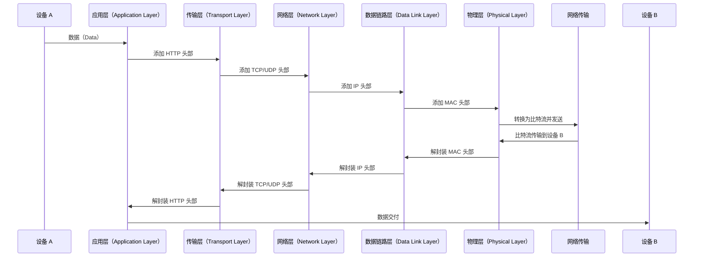

### **TCP/IP 数据封装：数据如何在网络上传输？为什么 OSI 模型需要这么多层？**

在网络上传输数据时，数据会经历一系列的封装与解封装过程。OSI 模型的分层设计让每一层都专注于自己的职责，从而实现高效且灵活的数据传输。以下是数据从设备 A 发送到设备 B 的具体封装与解封装过程。

---

### **封装过程**

#### **步骤 1：应用层（Application Layer）**
设备 A 通过 HTTP 协议向设备 B 发送数据。首先，在应用层，数据会被附加一个 **HTTP 头部（HTTP Header）**，该头部包含了应用层的必要信息。

#### **步骤 2：传输层（Transport Layer）**
在传输层，数据被添加了 **TCP 或 UDP 头部**，并封装为 **TCP 段（TCP Segment）** 或 **UDP 数据包（UDP Packet）**。此头部包含以下信息：
- 源端口号
- 目标端口号
- 序列号

#### **步骤 3：网络层（Network Layer）**
接下来，传输层生成的段会在网络层被添加 **IP 头部**，封装为 **IP 数据报（IP Datagram）**。IP 头部包含：
- 源 IP 地址
- 目标 IP 地址

#### **步骤 4：数据链路层（Data Link Layer）**
在数据链路层，IP 数据报会被附加 **MAC 头部**，并封装为 **帧（Frame）**。MAC 头部包含：
- 源 MAC 地址
- 目标 MAC 地址

#### **步骤 5：物理层（Physical Layer）**
最终，封装后的帧被转换为 **二进制比特流（Bits）**，在物理层通过网络介质发送到目标设备。

---

### **解封装过程**

当设备 B 接收到从网络传来的比特流时，会进行解封装过程，其步骤与封装过程相反：

#### **步骤 6-10：逐层解封装**
1. **物理层**：接收二进制比特流，并将其传递到数据链路层。
2. **数据链路层**：移除 MAC 头部，传递 IP 数据报到网络层。
3. **网络层**：移除 IP 头部，传递 TCP 段到传输层。
4. **传输层**：移除 TCP 或 UDP 头部，传递数据到应用层。
5. **应用层**：移除 HTTP 头部，最终将数据交付给目标应用程序。

设备 B 最终可以读取设备 A 发送的数据。

---

### **封装与解封装的时序图**

以下是基于封装和解封装过程的时序图：

---

### **为什么需要分层的 OSI 模型？**

分层模型的设计理念在于 **模块化和职责分离**。每一层都专注于自己的任务，具体特点如下：

1. **职责单一化**：每一层负责特定的功能，例如应用层专注于应用协议，传输层专注于可靠性与数据传输。
2. **独立性**：每一层只需依赖相邻层的输出，并根据头部中的信息进行操作，而不需要理解其他层的数据细节。
3. **灵活性与可扩展性**：不同层可以独立升级和修改，而不会影响其他层。例如，可以改进传输层协议，而无需更改应用层的实现。

---

通过分层设计，OSI 模型实现了网络通信的高效性、灵活性和标准化。数据封装和解封装的过程是分层模型中最关键的部分，它保证了设备间的数据可以正确传输和处理。
