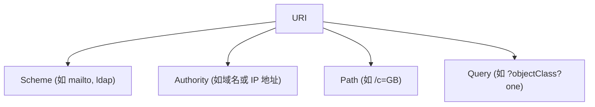
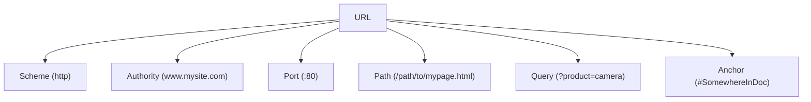
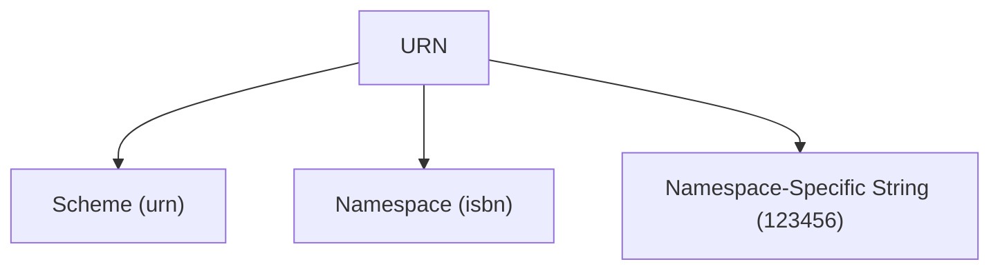

### **理解 URL、URI 和 URN：详细解释**

**URL**、**URI** 和 **URN** 是网络资源标识中常见的术语，尽管它们经常被混用，但实际上它们有着不同的含义和用途。本文将详细介绍它们的区别、组成部分以及彼此之间的关系。

---

### **什么是 URI？**

**URI（统一资源标识符，Uniform Resource Identifier）** 是一个通用术语，用于标识资源。URI 可以分为两种类型：
- **URL（统一资源定位符，Uniform Resource Locator）**：指定资源的位置。
- **URN（统一资源名称，Uniform Resource Name）**：通过名称标识资源，与其位置无关。

#### **URI 的组成部分**：
1. **Scheme（方案）**：定义协议或机制（例如 `mailto`、`ldap`、`http`）。
2. **Authority（权限）**：包含域名、IP 地址或其他标识信息。
3. **Path（路径）**：指示资源的具体位置或层级结构。
4. **Query（查询参数）**：为检索资源提供附加参数或指令。

---

### **什么是 URL？**

**URL** 是一种 URI，用于标识资源并提供访问该资源的方法。URL 包括协议（如 `http`、`https`）、域名、端口号和资源路径等信息。

#### **URL 的组成部分**：
1. **Scheme（方案）**：表示协议（如 `http`、`https`）。
2. **Authority（权限）**：包含域名或 IP 地址（如 `www.mysite.com`）。
3. **Port（端口号）**：指定端口号（如 `:80`，默认情况下可省略）。
4. **Path（路径）**：指向服务器上的文件路径（如 `/path/to/mypage.html`）。
5. **Query（查询参数）**：提供附加的请求参数（如 `?product=camera`）。
6. **Anchor（锚点）**：指向资源中的特定片段或部分（如 `#SomewhereInDoc`）。

#### **示例**：
`http://www.mysite.com:80/path/to/mypage.html?product=camera#SomewhereInDoc`

---

### **什么是 URN？**

**URN** 是另一种 URI，通过名称标识资源，而不是指定其位置。URN 的特点是即使资源的位置发生变化，其名称仍然唯一且不变。

#### **URN 的组成部分**：
1. **Scheme（方案）**：标识为 URN（如 `urn`）。
2. **Namespace（命名空间）**：指定资源类型（如 `isbn` 表示书籍）。
3. **Namespace-Specific String（命名空间特定字符串）**：命名空间内的唯一标识符（如 `123456`）。

#### **示例**：
`urn:isbn:123456`

---

### **URL、URI 和 URN 的主要区别**

| **属性**             | **URI**                                  | **URL**                                 | **URN**                                      |
|---------------------|------------------------------------------|-----------------------------------------|---------------------------------------------|
| **定义**            | 用于标识资源的通用术语                   | 标识资源并提供资源的访问位置             | 通过名称标识资源，与位置无关                 |
| **类型**            | 通用类别                                 | URI 的子类型                             | URI 的子类型                                 |
| **用途**            | 标识资源                                 | 标识资源并定位资源                       | 通过名称标识资源                             |
| **组成部分**        | Scheme、Authority、Path、Query 等         | Scheme、Authority、Path、Query、Anchor   | Scheme、Namespace、Namespace-Specific String |
| **示例**            | `mailto:Alice@mysite.com`               | `http://www.mysite.com:80/...`          | `urn:isbn:123456`                           |

---

### **可视化对比**

#### **URI**
- **作用**：标识资源。
- **示例**：
  - `mailto://Alice@mysite.com`
  - `ldap://2001:db8::7/c=GB?objectClass?one`

#### **URL**
- **作用**：标识并定位资源。
- **示例**：`http://www.mysite.com:80/path/to/mypage.html?product=camera#SomewhereInDoc`

#### **URN**
- **作用**：通过名称标识资源，与其位置无关。
- **示例**：`urn:isbn:123456`

---

### **总结**

- **URI** 是一个统称，包括 **URL** 和 **URN**。
- **URL** 关注标识资源和定位资源，是访问网络资源的常用方式。
- **URN** 提供了与位置无关的唯一标识符，用于需要永久标识的资源。

理解 URL、URI 和 URN 的区别有助于更好地设计和使用网络资源标识系统，同时提高对网络通信和资源访问的掌握。
