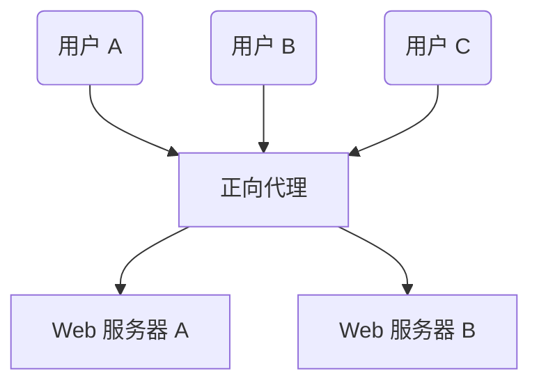
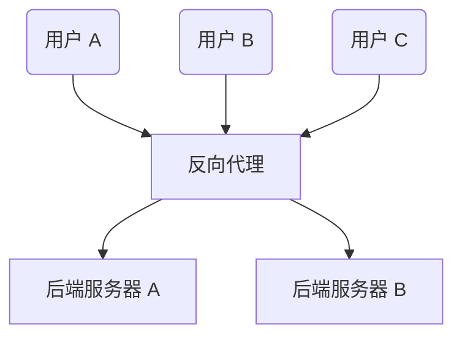

### **理解正向代理和反向代理：详细解释**

代理是现代网络中不可或缺的一部分，用于提高安全性、优化性能以及实现访问控制。正向代理和反向代理是两种常见的代理类型，它们各自有着不同的用途和功能。本文将详细探讨它们的作用、工作原理以及应用场景。

---

### **什么是正向代理（Forward Proxy）？**

正向代理是位于客户端设备（如笔记本电脑、手机）和互联网之间的服务器。它充当中间人，将客户端的请求转发到目标服务器，同时隐藏客户端的真实身份。

#### **工作原理**：
1. 用户向正向代理发送请求，而不是直接访问目标服务器。
2. 正向代理接收到请求后，进行访问控制或其他处理。
3. 代理将请求转发至目标服务器。
4. 目标服务器返回响应，代理再将响应转发给用户。

#### **主要应用场景**：
1. **保护客户端**：  
   - 隐藏客户端的 IP 地址和身份，提供在线隐私保护。
   
2. **绕过浏览限制**：  
   - 通过代理服务器访问受地理位置或网络限制的网站。

3. **内容访问控制**：  
   - 企业可使用正向代理限制员工访问特定网站（如社交媒体或不良内容）。

---

### **什么是反向代理（Reverse Proxy）？**

反向代理是位于客户端和后端服务器组之间的服务器。与正向代理相反，反向代理代表服务器处理客户端的请求。它将请求转发到后端服务器，并将后端服务器的响应返回给客户端，表现得好像请求是由代理服务器处理的一样。

#### **工作原理**：
1. 客户端向反向代理发送请求，而不是直接联系后端服务器。
2. 反向代理处理并评估请求。
3. 代理将请求转发给合适的后端服务器（通常基于负载均衡或其他策略）。
4. 后端服务器返回响应，代理将其发送回客户端。

#### **主要应用场景**：
1. **保护服务器**：  
   - 通过充当入口点隐藏后端服务器的身份和 IP 地址，防止直接访问。
   
2. **负载均衡**：  
   - 将客户端请求分配到多个后端服务器，防止某个服务器过载并提高可用性。
   
3. **缓存静态内容**：  
   - 缓存常见的静态资源（如图片、脚本）以加速响应时间，减少后端负载。
   
4. **SSL 加解密**：  
   - 反向代理可以处理 SSL/TLS 加密和解密工作，减轻后端服务器的负担。

---

### **正向代理与反向代理的主要区别**

| **方面**             | **正向代理**                                     | **反向代理**                                     |
|---------------------|-----------------------------------------------|-----------------------------------------------|
| **作用**            | 保护和代表**客户端**                              | 保护和代表**服务器**                              |
| **位置**            | 位于客户端和互联网之间                            | 位于客户端和后端服务器之间                          |
| **应用场景**        | - 绕过浏览限制                                    | - 负载均衡                                      |
|                     | - 内容访问控制                                    | - 缓存静态内容                                   |
|                     | - 匿名客户端请求                                  | - 保护后端服务器                                 |
| **客户端感知**      | 客户端必须知道代理的存在                            | 客户端无需知道代理的存在                           |
| **示例**            | - 企业网络中的内容过滤器                           | - NGINX 或 HAProxy                              |
|                     | - VPN 服务                                       | - Cloudflare                                   |

---

### **正向代理与反向代理的可视化**

#### **正向代理**：
- **场景**：多个用户（如用户 A、用户 B、用户 C）通过正向代理发送请求。  
- **优势**：确保对网络资源的控制，隐藏用户身份，并执行访问策略。

#### **反向代理**：
- **场景**：多个客户端（如用户 A、用户 B、用户 C）发送请求到反向代理，代理将请求分发到后端服务器（如 Web 服务器 A 和 B）。  
- **优势**：优化服务器性能，提供负载均衡，保护后端服务器安全。

---

### **总结**

正向代理和反向代理在网络安全和性能优化中都起着重要作用：  
- **正向代理**面向客户端，专注于隐私保护、内容控制和绕过限制。  
- **反向代理**面向服务器，专注于安全性、可扩展性和性能优化。  

了解它们的区别和使用场景有助于设计高效、可靠的网络架构。无论是为了提高服务器性能的反向代理，还是为了保护用户隐私的正向代理，这些代理工具在现代网络设计中都是强大的助手。
