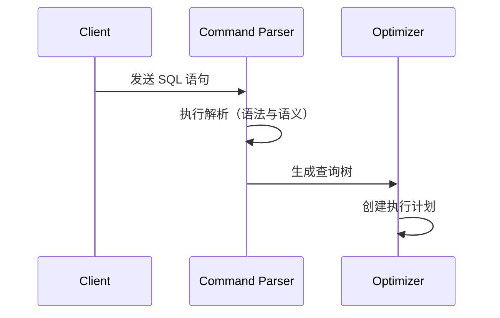
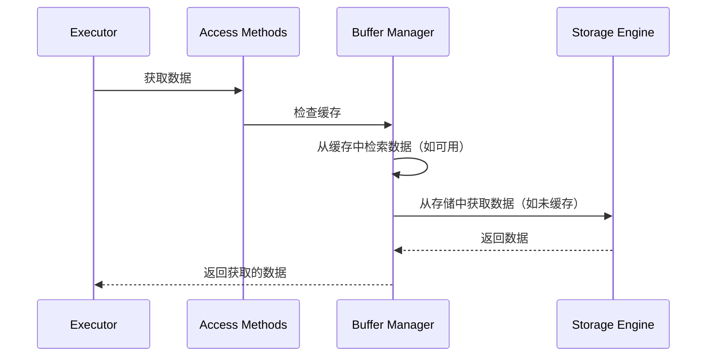
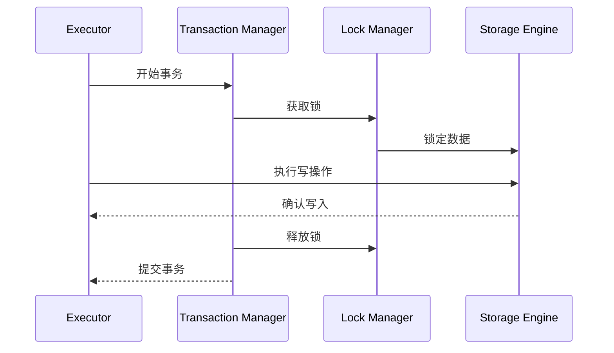

### **SQL 语句在数据库系统中的处理流程**

SQL 语句的处理涉及多个结构化步骤，每一步都负责确保语句的语法和语义正确，优化执行，并在维护数据库完整性的同时安全地处理数据。本文将带您了解 SQL 语句在数据库系统中的完整处理流程。

---

### **SQL 查询执行的逐步流程**

#### **步骤 1：发送 SQL 语句**
- **过程**：客户端通过传输协议（如 **TCP**）将 SQL 语句发送到数据库。
- **目的**：建立客户端与数据库之间的通信。

---

#### **步骤 2：命令解析**
- **过程**：
  1. SQL 语句传递到 **命令解析器**。
  2. 解析器执行 **语法分析**（检查语法正确性）和 **语义分析**（验证逻辑有效性）。
  3. 生成 **查询树**，表示 SQL 语句的逻辑结构。
- **目的**：确保 SQL 查询有效并构建进一步处理的表示形式。

---

#### **步骤 3：查询优化**
- **过程**：查询树传递到 **优化器**，生成 **执行计划**。
- **目的**：优化器评估多种执行路径，并选择资源消耗最少、性能最高的执行方式。

**时序图**：

---

#### **步骤 4：查询执行**
- **过程**：**执行器**接收执行计划并开始执行，从数据存储中检索所需数据。
- **目的**：将优化后的计划转换为可执行的操作步骤，用于数据检索或操作。

---

#### **步骤 5：数据检索**
- **过程**：
  - **访问方法**（Access Methods）提供从 **存储引擎**检索数据的逻辑。
  - 确定如何访问和处理数据。
- **目的**：抽象数据存储和检索的复杂性。

---

#### **步骤 6：只读查询（SELECT）**
- **过程**：
  - 如果 SQL 语句是 **只读查询**（如 SELECT），它会被传递到 **缓冲区管理器**。
  - 缓冲区管理器在 **缓存** 或 **数据文件** 中查找所需数据。
- **目的**：通过避免不必要的磁盘 I/O 提高性能。

**SELECT 查询时序图**：

---

#### **步骤 7：写入查询（INSERT/UPDATE）**
- **过程**：
  - 如果 SQL 语句修改数据（如 INSERT 或 UPDATE），它会被发送到 **事务管理器** 进行处理。
- **目的**：确保对数据库的更改作为事务的一部分进行处理，保持数据一致性和完整性。

---

#### **步骤 8：事务管理与锁定**
- **过程**：
  - 在事务处理中，**锁管理器** 确保数据处于锁定模式，防止并发更改破坏 **ACID 属性**。
  - 锁管理器还确保每个事务具有原子性、一致性、隔离性和持久性。
- **目的**：维护事务完整性，防止并发操作冲突。

**INSERT/UPDATE 查询时序图**：

---

### **关键组件概述**

| **步骤**           | **组件**              | **目的**                                                                 | **示例用途**                             |
|---------------------|-----------------------|--------------------------------------------------------------------------|------------------------------------------|
| 步骤 1             | 传输层               | 将 SQL 语句从客户端发送到数据库服务器。                                    | TCP 连接                                 |
| 步骤 2             | 命令解析器           | 验证并解析 SQL 语句，生成查询树。                                         | 语法检查                                 |
| 步骤 3             | 优化器               | 生成高效的执行计划。                                                     | 查询优化                                 |
| 步骤 4             | 执行器               | 执行优化后的查询计划，检索或修改数据。                                    | 查询执行                                 |
| 步骤 5             | 访问方法             | 提供从存储引擎检索数据的逻辑。                                           | 数据访问抽象                             |
| 步骤 6（SELECT）   | 缓冲区管理器         | 从缓存或存储引擎中检索数据。                                             | 缓存管理                                 |
| 步骤 7（INSERT/UPDATE）| 事务管理器         | 处理写入操作并确保事务完整性。                                            | 事务处理                                 |
| 步骤 8             | 锁管理器             | 确保数据锁定并维护事务的 ACID 属性。                                      | 数据锁定                                 |

---

### **总结**

SQL 语句的处理是一个高度结构化的多步骤过程，涵盖了解析、优化、执行和数据检索。数据库系统的每个组件都为确保高效性、完整性和性能作出了贡献。理解这些步骤及其交互方式，能够帮助开发者和数据库管理员更高效地优化查询，并诊断潜在的性能瓶颈。
