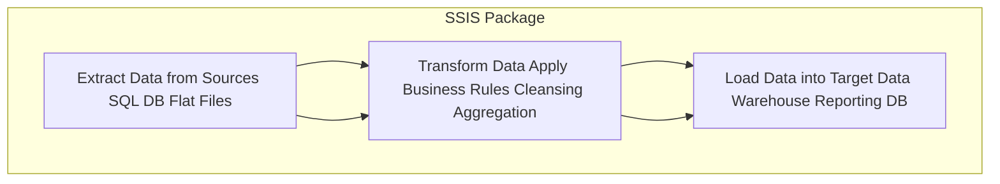
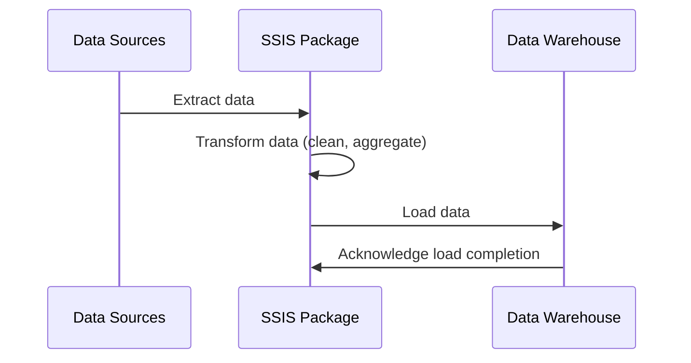

### ETL

ETL stands for **Extract, Transform, and Load**, While it’s a common data warehousing acronym, the second letter (“T”) specifically refers to the transformation of data into a suitable format before loading it into the target system.

**What is ETL in the Context of SSIS?**
- **Extract (E)**: Pulling data out of source systems, which may include databases, files, cloud services, or APIs.
- **Transform (T)**: Cleaning, enriching, restructuring, or merging the extracted data to fit the business or analytical requirements. For example, you might:
  - Convert date formats.
  - Aggregate sales data by region.
  - Standardize inconsistent product codes.
  - Apply business rules to filter or modify data.
- **Load (L)**: Writing the transformed data into a destination, typically a data warehouse, data mart, or another target database where it can be accessed for reporting, analysis, or further processing.

**How SSIS Implements ETL:**
**SQL Server Integration Services (SSIS)** is a platform provided by Microsoft’s SQL Server suite that supports the ETL process. It allows you to design data workflows (known as packages) that define how data is moved and transformed. Key features include:

- **Graphical Development Environment**: SSIS packages are often built using a drag-and-drop interface in SQL Server Data Tools (SSDT). This makes creating complex ETL processes more intuitive.
  
- **Rich Set of Transformations**: Out of the box, SSIS provides a variety of transformations—such as sorting, merging, pivoting/unpivoting, string manipulation, lookups, conditional splits, and more—to handle a wide range of data preparation tasks.

- **Connectivity**: SSIS can connect to various data sources, including relational databases (SQL Server, Oracle, MySQL), Excel files, flat text files, XML and JSON data sources, and third-party systems via custom adapters.

- **Error Handling and Logging**: SSIS includes mechanisms to log package execution details, handle errors gracefully (e.g., reroute problem rows, send notifications), and restart from checkpoints if something fails mid-process.

- **Scheduling and Automation**: Packages created in SSIS can be deployed to the SSIS Catalog on SQL Server and then scheduled via SQL Server Agent. This enables fully automated, routine ETL jobs that run daily, weekly, or on any defined schedule.

In summary, **SSIS is Microsoft’s ETL tool** that helps organizations efficiently extract data from various sources, transform it into a more usable form, and load it into targets like data warehouses—serving as a backbone for many analytics and reporting solutions.

---

Below is a diagram illustrating a simple ETL (Extract, Transform, Load) flow using SSIS concepts.

**Explanation:**
- **Extract (A)**: Data is pulled out from various sources (e.g., SQL databases, Excel files, CSVs).
- **Transform (B)**: The extracted data is cleaned, filtered, and aggregated as per business logic or analytical needs.
- **Load (C)**: The transformed data is then loaded into a destination system such as a data warehouse or data mart.

All these steps are controlled by an SSIS package (represented as the `S` subgraph) that orchestrates the entire ETL process.

---

If you prefer a sequence diagram (which emphasizes the order of operations), here’s a sequence diagram version:

**Explanation:**
- The **Data Sources (Src)** send data to the **SSIS Package**.
- The **SSIS Package** then internally transforms the data.
- After transformation, the data is loaded into the **Data Warehouse (DW)**.
- The data warehouse confirms that the load operation is complete.
