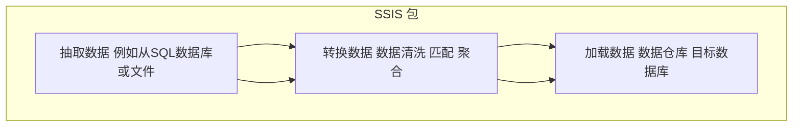

### SSIS ETL流程

下面以中文概述一个简单的SSIS ETL流程，并通过示意性的代码（伪代码方式）展示核心逻辑。SSIS实际是通过图形化界面（BIDS 或 SSDT）设计的，最终配置会存储为.dtsx文件的XML形式，不是直接手写代码。但为了说明流程原理，这里使用“伪代码”与图示帮助理解。

### SSIS流程简介

**ETL 三步：**  
1. **Extract（抽取）**：从源系统提取数据，比如从SQL数据库、平面文件或Excel中读取数据。  
2. **Transform（转换）**：对数据进行清洗、映射、转换、聚合等操作，使其符合目标数据仓库或数据集市的业务需求和格式。  
3. **Load（加载）**：将转换后的数据加载进目标系统（比如数据仓库或分析数据库）中。

### Mermaid流程图示

下面的Mermaid流程图描述一个简单的SSIS ETL流程。从左至右，数据从源被抽取出来，经转换处理后加载到目标存储中。



### 示例伪代码

在SSIS中，你通常使用设计器拖拽“数据流任务”（Data Flow Task）、“连接管理器”（Connection Manager）以及各类转换组件，而非手写代码。然而，我们可用伪代码描述逻辑步骤（请注意这非真实SSIS语法，仅作说明）：

```pseudo
// 定义连接管理器
SourceConnection = new OLEDBConnection("SourceDB_ConnectionString")
DestinationConnection = new OLEDBConnection("DataWarehouse_ConnectionString")

// 定义数据流任务
DataFlowTask:
    // 源组件: 从源数据库的Sales表抽取数据
    OleDbSource:
        Connection = SourceConnection
        SQL = "SELECT SaleID, ProductID, Quantity, SaleDate FROM Sales"

    // 转换组件1: 数据清洗（例如过滤无效记录）
    ConditionalSplit:
        Condition = "Quantity > 0"  // 只通过数量大于0的记录
        Output1 = "ValidRecords"
        Output2 = "InvalidRecords" // 过滤掉的行(可在此记录异常数据)
    
    // 转换组件2: 派生列（例如根据SaleDate派生年度列）
    DerivedColumn:
        Input = ValidRecords
        DerivedColumnName = "SaleYear"
        Expression = YEAR(SaleDate)

    // 转换组件3: 聚合（例如汇总每个产品每年的销售总量）
    Aggregate:
        Input = DerivedColumnOutput
        GroupBy = ProductID, SaleYear
        AggregateExpression = SUM(Quantity) as TotalQuantity

    // 目标组件: 将处理后的数据加载到数据仓库的FactSales表
    OleDbDestination:
        Connection = DestinationConnection
        Table = "FactSales"
        Mappings:
            ProductID -> FactSales.ProductID
            SaleYear -> FactSales.SaleYear
            TotalQuantity -> FactSales.TotalQuantity
```

**逻辑说明：**  
1. 从源数据库（SourceDB）的Sales表提取数据。  
2. 使用条件拆分（ConditionalSplit）过滤掉Quantity<=0的记录，只保留有效数据。  
3. 使用派生列（DerivedColumn）功能在数据流中为每一行添加一个SaleYear列，方便分组聚合。  
4. 使用聚合（Aggregate）组件对数据按产品和年份汇总，总计出各产品在每年的销售数量。  
5. 将最终汇总结果写入目标数据仓库的FactSales表中。  

### 总结
上述流程是对SSIS ETL过程的简单描述和伪代码演示。实际在SSIS中实现时，你会使用SSDT图形化环境配置数据流组件（Source、Derived Column、Aggregate、Destination等），设置好连接和映射，然后执行包（Package）。整个过程体现了ETL的核心概念：先从源抽取数据（E），对数据进行转换（T），最后将其加载到目标（L）。
