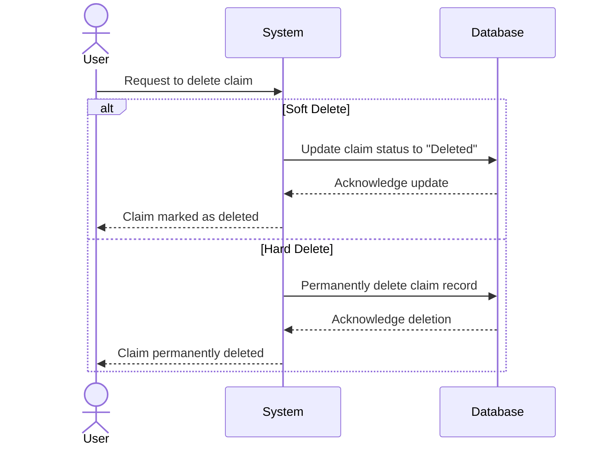

### **Soft Delete vs. Hard Delete: Best Practices, Use Case, and Implementation in Business Claim**

When building data-driven applications, the choice between **soft delete** and **hard delete** is critical to managing data effectively. This article explores the distinctions, industry standards, and implementation strategies, with a focus on the "Claim Business" feature. A practical **MSSQL** example and a visual sequence diagram are also included to illustrate the process.

---

### **Soft Delete vs. Hard Delete**

#### **What Is Soft Delete?**
Soft delete involves marking a record as deleted without removing it from the database. A common approach is to use a status flag or a dedicated field (`IsDeleted`) to indicate its deletion state.

**Characteristics**:
- **Data Recovery**: Allows data restoration.
- **Data Tracking**: Keeps historical data for audit and review.
- **Storage Impact**: Retains records, increasing storage over time.

**Use Cases**:
- Systems that require undo functionality (e.g., e-commerce orders or user management).
- Scenarios where regulatory or business policies mandate data retention.

---

#### **What Is Hard Delete?**
Hard delete permanently removes data from the database, making it unrecoverable.

**Characteristics**:
- **Performance**: Optimized query performance with reduced storage.
- **Irreversible**: Once deleted, data cannot be restored.
- **Compliance**: Often required for data privacy regulations.

**Use Cases**:
- Deleting temporary or irrelevant data (e.g., session logs).
- Complying with GDPR/CCPA privacy laws for "Right to Be Forgotten."

---

### **Comparison Table**

| **Aspect**             | **Soft Delete**                              | **Hard Delete**                              |
|-------------------------|----------------------------------------------|----------------------------------------------|
| **Definition**          | Marks a record as deleted but keeps it in the database. | Permanently removes the record from the database. |
| **Data Recovery**       | Data can be restored.                       | Data cannot be recovered.                    |
| **Storage Impact**      | Increases storage requirements over time.   | Frees up storage immediately.                |
| **Performance**         | Queries may slow down due to filtering.     | Optimized query performance.                 |
| **Audit and Tracking**  | Retains history for tracking and compliance.| Loses history; no audit trail remains.       |
| **Risk of Data Loss**   | Low, as data is not permanently deleted.    | High, as deleted data cannot be recovered.   |
| **Use Cases**           | Undo operations, tracking changes, and compliance with internal policies. | Sensitive data deletion for GDPR/CCPA compliance, removal of invalid data. |
| **Implementation Complexity** | Requires logic for filtering and periodic cleanup. | Simple deletion logic but irreversible.      |

---

### **Industry Standards**
1. **Soft Delete as Default**: 
   - Preferred for data that may need recovery or tracking.
   - Examples: User accounts, transaction records, and business claims.

2. **Hard Delete for Compliance**:
   - Necessary for privacy regulations (GDPR/CCPA) and scenarios requiring permanent removal.
   - Examples: User requests for personal data deletion.

3. **Hybrid Strategy**:
   - Use soft delete for operational needs and hard delete for long-term cleanup or legal compliance.

---

### **Use Case: Business Claim**
For a "Claim Business" feature, the application might need both soft delete and hard delete:

1. **Soft Delete**:
   - Used when a user cancels their claim or an admin rejects it.
   - Keeps the record for potential recovery or audit.

2. **Hard Delete**:
   - Used when a user requests permanent deletion of their claim under privacy regulations.
   - Applied to remove invalid or spam claims.

---

### **Implementation Example in MSSQL**

#### **Step 1: Schema Design**
Add a field to indicate deletion status.

```sql
ALTER TABLE BusinessClaims
ADD IsDeleted BIT DEFAULT 0;
```

#### **Step 2: Soft Delete Query**
Instead of removing the record, mark it as deleted.

```sql
UPDATE BusinessClaims
SET IsDeleted = 1
WHERE ClaimID = @ClaimID;
```

#### **Step 3: Retrieve Non-Deleted Records**
Filter out soft-deleted records in your queries.

```sql
SELECT * 
FROM BusinessClaims
WHERE IsDeleted = 0;
```

#### **Step 4: Restore Soft-Deleted Records**
Allow recovery of soft-deleted records.

```sql
UPDATE BusinessClaims
SET IsDeleted = 0
WHERE ClaimID = @ClaimID;
```

#### **Step 5: Periodic Cleanup**
Remove old soft-deleted records that are no longer needed.

```sql
DELETE FROM BusinessClaims
WHERE IsDeleted = 1 AND DeletedAt < DATEADD(MONTH, -12, GETDATE());
```

---

### **Mermaid Sequence Diagram**

Below is a sequence diagram to illustrate a user requesting claim deletion:



---

### **Recommendations**
1. **Default Strategy**: Use **soft delete** for most operations to allow recovery and tracking.
2. **Compliance Handling**: Implement **hard delete** for GDPR/CCPA compliance and data cleanup.
3. **Periodic Cleanup**: Regularly purge old soft-deleted records to optimize storage and performance.

---

By adopting a hybrid approach, businesses can ensure flexibility, meet regulatory demands, and maintain system efficiency. Whether it's preserving data history with soft delete or ensuring compliance with hard delete, the right strategy depends on balancing operational needs with technical considerations.
