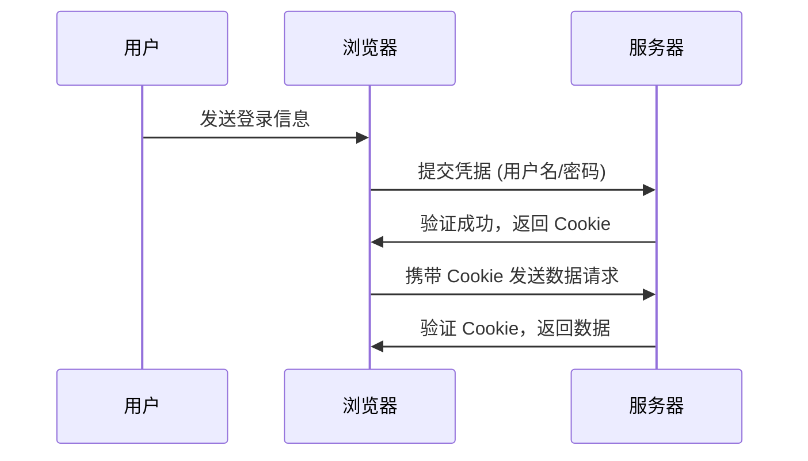
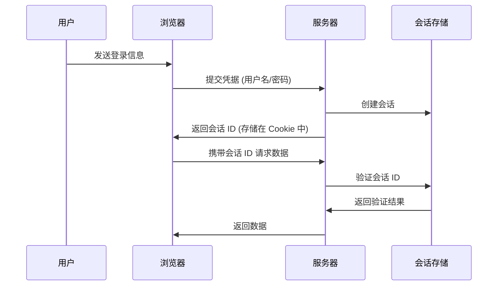
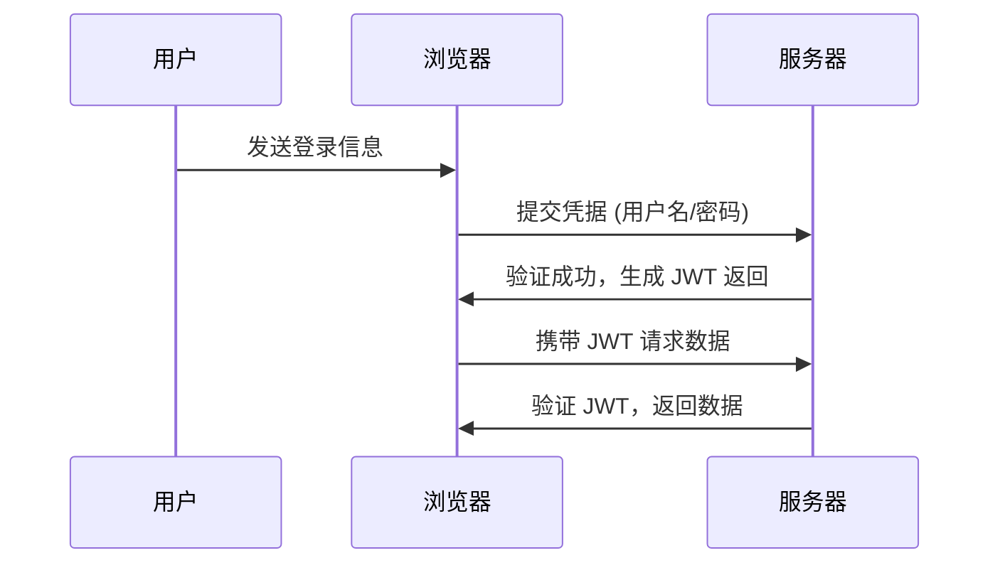
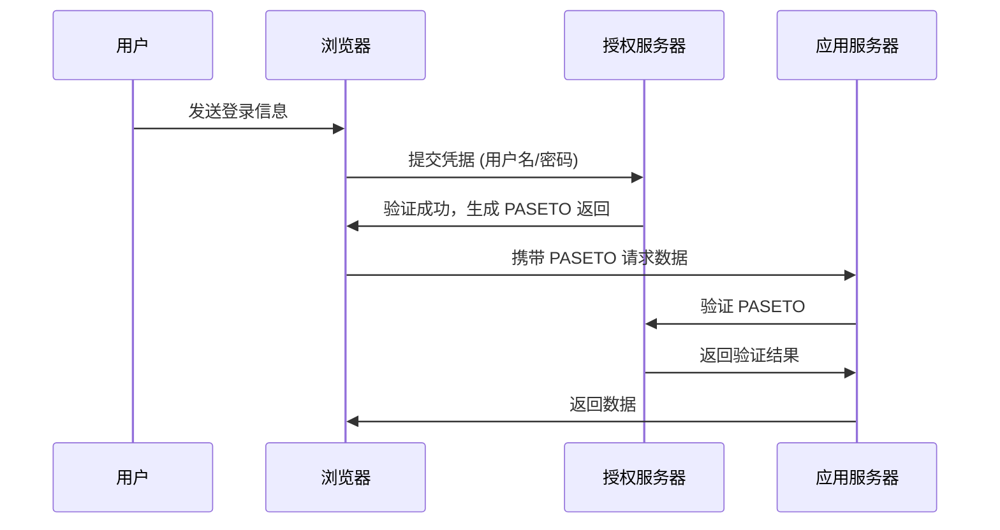

### **深入探讨认证机制：技术详解与实用案例**

认证是现代应用程序安全的第一道防线。它的核心目标是验证用户的身份，确保只有授权用户能够访问特定资源或执行关键操作。本文将深入探讨主流的认证机制，包括 Cookies、Sessions、JWT 和 PASETO，分析它们的技术实现、适用场景和实际案例，同时通过示例化的流程图（Mermaid）展示每种机制的工作流程。

---

### **1. 认证的基础概念**

认证是应用程序中至关重要的一环，回答了“你是谁？”这一核心问题。通过认证，系统可以对用户进行身份验证，并限制资源访问。

常见的认证机制包括：

- **Cookies（Cookie）**
- **Sessions（会话）**
- **JWT（JSON Web Token）**
- **PASETO（Platform-Agnostic Security Token）**

在实际开发中，选择合适的认证机制取决于系统的安全需求、性能要求以及用户体验目标。

---

### **2. Cookie 和会话 (Cookies and Sessions)**

#### **2.1 Cookies**

**描述**  
Cookie 是一种无状态的认证方式，服务器在用户首次登录后将认证信息存储到用户浏览器中。每次请求，浏览器会自动携带该 Cookie，以便服务器验证身份。

**优点**：
- 无需服务器端存储用户状态，减少了存储开销。
- 简单易用，便于前后端集成。

**缺点**：
- 存储在浏览器中的数据可能被恶意用户篡改（需要加密和签名）。
- 容易受到跨站点脚本（XSS）攻击。

**使用案例**  
- **电商网站**：在用户登录后，Cookie 存储用户身份信息，允许后续请求保持登录状态。

**流程图**  

---

#### **2.2 Sessions**

**描述**  
Sessions 是基于服务器的状态管理机制，服务器在用户登录时创建会话，并将会话 ID 返回给用户。会话数据存储在服务器端，客户端仅携带会话 ID 进行后续请求。

**优点**：
- 服务器控制所有会话数据，安全性更高。
- 便于实现用户权限管理和会话超时功能。

**缺点**：
- 需要额外的服务器存储资源。
- 不适合大规模分布式系统，扩展性有限。

**使用案例**  
- **银行应用**：会话 ID 用于确保每个请求的安全性，同时支持会话超时和活动跟踪。

**流程图**  

---

### **3. JWT（JSON Web Token）**

**描述**  
JWT 是一种无状态认证机制，通过数字签名验证令牌的真实性。JWT 将用户身份信息编码为一个令牌，在每次请求中传递，无需服务器存储用户状态。

**优点**：
- 无状态认证，便于分布式系统扩展。
- 可以携带自定义负载数据（如角色、权限等）。

**缺点**：
- 如果令牌未设置合理的过期时间，可能存在安全风险。
- 对于复杂场景，令牌长度可能较大，增加带宽消耗。

**使用案例**  
- **移动应用**：JWT 存储在客户端的本地存储中，适合需要支持跨设备和高并发的场景。

**流程图**  

---

### **4. PASETO（Platform-Agnostic Security Token）**

**描述**  
PASETO 是一种新兴的认证机制，与 JWT 类似，但默认采用更安全的加密算法和结构。它消除了 JWT 中的一些常见问题，例如不安全的算法选择和配置错误。

**优点**：
- 安全性更高，避免了 JWT 的常见漏洞。
- 简单易用，支持明确的安全模型。

**缺点**：
- 目前的生态和社区支持不如 JWT 广泛。
- 部分语言和框架可能缺乏直接支持。

**使用案例**  
- **医疗系统**：通过 PASETO 确保电子健康记录的安全访问，符合严格的隐私和安全要求（如 HIPAA）。

**流程图**  

---

### **总结**

选择适合的认证机制需要平衡安全性、用户体验和性能：

1. **Cookies 和会话**：适合中小型单体应用，便于管理。
2. **JWT**：更适用于分布式系统，无状态认证带来灵活性。
3. **PASETO**：对安全性要求极高的应用（如医疗或金融系统）的理想选择。

开发者应根据实际需求选择最佳方案，同时考虑不断演变的安全威胁和用户期望。
