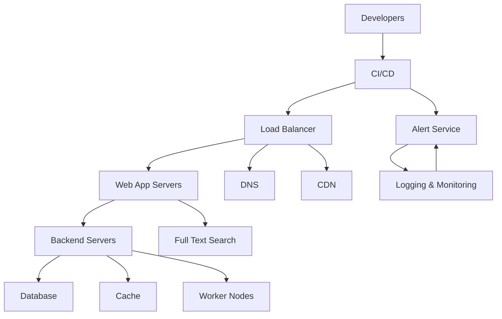

### 10 Essential Components of a Production Web Application:

### Explanation of Diagram Components:

1. **Developers**: Developers interact with the CI/CD system to deploy updates.
2. **CI/CD**: Continuous Integration and Continuous Deployment pipeline that facilitates code deployment and testing.
3. **Load Balancer**: Distributes incoming requests across multiple web servers for optimal resource use.
4. **Web App Servers**: Host the application logic and handle user requests.
5. **Backend Servers**: Manage the business logic and communicate with databases, cache, and worker nodes.
6. **Database**: Stores the application’s data.
7. **Cache**: Speeds up data retrieval for frequently accessed information.
8. **Worker Nodes**: Handle background tasks, such as sending emails or processing jobs.
9. **Full Text Search**: Provides search capabilities within the application.
10. **DNS**: Resolves domain names for the application.
11. **CDN**: Caches and delivers content close to the users to reduce latency.
12. **Alert Service**: Sends notifications or alerts in case of issues.
13. **Logging & Monitoring**: Collects logs and monitors the application’s health. 

This diagram provides a high-level overview of the components and their interactions in a typical production web application setup.
