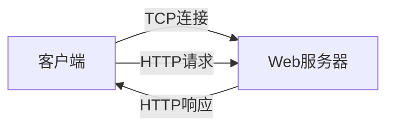
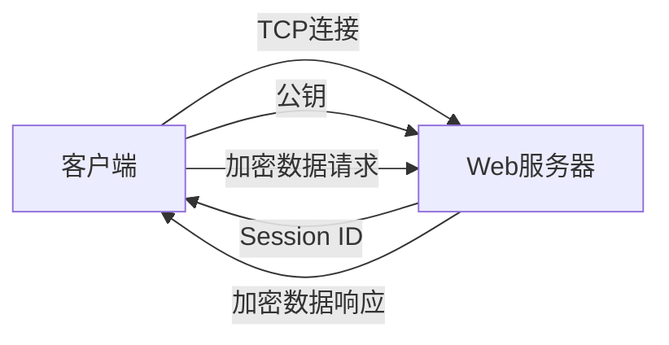
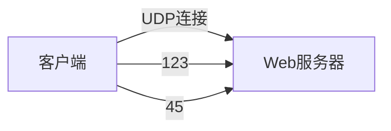
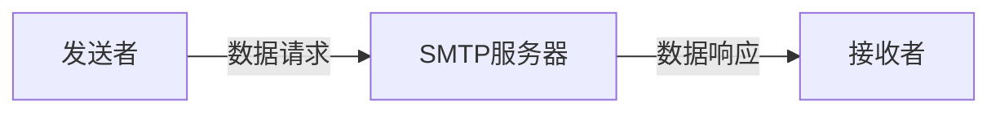
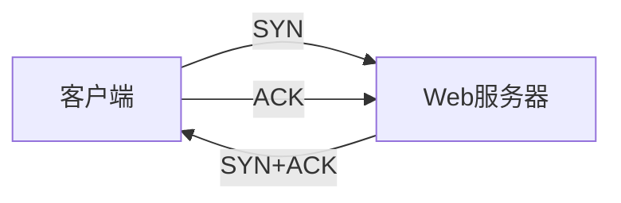
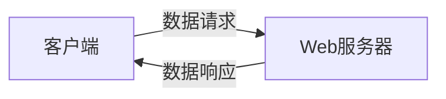

### 6 common network protocols 

here is a structured summary of each protocol with key features and differences. 

---

### 1. HTTP (超文本传输协议)

HTTP是一种无状态的协议，主要用于在客户端和服务器之间传输数据，如网页浏览。

**特点**：
- 基于TCP连接。
- 使用请求-响应模式。
- 无状态，不会在请求之间保持会话信息。

---

### 2. HTTPS (超文本传输安全协议)

HTTPS是HTTP的加密版本，增加了SSL/TLS层来确保数据的安全传输，防止数据被窃听和篡改。

**特点**：
- 基于TCP连接并使用SSL/TLS加密。
- 通过公钥加密、会话密钥保护数据传输。
- 确保数据的机密性和完整性。

---

### 3. HTTP/3

HTTP/3基于UDP协议，通过QUIC实现传输，减少了连接建立延迟和拥塞控制延迟，适合在延迟较高的网络环境中使用。

**特点**：
- 基于UDP而非TCP。
- 使用QUIC协议实现快速连接和数据传输。
- 提高了传输效率，减少了延迟。

---

### 4. SMTP (简单邮件传输协议)

SMTP用于电子邮件的发送，是基于TCP协议的应用层协议。

**特点**：
- 基于TCP连接。
- 负责在邮件服务器之间传输电子邮件。
- 提供客户端到服务器的邮件发送。

---

### 5. TCP (传输控制协议)

TCP是一种面向连接的传输层协议，提供可靠的数据传输，通过三次握手建立连接，保证数据包按顺序传输且无丢失。

**特点**：
- 面向连接。
- 提供可靠的数据传输。
- 使用三次握手建立连接。

---

### 6. UDP (用户数据报协议)

UDP是一种无连接的传输层协议，提供不可靠的数据传输，常用于实时应用如视频通话、在线游戏等。

**特点**：
- 无连接。
- 不保证数据的顺序和完整性。
- 适用于实时传输场景。

---

### Protocol Summary Table

| 协议   | 描述                               | 特点                                                         | 应用场景                  |
|--------|------------------------------------|--------------------------------------------------------------|---------------------------|
| HTTP   | 无状态传输协议                     | 基于TCP，无加密                                             | 浏览网页                  |
| HTTPS  | 安全的HTTP                         | 基于TCP，使用SSL/TLS加密                                    | 安全网页、支付            |
| HTTP/3 | 基于UDP的HTTP版本                  | 使用QUIC协议，减少延迟                                      | 高延迟网络环境            |
| SMTP   | 简单邮件传输协议                   | 基于TCP，发送电子邮件                                       | 电子邮件传输              |
| TCP    | 传输控制协议                       | 面向连接，可靠传输，三次握手                                 | 数据完整性要求高的应用    |
| UDP    | 用户数据报协议                     | 无连接，不可靠传输                                          | 视频通话、在线游戏        |

This overview includes the key characteristics of each protocol, highlighting their typical use cases and the main differences between them. The diagrams illustrate the fundamental flow of each protocol's operation.
