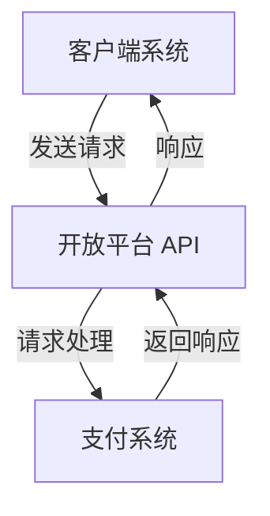
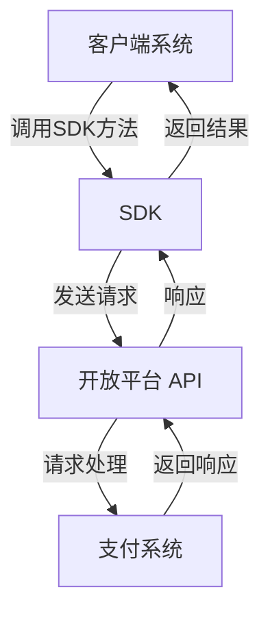

### API vs SDK

以下是根据您提供的图示内容，对 **API（应用程序接口）** 和 **SDK（软件开发工具包）** 的详细解释，包括每个组件的描述，并使用 Mermaid 流程图进行可视化。

---

### API（应用程序接口）

**API** 是一组允许不同软件应用程序相互通信的规则和协议。API 提供了一种通过 HTTP 方法（如 `GET`、`POST`、`PUT` 和 `DELETE`）来访问某些平台或服务功能的方式。

**主要特性**：
- **HTTP 方法**：使用 GET、POST、PUT、DELETE 等方法与 API 进行交互。
- **需要编程**：通常需要开发者编写代码来向 API 发送请求并处理响应。
- **跨进程通信**：允许不同系统和平台之间的通信。
  
**典型流程**：
1. 客户端应用程序向开放平台的 API 发送请求。
2. API 处理请求，可能与其他服务（例如支付系统）进行交互。
3. API 返回响应给客户端。

---

### SDK（软件开发工具包）

**SDK** 是由平台或服务提供的工具包，旨在简化该平台的开发过程。SDK 包括库、示例代码、文档和工具，以帮助开发者更轻松地构建应用程序。

**主要特性**：
- **本地方法调用**：SDK 中的函数类似于本地方法调用，使用方便。
- **简化流程**：SDK 将复杂的 API 调用封装成更简单的高级方法。
- **进程内通信**：便于在同一进程内的调用，便于开发者集成使用。

**典型流程**：
1. 客户端应用程序调用本地 SDK 方法。
2. SDK 向开放平台的 API 发送请求，封装了复杂性。
3. API 处理请求，必要时与其他服务交互。
4. API 返回响应，SDK 将结果返回给客户端应用程序。

---

### 总结

| 比较项           | API                             | SDK                           |
|------------------|---------------------------------|-------------------------------|
| 调用方法         | 直接 HTTP 请求                   | 本地方法调用                   |
| 编程难度         | 较高，需要直接编码               | 较低，通过封装的方法使用       |
| 适用场景         | 跨进程调用                       | 进程内调用                     |
| 返回数据         | 原始 API 响应数据               | 处理后的 SDK 响应数据         |
| 常用的接口方法   | GET/POST/PUT/DELETE             | 简化的方法调用                 |

以上表格总结了 API 和 SDK 在复杂性、使用场景和调用方式上的区别。SDK 通常对开发者更友好，因为它封装了许多直接 API 交互的复杂性，使开发更为便捷。
