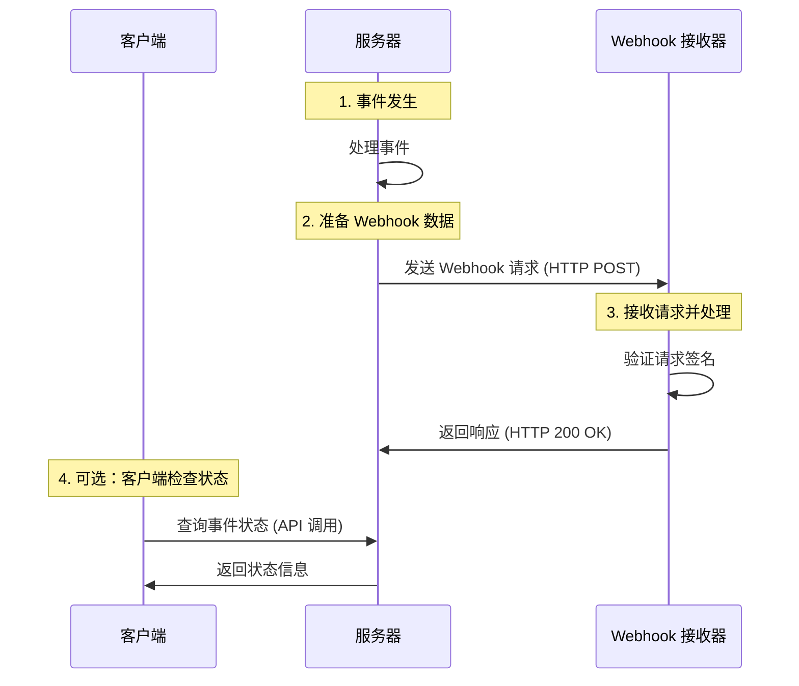
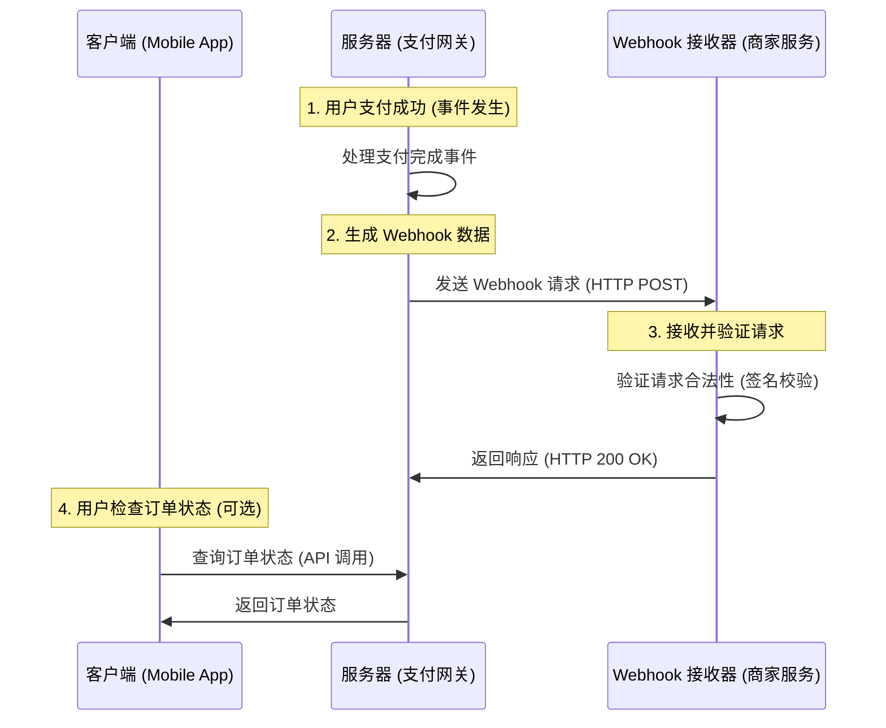

### APIs vs. Webhooks: 区别解析

---

#### **Quick Answer (快速回答)**

- **API（应用程序接口）**: 客户端需要主动发送请求到服务器以获取或推送数据。  
- **Webhook（网络钩子）**: 服务器主动将实时事件推送到客户端，无需客户端轮询。

---

#### **5W Explanation (5W 分析)**

1. **What (什么是 APIs 和 Webhooks)**  
   - **API**: 提供一组方法或端点，允许客户端与服务器进行交互，例如获取用户数据或提交订单。
   - **Webhook**: 当特定事件发生时，服务器向客户端发送 HTTP 回调请求。例如，用户完成支付后通知客户端。

2. **Why (为什么需要它们)**  
   - **API**: 提供灵活性，客户端可按需请求数据。
   - **Webhook**: 减少客户端频繁轮询，提高效率，适合实时事件通知。

3. **When (什么时候用)**  
   - **API**: 客户端需要随时获取或操作服务器数据时。
   - **Webhook**: 客户端需要实时接收某些特定事件通知时。

4. **Where (在哪使用)**  
   - **API**: RESTful 服务、GraphQL 服务等。
   - **Webhook**: 事件驱动的系统，如支付网关、GitHub 通知。

5. **How (如何实现)**  
   - **API**: 客户端通过 HTTP 请求调用。
   - **Webhook**: 服务器通过 HTTP POST 请求推送数据到客户端提供的 URL。

---

### Webhook 流程图

以下是 Webhook 工作流程的 Mermaid 序列图示例，使用中文标注并包含流程编号：



### 中文流程描述

1. **事件发生**：当系统内某个事件（例如订单支付成功）触发时，服务器会进行处理。
2. **准备 Webhook 数据**：服务器整理相关数据（如事件类型和细节）并准备发送到客户端提供的 Webhook 接收 URL。
3. **发送 Webhook 请求**：服务器通过 HTTP POST 请求，将事件数据推送到 Webhook 接收器。
4. **接收并验证请求**：Webhook 接收器验证请求的合法性（如签名校验），处理事件数据后返回 HTTP 200 响应。
5. **（可选）客户端检查状态**：如果客户端未收到 Webhook，或者需要进一步确认事件状态，可以通过 API 主动查询。

---

- `participant` 定义交互的实体，例如客户端、服务器和 Webhook 接收器。
- `Note over` 用于在流程步骤中标注中文描述和编号。
- `->>` 表示发起的请求或消息流。

这种图形化方式非常适合描述 Webhook 事件的流转过程，方便直观理解每个步骤。

---

### **1. 客户端 (Client)**

**定义**：客户端是指调用服务器或接收 Webhook 通知的应用程序。通常是用户端或业务系统的一部分。  
**功能**：
- 可以通过 API 主动向服务器发起请求查询状态。
- 在某些场景下，用于确认 Webhook 通知是否成功处理。  

**示例**：  
- 一个移动应用程序，用于显示用户订单状态。
- 业务方系统，用于接收订单完成或支付成功的通知。

### **2. 服务器 (Server)**

**定义**：服务器是负责处理事件、生成 Webhook 数据并推送给客户端的核心。  
**功能**：
- 监听并处理系统中的事件（如订单完成或支付成功）。
- 根据业务逻辑，生成包含事件信息的 Webhook 数据。
- 主动向 Webhook 接收器发送 HTTP POST 请求。

**示例**：  
- 支付网关系统：当支付完成后，向商家系统发送支付完成通知。  
- GitHub 服务器：在代码提交或 PR 更新时向外部服务推送事件。

### **3. Webhook 接收器 (Webhook Receiver)**

**定义**：Webhook 接收器是客户端提供的 HTTP 接口，用于接收来自服务器的事件通知。  
**功能**：
- 通过公开的 URL 监听来自服务器的 Webhook 回调请求。
- 验证请求的合法性（如签名校验、IP 白名单等）。
- 处理接收到的事件数据并执行相关业务逻辑（如更新数据库、触发内部流程）。

**示例**：  
- 商家的后端服务：接收支付完成的通知并更新订单状态。  
- DevOps 系统：接收来自 GitHub 的代码提交事件，并触发自动化构建或部署流程。

### **关系与交互**

| **角色**       | **交互方式**                                                                 |
|----------------|-----------------------------------------------------------------------------|
| **客户端**     | 通过 API 主动向服务器请求数据，或者被动等待 Webhook 接收器收到通知并处理业务逻辑。 |
| **服务器**     | 负责监听事件、处理事件并将通知推送到 Webhook 接收器。                             |
| **Webhook 接收器** | 接收来自服务器的回调，验证请求合法性并执行后续业务操作。                               |

通过这些定义和角色，您可以清楚地理解 Mermaid 图中各参与者的角色与职责。

---

#### **C# Code Example (C# 代码示例)**

##### API Example (API 示例)

客户端通过 API 获取用户数据：
```csharp
using System;
using System.Net.Http;
using System.Threading.Tasks;

class Program
{
    static async Task Main(string[] args)
    {
        string apiUrl = "https://api.example.com/users/123";
        using HttpClient client = new HttpClient();

        try
        {
            HttpResponseMessage response = await client.GetAsync(apiUrl);
            response.EnsureSuccessStatusCode();
            string responseBody = await response.Content.ReadAsStringAsync();
            Console.WriteLine("User Data: " + responseBody);
        }
        catch (HttpRequestException e)
        {
            Console.WriteLine("Error: " + e.Message);
        }
    }
}
```

**说明**:
1. 客户端通过 `GET` 请求向 API 发送请求。
2. API 返回用户数据的响应。

---




---

### **流程详解**

#### 示例背景
- **客户端**：移动应用（如购物 App），用户可以通过它查询订单状态。
- **服务器**：支付网关，当用户支付成功时，它会通知商家的后端服务。
- **Webhook 接收器**：商家的后端服务，用于接收支付网关发送的 Webhook 通知并更新订单状态。

---

#### **编号步骤**

1. **用户支付成功（事件发生）**：  
   - 用户通过客户端完成支付，支付网关监听到支付成功事件。

2. **生成 Webhook 数据**：  
   - 支付网关服务器处理支付完成事件，生成包含订单信息的 Webhook 数据。

3. **发送 Webhook 请求**：  
   - 支付网关通过 HTTP POST 将 Webhook 数据发送到商家服务的接收 URL。

4. **接收并验证请求**：  
   - 商家服务验证 Webhook 请求的签名是否有效，并解析订单数据。
   - 处理完成后，返回 HTTP 200 OK 表示接收成功。

5. **（可选）用户检查订单状态**：  
   - 如果 Webhook 出现延迟或用户想确认订单状态，可以通过客户端向支付网关发起查询请求，获取订单状态。

---

### **优点**

通过这种方式，支付网关和商家系统实现了**事件驱动通信**，减少了客户端的轮询负担，同时提高了实时性。


```csharp
// 导入必要的命名空间，用于 HTTP 操作和 JSON 序列化
using System;
using System.Net.Http;
using System.Text.Json;
using System.Threading.Tasks;
using Microsoft.AspNetCore.Mvc;

// 模拟服务器 (支付网关) 负责发送 Webhook
public class Server
{
    private static readonly HttpClient HttpClient = new HttpClient(); // 初始化可复用的 HttpClient，用于发送 HTTP 请求

    public async Task SendWebhookAsync(string webhookUrl, WebhookPayload payload)
    {
        try
        {
            Console.WriteLine("1. 生成 Webhook 数据中..."); // 日志记录：开始生成 Webhook 数据
            string jsonData = JsonSerializer.Serialize(payload); // 将负载数据序列化为 JSON 格式

            Console.WriteLine("2. 正在向商家发送 Webhook..."); // 日志记录：准备发送 Webhook
            var content = new StringContent(jsonData, System.Text.Encoding.UTF8, "application/json"); // 准备 HTTP POST 内容，包括 JSON 数据

            HttpResponseMessage response = await HttpClient.PostAsync(webhookUrl, content); // 向 Webhook URL 发送 HTTP POST 请求
            
            // 检查返回的响应状态码，判断是否成功送达
            if (response.IsSuccessStatusCode)
                Console.WriteLine("3. Webhook 成功送达！"); // 日志记录：Webhook 送达成功
            else
                Console.WriteLine($"Webhook 送达失败，状态码: {response.StatusCode}"); // 日志记录：Webhook 送达失败，并记录状态码
        }
        catch (Exception ex)
        {
            // 捕获并记录在发送 Webhook 过程中发生的异常
            Console.WriteLine($"发送 Webhook 出现错误: {ex.Message}");
        }
    }
}

// 模拟 Webhook 接收器 (商家服务)，用于处理接收到的 Webhook 请求
[ApiController]
[Route("api/[controller]")] // 定义路由为 "/api/WebhookReceiver"
public class WebhookReceiverController : ControllerBase
{
    [HttpPost] // 指定此端点处理 HTTP POST 请求
    public IActionResult ReceiveWebhook([FromBody] WebhookPayload payload)
    {
        Console.WriteLine("4. 商家服务接收到 Webhook..."); // 日志记录：Webhook 请求已接收
        
        // 验证 Webhook 签名，确保请求来源可信
        if (!ValidateSignature(payload))
        {
            Console.WriteLine("Webhook 签名无效。"); // 日志记录：签名验证失败
            return BadRequest("签名无效"); // 返回 HTTP 400 Bad Request 状态
        }

        // 处理接收到的 Webhook 事件
        Console.WriteLine($"5. 正在处理 Webhook 事件: {payload.EventType}"); // 日志记录：显示正在处理的事件类型
        return Ok(new { Message = "Webhook 处理成功" }); // 返回 HTTP 200 OK，并附带处理成功的消息
    }

    private bool ValidateSignature(WebhookPayload payload)
    {
        // 签名验证逻辑占位符（例如使用 HMAC 或令牌验证）
        return true; // 为简单起见，假设验证通过
    }
}

// 定义 Webhook 负载的结构
public class WebhookPayload
{
    public string EventType { get; set; } // 事件类型，例如 "PaymentSuccess" (支付成功)
    public string OrderId { get; set; } // 与事件相关的订单 ID
    public decimal Amount { get; set; } // 事件涉及的金额
}
```

---

### **代码中的逐行解释**

1. **服务器部分**：
   - `SendWebhookAsync` 方法：
     - 将 `WebhookPayload` 序列化为 JSON 格式。
     - 通过 HTTP POST 请求将 Webhook 发送到商家的 Webhook 接收端点。
     - 记录 Webhook 是否成功送达或失败。

2. **Webhook 接收器部分**：
   - `ReceiveWebhook` 方法：
     - 接收来自服务器的 Webhook 负载并验证签名。
     - 日志记录事件类型，处理接收到的事件数据。
     - 返回适当的 HTTP 状态码，确认处理结果。

3. **负载类**：
   - 定义 Webhook 数据的结构，确保发送方和接收方都能正确解析和理解数据。

通过在代码内部直接注释解释，每一行或代码块都清楚地说明其在 Webhook 工作流程中的作用和目的。


---

##### Webhook Example (Webhook 示例)

服务端接收 Webhook 通知：
```csharp
using Microsoft.AspNetCore.Mvc;

namespace WebhookDemo.Controllers
{
    [Route("api/[controller]")]
    [ApiController]
    public class WebhookController : ControllerBase
    {
        [HttpPost]
        public IActionResult ReceiveWebhook([FromBody] WebhookPayload payload)
        {
            Console.WriteLine($"Received Event: {payload.EventType}");
            Console.WriteLine($"Data: {payload.Data}");
            
            // 处理业务逻辑
            return Ok(new { Status = "Received" });
        }
    }

    public class WebhookPayload
    {
        public string EventType { get; set; }
        public string Data { get; set; }
    }
}
```

**说明**:
1. 服务端通过 `POST` 方法接收 Webhook 通知。
2. Webhook 通知包含事件类型和数据。
3. 服务器处理数据后返回成功响应。

---

#### **Comparison Table (比较表格)**

| **特性**         | **API**                                        | **Webhook**                                    |
|------------------|-----------------------------------------------|-----------------------------------------------|
| **通信方向**      | 客户端向服务器发起请求                            | 服务器向客户端推送通知                            |
| **实时性**       | 不实时，需轮询                                  | 实时通知                                       |
| **触发方式**      | 客户端主动                                     | 服务器事件驱动                                   |
| **实现复杂度**    | 需要客户端实现请求逻辑                            | 需要服务器和客户端实现接收回调接口                    |
| **适用场景**      | 需要定期或按需获取数据                            | 需要实时响应的事件，例如支付或状态变更通知               |

---

#### **Tips (提示)**

- **API**:
  - 使用标准化协议（如 RESTful）。
  - 确保 API 的身份验证（如 OAuth）。

- **Webhook**:
  - 提供安全机制（如签名验证）防止伪造请求。
  - 处理失败时需要重试机制。

---

#### **Interview Questions (面试问题)**

1. **What are the advantages of Webhooks over APIs?**
   - Webhooks 提供实时性，减少轮询的负担。
2. **How do you secure Webhook endpoints?**
   - 通过验证签名、防火墙规则等。
3. **What happens if a Webhook delivery fails?**
   - 服务器应实现重试机制，或记录失败日志。

---

#### **Summary (总结)**

- API 和 Webhook 是服务通信的两种方式，各有优劣。
- **API** 提供灵活性，适合按需请求；**Webhook** 提供实时性，适合事件驱动场景。
- 根据场景选择适合的方式，以满足业务需求和系统效率。

