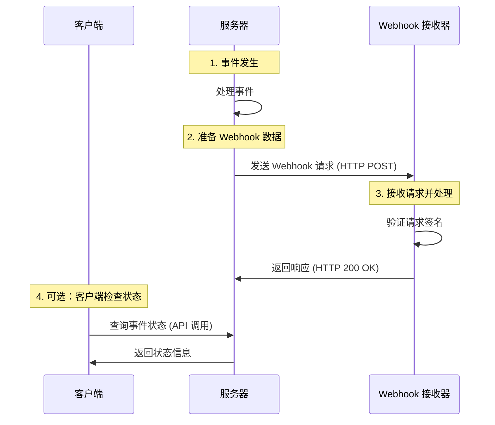

### APIs vs. Webhooks: 区别解析

---

#### **Quick Answer (快速回答)**

- **API（应用程序接口）**: 客户端需要主动发送请求到服务器以获取或推送数据。  
- **Webhook（网络钩子）**: 服务器主动将实时事件推送到客户端，无需客户端轮询。

---

#### **5W Explanation (5W 分析)**

1. **What (什么是 APIs 和 Webhooks)**  
   - **API**: 提供一组方法或端点，允许客户端与服务器进行交互，例如获取用户数据或提交订单。
   - **Webhook**: 当特定事件发生时，服务器向客户端发送 HTTP 回调请求。例如，用户完成支付后通知客户端。

2. **Why (为什么需要它们)**  
   - **API**: 提供灵活性，客户端可按需请求数据。
   - **Webhook**: 减少客户端频繁轮询，提高效率，适合实时事件通知。

3. **When (什么时候用)**  
   - **API**: 客户端需要随时获取或操作服务器数据时。
   - **Webhook**: 客户端需要实时接收某些特定事件通知时。

4. **Where (在哪使用)**  
   - **API**: RESTful 服务、GraphQL 服务等。
   - **Webhook**: 事件驱动的系统，如支付网关、GitHub 通知。

5. **How (如何实现)**  
   - **API**: 客户端通过 HTTP 请求调用。
   - **Webhook**: 服务器通过 HTTP POST 请求推送数据到客户端提供的 URL。

---

### Webhook 流程图

以下是 Webhook 工作流程的 Mermaid 序列图示例，使用中文标注并包含流程编号：



### 中文流程描述

1. **事件发生**：当系统内某个事件（例如订单支付成功）触发时，服务器会进行处理。
2. **准备 Webhook 数据**：服务器整理相关数据（如事件类型和细节）并准备发送到客户端提供的 Webhook 接收 URL。
3. **发送 Webhook 请求**：服务器通过 HTTP POST 请求，将事件数据推送到 Webhook 接收器。
4. **接收并验证请求**：Webhook 接收器验证请求的合法性（如签名校验），处理事件数据后返回 HTTP 200 响应。
5. **（可选）客户端检查状态**：如果客户端未收到 Webhook，或者需要进一步确认事件状态，可以通过 API 主动查询。

---

#### **Mermaid 图说明**

- `participant` 定义交互的实体，例如客户端、服务器和 Webhook 接收器。
- `Note over` 用于在流程步骤中标注中文描述和编号。
- `->>` 表示发起的请求或消息流。

这种图形化方式非常适合描述 Webhook 事件的流转过程，方便直观理解每个步骤。

---

#### **C# Code Example (C# 代码示例)**

##### API Example (API 示例)

客户端通过 API 获取用户数据：
```csharp
using System;
using System.Net.Http;
using System.Threading.Tasks;

class Program
{
    static async Task Main(string[] args)
    {
        string apiUrl = "https://api.example.com/users/123";
        using HttpClient client = new HttpClient();

        try
        {
            HttpResponseMessage response = await client.GetAsync(apiUrl);
            response.EnsureSuccessStatusCode();
            string responseBody = await response.Content.ReadAsStringAsync();
            Console.WriteLine("User Data: " + responseBody);
        }
        catch (HttpRequestException e)
        {
            Console.WriteLine("Error: " + e.Message);
        }
    }
}
```

**说明**:
1. 客户端通过 `GET` 请求向 API 发送请求。
2. API 返回用户数据的响应。

---

##### Webhook Example (Webhook 示例)

服务端接收 Webhook 通知：
```csharp
using Microsoft.AspNetCore.Mvc;

namespace WebhookDemo.Controllers
{
    [Route("api/[controller]")]
    [ApiController]
    public class WebhookController : ControllerBase
    {
        [HttpPost]
        public IActionResult ReceiveWebhook([FromBody] WebhookPayload payload)
        {
            Console.WriteLine($"Received Event: {payload.EventType}");
            Console.WriteLine($"Data: {payload.Data}");
            
            // 处理业务逻辑
            return Ok(new { Status = "Received" });
        }
    }

    public class WebhookPayload
    {
        public string EventType { get; set; }
        public string Data { get; set; }
    }
}
```

**说明**:
1. 服务端通过 `POST` 方法接收 Webhook 通知。
2. Webhook 通知包含事件类型和数据。
3. 服务器处理数据后返回成功响应。

---

#### **Comparison Table (比较表格)**

| **特性**         | **API**                                        | **Webhook**                                    |
|------------------|-----------------------------------------------|-----------------------------------------------|
| **通信方向**      | 客户端向服务器发起请求                            | 服务器向客户端推送通知                            |
| **实时性**       | 不实时，需轮询                                  | 实时通知                                       |
| **触发方式**      | 客户端主动                                     | 服务器事件驱动                                   |
| **实现复杂度**    | 需要客户端实现请求逻辑                            | 需要服务器和客户端实现接收回调接口                    |
| **适用场景**      | 需要定期或按需获取数据                            | 需要实时响应的事件，例如支付或状态变更通知               |

---

#### **Tips (提示)**

- **API**:
  - 使用标准化协议（如 RESTful）。
  - 确保 API 的身份验证（如 OAuth）。

- **Webhook**:
  - 提供安全机制（如签名验证）防止伪造请求。
  - 处理失败时需要重试机制。

---

#### **Interview Questions (面试问题)**

1. **What are the advantages of Webhooks over APIs?**
   - Webhooks 提供实时性，减少轮询的负担。
2. **How do you secure Webhook endpoints?**
   - 通过验证签名、防火墙规则等。
3. **What happens if a Webhook delivery fails?**
   - 服务器应实现重试机制，或记录失败日志。

---

#### **Summary (总结)**

- API 和 Webhook 是服务通信的两种方式，各有优劣。
- **API** 提供灵活性，适合按需请求；**Webhook** 提供实时性，适合事件驱动场景。
- 根据场景选择适合的方式，以满足业务需求和系统效率。

