### 7种事件驱动架构模式的详细解释：

### 1. Competing Consumer Pattern（竞争消费者模式）

**描述**：  
在竞争消费者模式中，多个消费者（Consumers）从同一个消息队列中读取消息。任务被负载均衡地分配给每个消费者，以便均匀地处理任务。这种模式可以有效提高系统的吞吐量，因为多个消费者可以并行处理任务。

**应用场景**：
- 需要提高系统处理吞吐量的情况。
- 处理大量并发任务，比如订单处理、用户请求处理等。

**优点**：
- 提高系统的处理速度和效率。
- 简化了任务分发，因为消息队列会自动进行负载均衡。

**缺点**：
- 可能会导致消费者处理不均匀，某些消费者处理任务较多，可能会成为瓶颈。

---

### 2. Consume and Project Pattern（消费和投影模式）

**描述**：  
在消费和投影模式中，数据在被处理后，经过事件生成并投影到不同的数据视图（View）。举例来说，订单服务（Order Service）创建订单后，会发送订单创建事件，消费者如订单投影服务（Order Projection Service）可以监听这个事件并根据事件数据创建一个“订单-客户”投影视图。这个模式适合创建可读性更强的视图或模型，通常用于实现CQRS（命令查询职责分离）模式。

**应用场景**：
- 需要将数据从多个来源组合成一个综合视图。
- 实现CQRS架构，以分离写入和读取的逻辑。

**优点**：
- 提高了数据的可读性，创建了优化查询的专用视图。
- 可以解耦读写服务，提升扩展性。

**缺点**：
- 需要管理多个视图，可能导致数据一致性问题。

---

### 3. Event Sourcing Pattern（事件溯源模式）

**描述**：  
在事件溯源模式中，每一个数据的状态变更都通过事件存储（Event Store）来记录。系统不直接保存当前状态，而是通过回放所有事件来重建状态。事件溯源的一个关键特点是事件是不可变的，这意味着任何状态的更改都会生成一个新的事件。

**应用场景**：
- 需要对数据的每个状态变更进行精确记录的情况。
- 实现审计和可追溯性，例如财务应用程序。

**优点**：
- 提供了数据的完整历史记录，便于审计和回溯。
- 支持重放事件以恢复系统状态，提升系统的鲁棒性。

**缺点**：
- 存储和回放大量事件可能会影响性能。
- 事件溯源系统可能比传统系统更复杂。

---

### 4. Async Task Execution Pattern（异步任务执行模式）

**描述**：  
异步任务执行模式通常会将任务放入队列中，并使用多个工作线程（Workers）来处理任务。这种模式能够根据任务的优先级或延迟需求，将任务放入不同的队列中（例如默认队列和紧急队列），从而对任务进行分层处理。

**应用场景**：
- 大量任务需要异步处理的场景，例如邮件通知或批处理作业。
- 任务有优先级，需要优先处理紧急任务的情况。

**优点**：
- 提高系统处理任务的吞吐量和灵活性。
- 允许根据任务优先级来动态调度。

**缺点**：
- 可能导致任务饥饿问题（某些低优先级任务可能长期无法执行）。
- 需要管理多个队列和工作线程，复杂度增加。

---

### 5. Transactional Outbox Pattern（事务外发模式）

**描述**：  
事务外发模式用于确保数据库操作和消息发送的一致性。首先，将消息写入数据库的外发表（Outbox Table）中，然后在事务提交后，消息才会被发送到消息队列。这样可以确保消息发送和数据库操作之间的原子性，避免出现不一致的情况。

**应用场景**：
- 需要确保数据库操作和消息传递之间的一致性。
- 例如订单创建后必须通知库存服务进行库存检查的情况。

**优点**：
- 确保数据库和消息队列之间的数据一致性。
- 避免了分布式事务的开销，提升了系统性能。

**缺点**：
- 需要实现额外的逻辑来管理外发表。
- 如果没有清理机制，外发表可能会积累大量数据，影响性能。

---

### 6. Event Aggregation Pattern（事件聚合模式）

**描述**：  
事件聚合模式用于将多个细粒度的事件合并成一个粗粒度的事件。例如，创建客户的过程可能包括多个子事件（创建联系人、创建账户、创建地址等），可以将这些子事件聚合为一个创建客户的聚合事件。

**应用场景**：
- 需要对多个事件进行聚合并生成新的事件时。
- 在微服务环境中，每个微服务负责不同子事件的处理。

**优点**：
- 减少下游系统接收的事件数量，提升系统效率。
- 让事件更加清晰和易于理解，便于维护。

**缺点**：
- 可能增加事件处理的延迟，因为需要等待多个事件。
- 事件聚合逻辑较为复杂，特别是在并发环境中。

---

### 7. Saga Pattern（事务补偿模式）

**描述**：  
Saga模式用于管理长时间运行的分布式事务，特别适合微服务环境。Saga将一个全局事务拆分为多个局部事务，若其中一个事务失败，则会触发补偿事务来撤销之前的操作。Saga通常采用编排器模式（Orchestrator Pattern），有一个专门的Saga编排器负责协调各个子事务的执行。

**应用场景**：
- 需要确保分布式事务的最终一致性。
- 例如电商系统的订单创建、支付和发货流程。

**优点**：
- 避免了分布式事务的复杂性，通过局部事务实现最终一致性。
- Saga编排器提供了对事务的集中控制和监控。

**缺点**：
- 可能会出现补偿操作过多，导致额外开销。
- Saga编排器可能成为系统的单点故障。

---

### 总结

这七种事件驱动架构模式各有其适用场景和优缺点。在实际应用中，应根据系统的需求和具体场景来选择合适的模式。例如：

- 如果需要高吞吐量并行处理，可以使用**竞争消费者模式**。
- 如果需要对事件进行长时间的跟踪和回溯，可以使用**事件溯源模式**。
- 如果需要分布式事务的一致性保障，可以选择**事务补偿模式（Saga Pattern）**或**事务外发模式（Transactional Outbox Pattern）**。

选择合适的事件驱动模式有助于提高系统的鲁棒性、可扩展性和可靠性。

---

下面是每个事件驱动架构模式的Mermaid流程图、C#代码示例和Mermaid类图，以帮助深入理解和实现这些模式。

---

### 1. Competing Consumer Pattern（竞争消费者模式）

#### Mermaid流程图

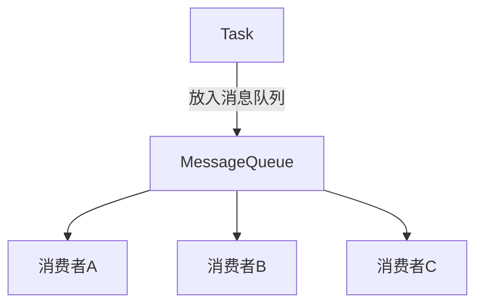

#### C#代码示例

```csharp
using System;
using System.Collections.Concurrent;
using System.Threading.Tasks;

public class CompetingConsumer
{
    private static BlockingCollection<string> messageQueue = new BlockingCollection<string>();

    public static void Main()
    {
        // 模拟生产任务
        Task.Run(() => ProduceMessages());

        // 消费者并行处理
        Task.Run(() => ConsumeMessages("消费者A"));
        Task.Run(() => ConsumeMessages("消费者B"));
        Task.Run(() => ConsumeMessages("消费者C"));
        
        Console.ReadLine();
    }

    static void ProduceMessages()
    {
        for (int i = 0; i < 10; i++)
        {
            string message = $"任务{i}";
            Console.WriteLine($"生产任务: {message}");
            messageQueue.Add(message);
            Task.Delay(500).Wait(); // 模拟任务生成延迟
        }
        messageQueue.CompleteAdding();
    }

    static void ConsumeMessages(string consumerName)
    {
        foreach (var message in messageQueue.GetConsumingEnumerable())
        {
            Console.WriteLine($"{consumerName} 处理 {message}");
            Task.Delay(1000).Wait(); // 模拟任务处理时间
        }
    }
}
```

#### Mermaid类图

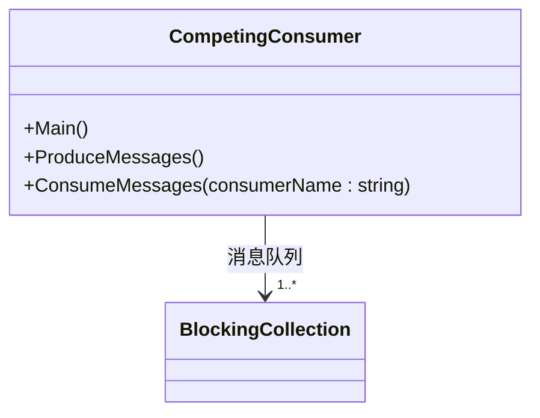

---

### 2. Consume and Project Pattern（消费和投影模式）

#### Mermaid流程图

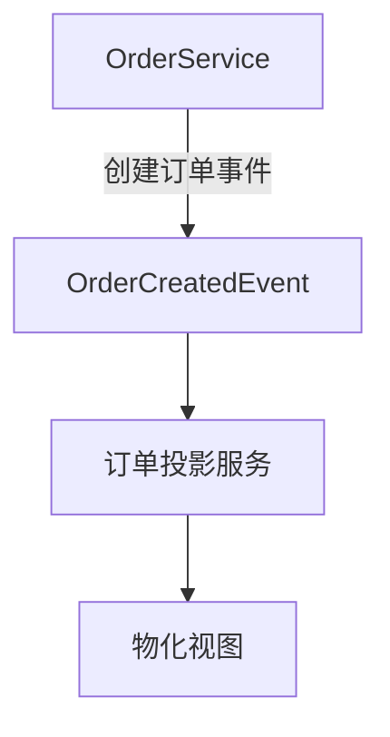

#### C#代码示例

```csharp
using System;
using System.Collections.Generic;

public class OrderService
{
    public event Action<string> OrderCreated;

    public void CreateOrder(string orderId)
    {
        Console.WriteLine($"订单 {orderId} 已创建");
        OrderCreated?.Invoke(orderId); // 发布事件
    }
}

public class OrderProjectionService
{
    private Dictionary<string, string> materializedView = new Dictionary<string, string>();

    public void OnOrderCreated(string orderId)
    {
        materializedView[orderId] = $"Order {orderId} 投影视图";
        Console.WriteLine($"订单 {orderId} 的物化视图已创建");
    }
}

public class Program
{
    public static void Main()
    {
        var orderService = new OrderService();
        var orderProjectionService = new OrderProjectionService();

        // 订阅事件
        orderService.OrderCreated += orderProjectionService.OnOrderCreated;

        // 创建订单
        orderService.CreateOrder("123");
    }
}
```

#### Mermaid类图

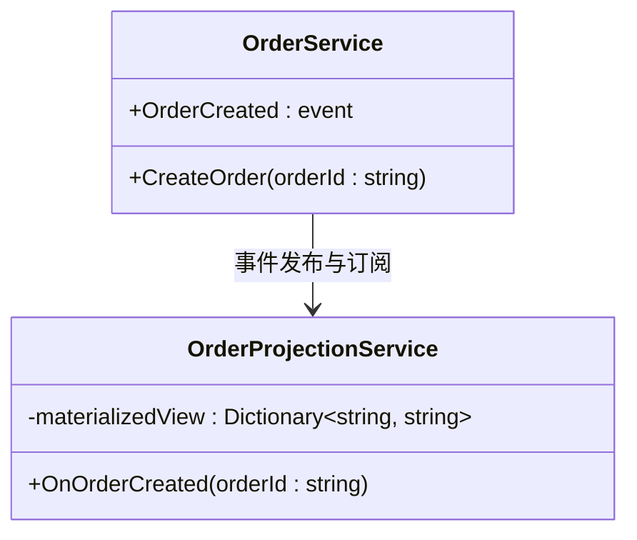

---

### 3. Event Sourcing Pattern（事件溯源模式）

#### Mermaid流程图

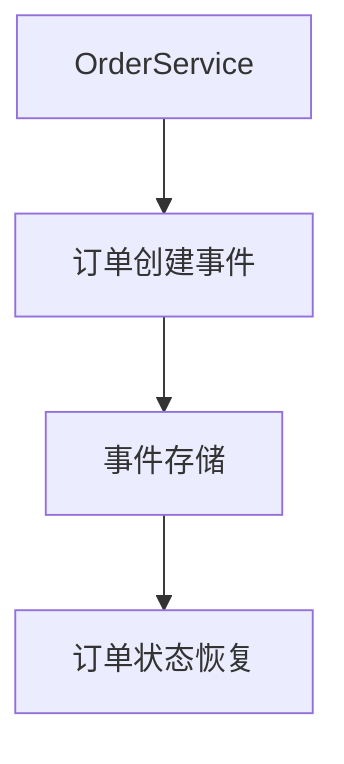

#### C#代码示例

```csharp
using System;
using System.Collections.Generic;

public class EventStore
{
    private List<string> events = new List<string>();

    public void SaveEvent(string eventMessage)
    {
        events.Add(eventMessage);
        Console.WriteLine($"事件已存储: {eventMessage}");
    }

    public void ReplayEvents()
    {
        Console.WriteLine("重放所有事件...");
        foreach (var e in events)
        {
            Console.WriteLine($"重放事件: {e}");
        }
    }
}

public class OrderService
{
    private EventStore eventStore;

    public OrderService(EventStore eventStore)
    {
        this.eventStore = eventStore;
    }

    public void CreateOrder(string orderId)
    {
        string eventMessage = $"订单 {orderId} 已创建";
        eventStore.SaveEvent(eventMessage);
    }
}

public class Program
{
    public static void Main()
    {
        var eventStore = new EventStore();
        var orderService = new OrderService(eventStore);

        // 创建订单并存储事件
        orderService.CreateOrder("123");

        // 重放事件
        eventStore.ReplayEvents();
    }
}
```

#### Mermaid类图

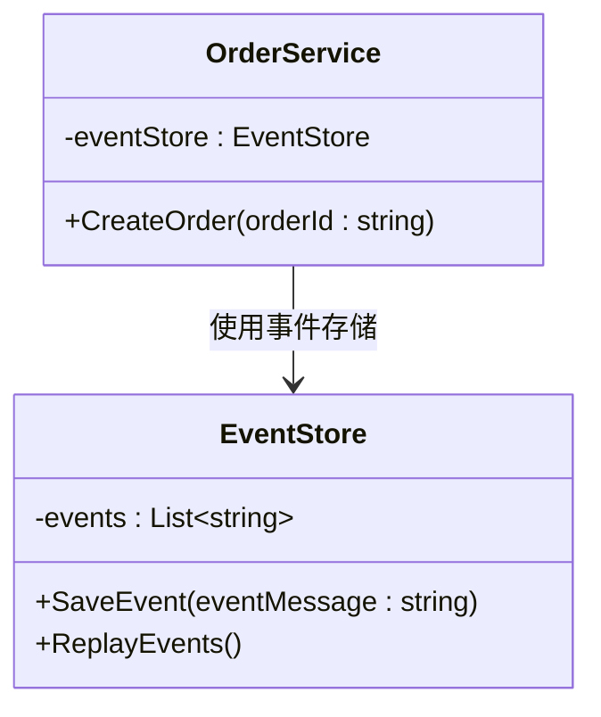

---

### 4. Async Task Execution Pattern（异步任务执行模式）

#### Mermaid流程图

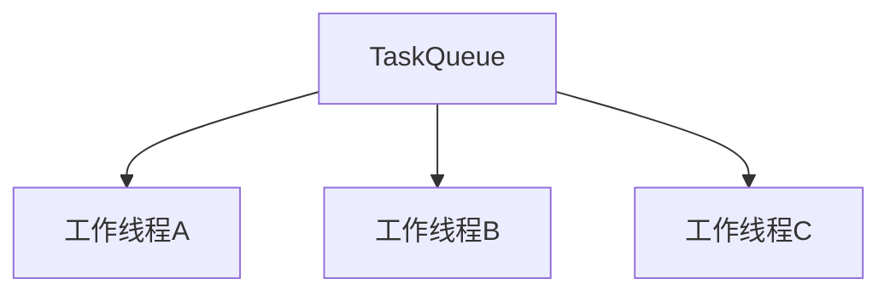

#### C#代码示例

```csharp
using System;
using System.Collections.Concurrent;
using System.Threading.Tasks;

public class AsyncTaskExecutor
{
    private static BlockingCollection<string> taskQueue = new BlockingCollection<string>();

    public static void Main()
    {
        // 模拟生产任务
        Task.Run(() => ProduceTasks());

        // 并行处理任务
        Task.Run(() => ProcessTask("工作线程A"));
        Task.Run(() => ProcessTask("工作线程B"));
        Task.Run(() => ProcessTask("工作线程C"));

        Console.ReadLine();
    }

    static void ProduceTasks()
    {
        for (int i = 0; i < 10; i++)
        {
            string task = $"任务{i}";
            Console.WriteLine($"生产任务: {task}");
            taskQueue.Add(task);
            Task.Delay(500).Wait();
        }
        taskQueue.CompleteAdding();
    }

    static void ProcessTask(string workerName)
    {
        foreach (var task in taskQueue.GetConsumingEnumerable())
        {
            Console.WriteLine($"{workerName} 处理 {task}");
            Task.Delay(1000).Wait();
        }
    }
}
```

#### Mermaid类图

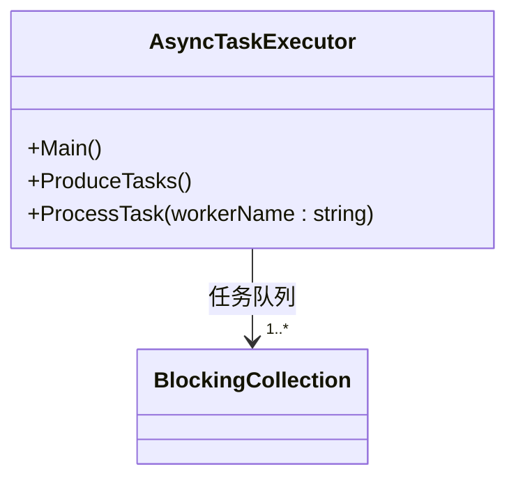

---

### 5. Transactional Outbox Pattern（事务外发模式）

#### Mermaid流程图

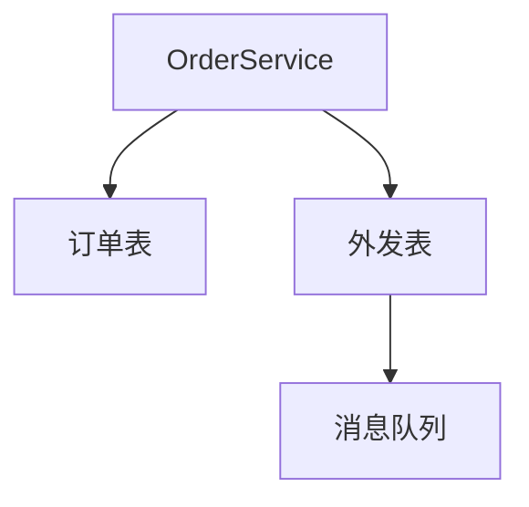

#### C#代码示例

```csharp
using System;
using System.Data.SqlClient;

public class TransactionalOutbox
{
    private string connectionString = "<连接字符串>";

    public void CreateOrderWithOutbox(string orderId)
    {
        using (var connection = new SqlConnection(connectionString))
        {
            connection.Open();
            using (var transaction = connection.BeginTransaction())
            {
                try
                {
                    // 订单表操作
                    var orderCommand = new SqlCommand("INSERT INTO OrderTable VALUES (@orderId)", connection, transaction);
                    orderCommand.Parameters.AddWithValue("@orderId", orderId);
                    orderCommand.ExecuteNonQuery();

                    // 外发表操作
                    var outboxCommand = new SqlCommand("INSERT INTO OutboxTable VALUES (@message)", connection, transaction);
                    outboxCommand.Parameters.AddWithValue("@message", $"Order Created: {orderId}");
                    outboxCommand.ExecuteNonQuery();

                    transaction.Commit();
                    Console.WriteLine($"订单 {orderId} 已创建，并记录在外发表。");
                }
                catch
                {
                    transaction.Rollback();
                    Console.WriteLine("事务失败，已回滚。");
                }
            }
        }
    }
}
```

#### Mermaid类图

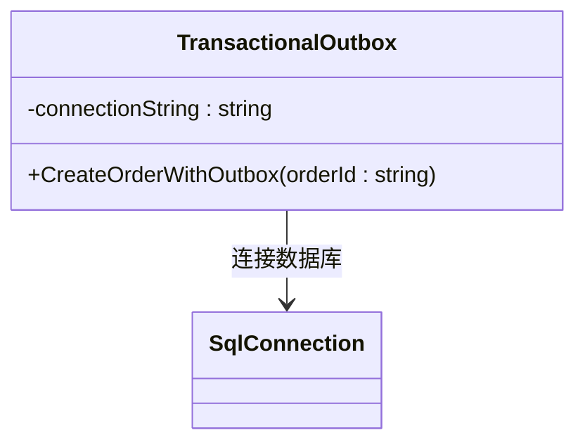

---

### 6. Event Aggregation Pattern（事件聚合模式）

#### Mermaid流程图

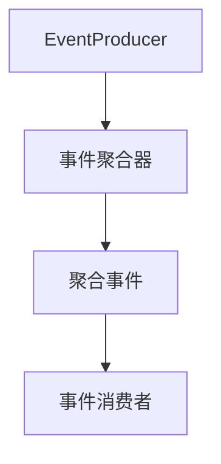

#### C#代码示例

```csharp
using System;
using System.Collections.Generic;

public class EventAggregator
{
    public event Action<string> AggregatedEvent;

    public void AggregateEvents(List<string> events)
    {
        string aggregatedEvent = string.Join(", ", events);
        Console.WriteLine($"聚合事件: {aggreg

atedEvent}");
        AggregatedEvent?.Invoke(aggregatedEvent);
    }
}

public class EventConsumer
{
    public void OnAggregatedEvent(string eventData)
    {
        Console.WriteLine($"消费聚合事件: {eventData}");
    }
}

public class Program
{
    public static void Main()
    {
        var eventAggregator = new EventAggregator();
        var eventConsumer = new EventConsumer();

        // 订阅聚合事件
        eventAggregator.AggregatedEvent += eventConsumer.OnAggregatedEvent;

        // 生成聚合事件
        eventAggregator.AggregateEvents(new List<string> { "事件1", "事件2", "事件3" });
    }
}
```

#### Mermaid类图

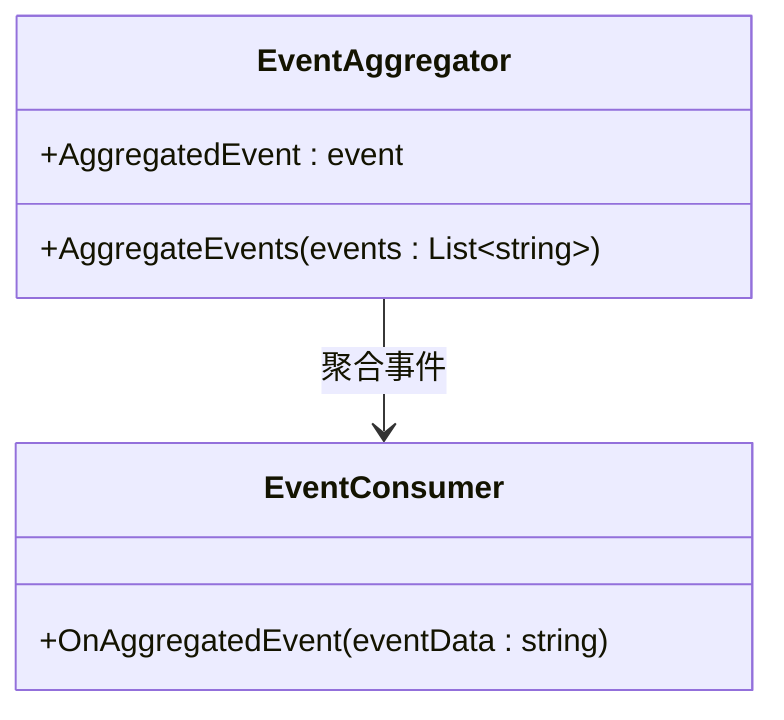

---

### 7. Saga Pattern（事务补偿模式）

#### Mermaid流程图

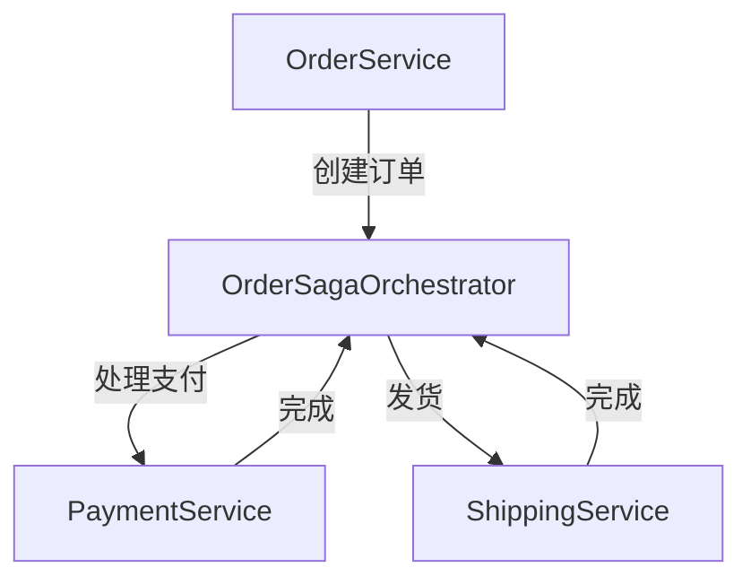

#### C#代码示例

```csharp
using System;

public class OrderSagaOrchestrator
{
    public void StartSaga()
    {
        CreateOrder();
        ProcessPayment();
        ShipOrder();
    }

    private void CreateOrder()
    {
        Console.WriteLine("订单已创建");
        // 触发补偿操作
    }

    private void ProcessPayment()
    {
        Console.WriteLine("支付已处理");
        // 触发补偿操作
    }

    private void ShipOrder()
    {
        Console.WriteLine("订单已发货");
        // 触发补偿操作
    }
}

public class Program
{
    public static void Main()
    {
        var orchestrator = new OrderSagaOrchestrator();
        orchestrator.StartSaga();
    }
}
```

#### Mermaid类图

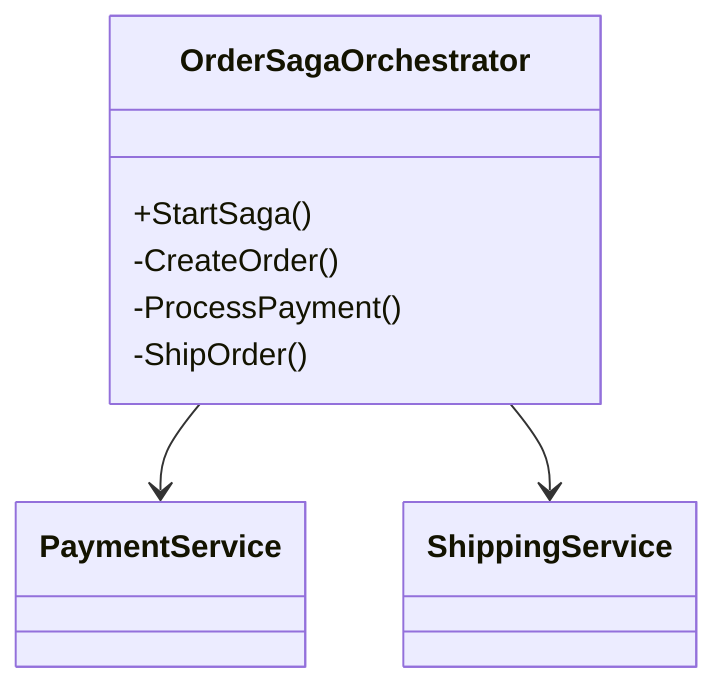

---

每个事件驱动架构模式都可以根据特定的应用场景进行实现。上面的代码和类图示例帮助理解和实现这些模式，在实际开发中可根据业务需求进行扩展和优化。
