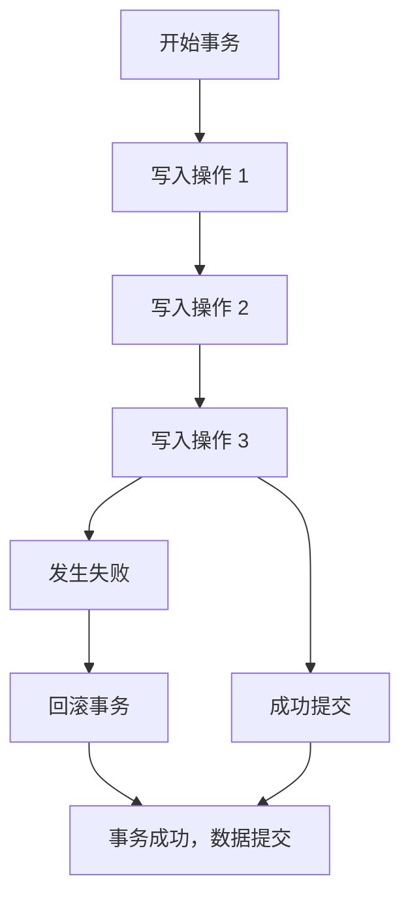
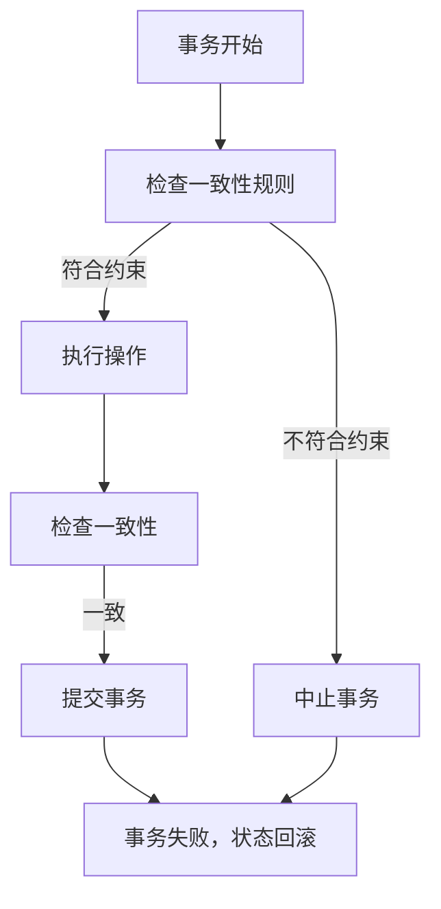
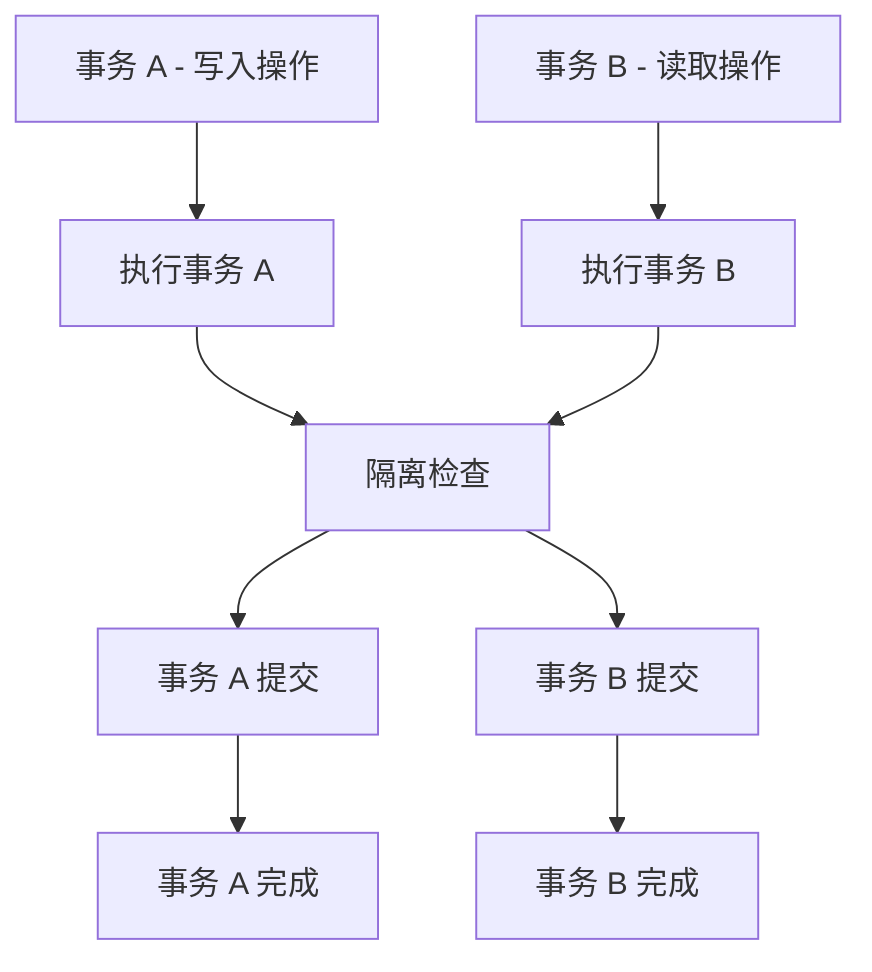
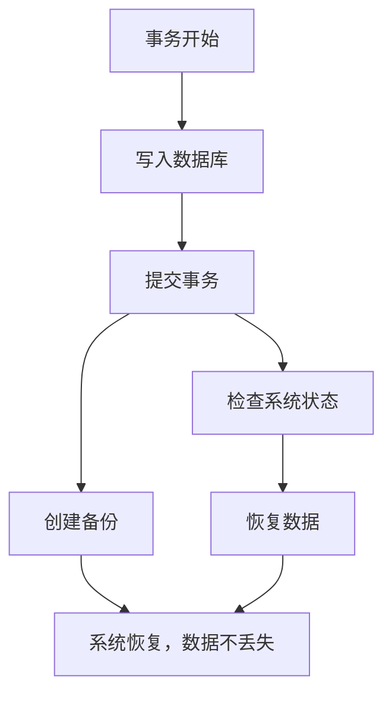

### ACID 原则

---

### 1. 原子性 (Atomicity)

原子性意味着事务中的所有操作必须全部成功或全部失败。如果事务中的任何操作失败，则整个事务会回滚，数据库状态不发生变化。

### 2. 一致性 (Consistency)

一致性确保在事务执行前后的数据库状态保持一致。事务必须符合数据库的完整性约束，以确保没有任何损坏的数据写入数据库。

### 3. 隔离性 (Isolation)

隔离性确保并发事务之间互不干扰。一个事务的执行不应影响到其他并发事务，保持数据库的独立性。

### 4. 持久性 (Durability)

持久性意味着一旦事务提交成功，其对数据库的更改将永久保存，即使系统崩溃或断电，数据依然不会丢失。

---

### ACID 原则总结

- **原子性**：事务中的所有操作要么全部成功，要么全部失败。
- **一致性**：事务的执行不会破坏数据库的完整性。
- **隔离性**：并发事务之间互不干扰。
- **持久性**：事务提交后数据持久保存。

这些原则在数据库事务管理中非常重要，确保数据的可靠性和一致性，适用于大部分关系型数据库系统，如 MySQL、PostgreSQL 和 Oracle。
