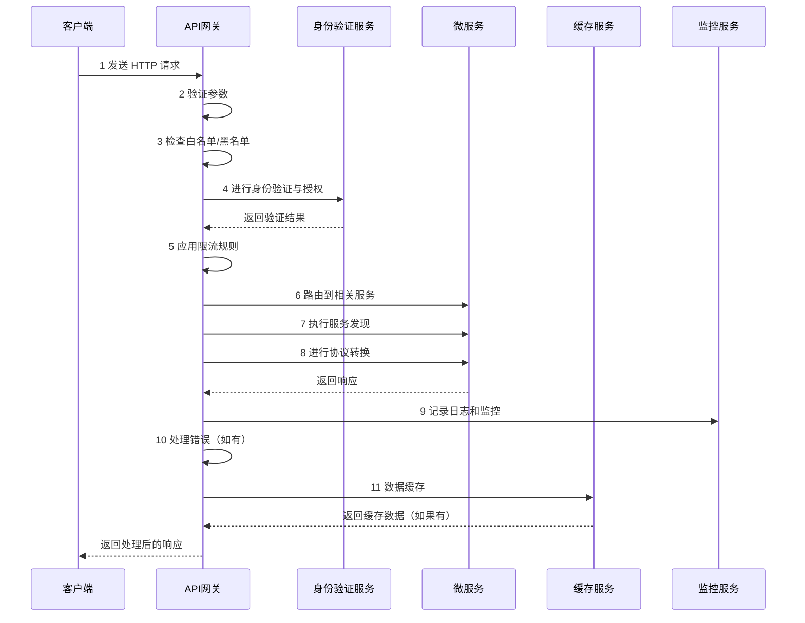

### **API 网关**

API 网关（API Gateway）是微服务架构中的一个核心组件，用于处理客户端请求并将其路由到后端服务，同时提供安全性、性能优化和监控功能。以下是详细的工作流程及解释。

---

### **API 网关工作流程**

```mermaid
flowchart TD
    Client[客户端: Web / 移动端 / PC] -->|1 HTTP 请求| API_Gateway[API 网关]
    API_Gateway -->|2 参数验证| Step2[参数验证]
    Step2 -->|3 白名单/黑名单检查| Step3[白名单/黑名单]
    Step3 -->|4 身份验证和授权| Step4[认证与授权]
    Step4 -->|5 应用限流规则| Step5[限流]
    Step5 -->|6 路由到相关服务| Step6[动态路由]
    Step6 -->|7 服务发现| Step7[服务发现]
    Step7 -->|8 协议转换| Step8[协议转换]
    Step8 --> Microservices[后端微服务]
    API_Gateway -->|9 错误处理| Step9[错误处理]
    API_Gateway -->|10 熔断机制| Step10[熔断]
    API_Gateway -->|11 日志记录与监控| Step11[日志与监控 (ELK 堆栈)]
    API_Gateway -->|12 数据缓存| Step12[Redis 缓存]
```

---

### **API 网关序列图**



---

### **步骤详解**

#### **步骤 1：客户端发送 HTTP 请求**
- 客户端（例如网页、移动应用或 PC）向 API 网关发送 HTTP 请求。
- 请求中包含头部信息、路径参数和请求体等。

#### **步骤 2：参数验证**
- API 网关检查请求中是否包含必要的参数，并验证参数格式是否正确。
- 例如，检查查询参数是否符合预期的规范。

#### **步骤 3：白名单/黑名单检查**
- API 网关检查请求来源是否在允许的白名单中。
- 如果请求来源被列入黑名单，网关将直接拒绝请求。

#### **步骤 4：身份验证与授权**
- API 网关与身份验证服务（如 OAuth、JWT）交互，验证用户的身份。
- 检查用户是否有权限访问特定资源或服务。

#### **步骤 5：应用限流规则**
- 根据配置的限流策略，API 网关限制单个客户端的请求频率。
- 如果客户端的请求超出限制，API 网关会返回限流错误响应。

#### **步骤 6：路由到相关服务**
- API 网关根据请求的路径匹配对应的后端微服务。
- 例如，`/users` 路由到用户服务，`/orders` 路由到订单服务。

#### **步骤 7：服务发现**
- 在动态微服务环境中，API 网关通过服务发现机制（如 Consul 或 Eureka）定位目标服务的实例。

#### **步骤 8：协议转换**
- API 网关将请求转换为目标服务可接受的协议格式。
- 例如，将 HTTP 请求转换为 gRPC 或将 REST API 请求转换为 SOAP。

#### **步骤 9：错误处理**
- 如果请求处理过程中出现错误，API 网关返回适当的错误响应（例如 500 错误）。
- 在特定情况下，网关可以尝试重试操作。

#### **步骤 10：熔断机制**
- 如果后端服务长时间无法恢复，API 网关会启动熔断机制，避免服务过载。
- 可以返回默认响应或错误信息作为备用。

#### **步骤 11：日志记录与监控**
- API 网关通过 **ELK 堆栈**（ElasticSearch, Logstash, Kibana）记录请求与响应日志。
- 这些日志用于性能监控、错误排查和系统运行状态分析。

#### **步骤 12：数据缓存**
- API 网关将经常访问的数据（如用户信息、产品列表）缓存在 Redis 等缓存系统中。
- 如果缓存中有可用数据，直接返回，无需请求后端服务，从而减少延迟。

---

### **总结**

API 网关在微服务架构中是一个不可或缺的组件，主要负责以下功能：
1. **安全性**：通过身份验证、授权、限流和黑名单保护系统安全。
2. **请求路由**：将请求精确路由到目标微服务。
3. **协议转换**：确保服务间的兼容性和通信效率。
4. **性能优化**：通过数据缓存和熔断机制提升系统稳定性。
5. **监控和日志**：提供完整的日志记录和监控功能，帮助运维团队快速定位问题。

API 网关作为客户端和微服务之间的接口，为整个系统提供了稳定、安全、高效的访问方式，是现代分布式架构中必不可少的一部分。
