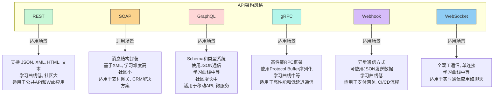
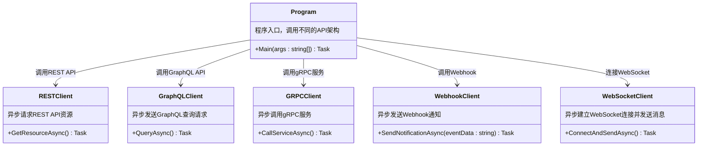

### API架构风格：



### API架构风格说明

1. **REST**:
   - **适用场景**：公共API、Web应用。
   - **特点**：支持多种格式（JSON、XML、HTML、文本），易于学习，拥有庞大的开发者社区。

2. **SOAP**:
   - **适用场景**：支付网关、CRM解决方案、电信服务。
   - **特点**：基于XML，封装消息结构，学习难度较高，社区小。

3. **GraphQL**:
   - **适用场景**：移动API、微服务、复杂系统。
   - **特点**：基于Schema和类型系统，使用JSON进行通信，学习曲线适中，社区正在增长。

4. **gRPC**:
   - **适用场景**：高性能、低延迟通信。
   - **特点**：高性能RPC框架，使用Protocol Buffer进行序列化，学习曲线适中，适合高性能需求的应用。

5. **Webhook**:
   - **适用场景**：支付网关、CI/CD流程。
   - **特点**：异步通信，支持JSON，学习难度低，适合触发式通知和事件处理。

6. **WebSocket**:
   - **适用场景**：实时通信应用，如聊天应用。
   - **特点**：全双工通信，通过单连接实现，学习难度适中，适合需要实时更新的场景。

### 总结

该图展示了REST、SOAP、GraphQL、gRPC、Webhook和WebSocket六种API架构风格的主要特点及适用场景，帮助开发人员选择适合自己项目的API架构风格。

---

下面是一个使用C#和异步编程 (`async` / `await`) 的代码示例，模拟API架构风格的各种实现。这个代码示例展示了如何在C#中异步调用不同的API风格，包括REST、GraphQL、gRPC、Webhook 和 WebSocket。

我们将实现几个类来模拟这些API架构风格，分别进行异步调用：

1. **REST API**：使用HTTP GET请求获取数据。
2. **GraphQL API**：使用HTTP POST请求进行GraphQL查询。
3. **gRPC API**：模拟gRPC调用（在实际应用中需要gRPC客户端支持）。
4. **Webhook**：发送异步通知。
5. **WebSocket**：建立WebSocket连接并进行双向通信。

### C#代码示例

```csharp
using System;
using System.Net.Http;
using System.Text;
using System.Threading.Tasks;
using Websocket.Client;
using Grpc.Net.Client;

namespace APIArchitecturesDemo
{
    class Program
    {
        static async Task Main(string[] args)
        {
            // REST API 示例
            await RESTClient.GetResourceAsync();

            // GraphQL API 示例
            await GraphQLClient.QueryAsync();

            // gRPC API 示例
            await GRPCClient.CallServiceAsync();

            // Webhook 示例
            await WebhookClient.SendNotificationAsync("Sample Event");

            // WebSocket 示例
            await WebSocketClient.ConnectAndSendAsync();
        }
    }

    // REST API 客户端
    public class RESTClient
    {
        private static readonly HttpClient httpClient = new HttpClient();

        public static async Task GetResourceAsync()
        {
            string url = "https://jsonplaceholder.typicode.com/posts/1";
            HttpResponseMessage response = await httpClient.GetAsync(url);
            string content = await response.Content.ReadAsStringAsync();
            Console.WriteLine($"REST API Response: {content}");
        }
    }

    // GraphQL API 客户端
    public class GraphQLClient
    {
        private static readonly HttpClient httpClient = new HttpClient();

        public static async Task QueryAsync()
        {
            string url = "https://graphql.example.com";
            var query = new { query = "{ user(id: \"1\") { name } }" };
            var content = new StringContent(Newtonsoft.Json.JsonConvert.SerializeObject(query), Encoding.UTF8, "application/json");

            HttpResponseMessage response = await httpClient.PostAsync(url, content);
            string result = await response.Content.ReadAsStringAsync();
            Console.WriteLine($"GraphQL Response: {result}");
        }
    }

    // gRPC 客户端
    public class GRPCClient
    {
        public static async Task CallServiceAsync()
        {
            using var channel = GrpcChannel.ForAddress("https://localhost:5001");
            var client = new MyGrpcService.MyGrpcServiceClient(channel);
            var response = await client.MyGrpcMethodAsync(new MyGrpcRequest { Message = "Hello gRPC" });
            Console.WriteLine($"gRPC Response: {response.ResponseMessage}");
        }
    }

    // Webhook 客户端
    public class WebhookClient
    {
        private static readonly HttpClient httpClient = new HttpClient();

        public static async Task SendNotificationAsync(string eventData)
        {
            string url = "https://webhook.example.com/notify";
            var content = new StringContent(eventData, Encoding.UTF8, "application/json");

            HttpResponseMessage response = await httpClient.PostAsync(url, content);
            Console.WriteLine($"Webhook Response: {response.StatusCode}");
        }
    }

    // WebSocket 客户端
    public class WebSocketClient
    {
        public static async Task ConnectAndSendAsync()
        {
            using var client = new WebsocketClient(new Uri("wss://echo.websocket.org"));
            client.MessageReceived.Subscribe(msg => Console.WriteLine($"WebSocket Received: {msg}"));
            await client.Start();

            Console.WriteLine("WebSocket Connected. Sending message...");
            await client.Send("Hello WebSocket");
            await Task.Delay(2000); // 等待接收消息
        }
    }
}
```

### 代码说明

1. **REST API**：
   - `RESTClient.GetResourceAsync()` 使用 `HttpClient` 进行异步GET请求，获取REST API的响应数据。

2. **GraphQL API**：
   - `GraphQLClient.QueryAsync()` 使用 `HttpClient` 发送POST请求来查询GraphQL API。请求内容包括GraphQL查询语句。

3. **gRPC API**：
   - `GRPCClient.CallServiceAsync()` 使用 `Grpc.Net.Client` 连接到gRPC服务，并发送请求，接收响应。

4. **Webhook**：
   - `WebhookClient.SendNotificationAsync()` 模拟向一个Webhook发送异步通知。

5. **WebSocket**：
   - `WebSocketClient.ConnectAndSendAsync()` 使用 `Websocket.Client` 库建立一个WebSocket连接，发送和接收消息，实现全双工通信。

### Mermaid类图

以下是上述C#类的Mermaid类图，用于展示不同API架构风格的类关系。



### 总结

- **代码**：该C#示例代码展示了如何使用异步编程处理不同API架构的请求，适用于处理REST、GraphQL、gRPC、Webhook和WebSocket等API的异步调用。
- **类图**：Mermaid类图展示了各类的关系，其中 `Program` 类作为入口，调用其他各个API客户端的异步方法。

这个架构演示了一个API架构的异步调用示例，可以帮助您理解不同API风格在C#中的基本实现方式。
