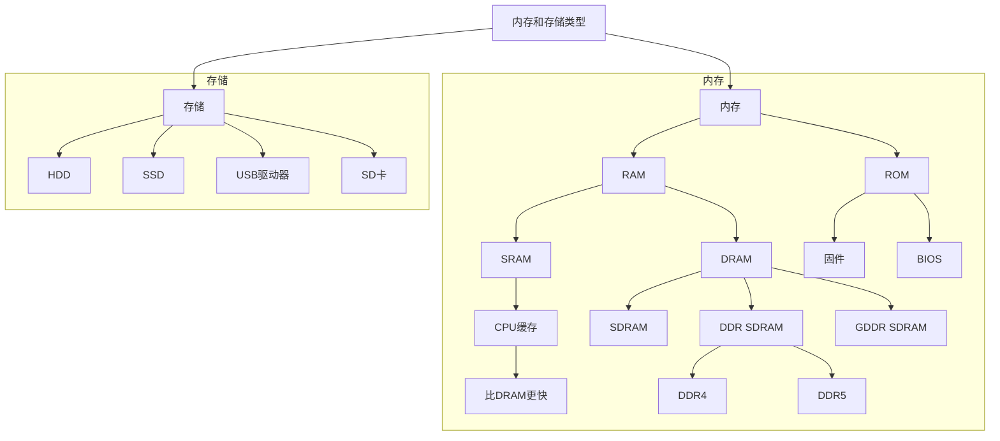

以下是“内存和存储类型”的详细说明和对应的 Mermaid 图表。

---

### 内存和存储类型

内存和存储是计算机系统中的关键组件，各自承担不同的功能。以下是不同类型的分类结构。

1. **内存**
   - **RAM（随机存取内存）**
     - **SRAM（静态RAM）**
       - 用于**CPU缓存**
       - **比DRAM更快**
     - **DRAM（动态RAM）**
       - **SDRAM（同步DRAM）**
       - **DDR SDRAM（双倍数据速率SDRAM）**
         - **DDR4**
         - **DDR5**
       - **GDDR SDRAM（图形DDR SDRAM）**
   - **ROM（只读存储器）**
     - 包含**固件**
     - 包括**BIOS（基本输入/输出系统）**

2. **存储**
   - **HDD（硬盘驱动器）**
   - **SSD（固态硬盘）**
   - **USB驱动器**
   - **SD卡**

---

### Mermaid 图表

该结构呈现了计算机系统中常见的各种内存和存储类型的层次关系。内存类型如RAM和ROM对处理速度和可靠性至关重要，而存储类型如HDD和SSD则负责数据的持久化存储。
