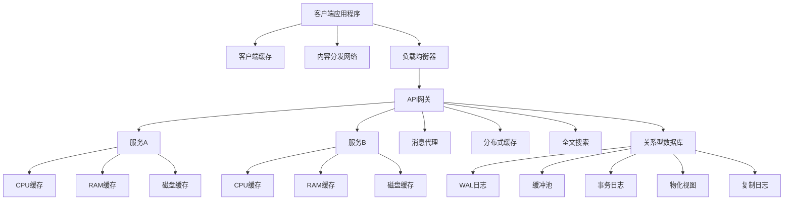

### 开发者应了解的缓存系统

缓存系统在分布式系统中扮演着重要角色，可以显著提高系统的性能和响应速度。以下是常见的缓存系统类型和它们在典型架构中的应用。

1. **客户端缓存**
   - **描述**：直接在客户端应用程序中存储缓存数据，减少网络请求和服务器负载。
   - **应用场景**：适合对缓存敏感度低的非动态数据。

2. **内容分发网络（CDN）**
   - **描述**：主要用于缓存静态数据，如图片、视频等内容，分布在全球的CDN节点上，靠近用户位置。
   - **应用场景**：提供更快的内容加载速度和更高的可用性。

3. **负载均衡器缓存**
   - **描述**：负载均衡器可以缓存部分请求数据，减少传入服务器的重复请求，降低后端压力。
   - **应用场景**：适用于需多次访问相同数据的场景。

4. **消息代理缓存**
   - **描述**：使用消息代理（如Kafka）缓存消息，支持异步通信和流式数据处理。
   - **应用场景**：处理事件驱动系统中的消息队列，确保可靠的数据传输。

5. **服务层缓存**
   - **描述**：在各个服务中设置缓存，包括CPU缓存、RAM缓存、磁盘缓存等不同层次的缓存。
   - **应用场景**：对于需要高性能的服务，可以利用多层缓存提高系统吞吐量。

6. **分布式缓存**
   - **描述**：分布式缓存（如Redis）用于多个服务间共享缓存数据，提供快速的内存级数据存储。
   - **应用场景**：适用于多服务并发访问的场景，提高访问效率。

7. **全文搜索缓存**
   - **描述**：使用全文搜索引擎（如Elasticsearch）缓存索引数据，支持快速的全文检索。
   - **应用场景**：适合于需要快速文本搜索的应用程序。

8. **关系型数据库缓存**
   - **描述**：数据库自身的缓存机制，包括写前日志（WAL）、缓冲池、事务日志等。
   - **应用场景**：确保数据库操作的效率和数据的持久性。

---

### 缓存系统结构图

---

通过在各个层次引入缓存，系统可以显著减少延迟并提升响应速度。每个缓存层次各自承担不同的角色，适用于不同的应用场景。
