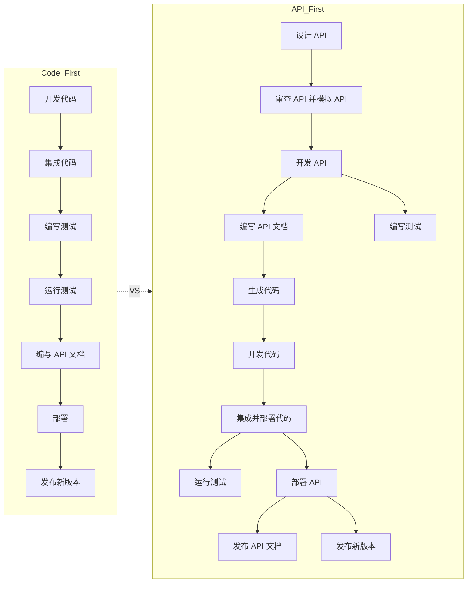

### **Code-First vs. API-First 开发模式对比**

在现代软件开发中，**Code-First** 和 **API-First** 是两种常见的开发方式。以下是它们的关键区别以及为什么推荐使用 API-First 的原因。

---

### **Code-First 和 API-First 的对比图**

---

### **Code-First 开发模式**

在 Code-First 开发中，开发团队从**直接编写代码**开始，接着进行代码的集成、测试和部署，最后编写 API 文档。以下是它的主要特点：

1. **流程**：
   - 从代码开发开始，不考虑整体的 API 设计。
   - 测试和文档通常在开发后期完成。
   - 代码的集成和测试可能导致服务间不一致的情况。

2. **问题**：
   - 服务边界和通信规范在开发后期才明确，可能导致返工。
   - 缺乏统一的 API 规范，跨团队协作效率低下。
   - 项目后期的改动会增加不确定性和开发成本。

---

### **API-First 开发模式**

在 API-First 开发中，开发团队从**API 设计**开始，先定义服务之间的通信接口，然后进行模拟测试（Mock API）和代码开发。以下是它的主要特点：

1. **流程**：
   - **API 设计** 是项目开发的起点，先定义清晰的服务边界。
   - 在开发代码之前，先审查 API，并通过 Mock API 验证接口。
   - 测试、文档和代码开发同步进行，确保一致性。
   - API 部署后，发布文档，最终交付新版本。

2. **优势**：
   - **更高的协作效率**：
     - API 是跨团队的通用语言，方便各功能团队并行开发。
     - 提前定义接口可以减少后期沟通成本。
   - **减少复杂性**：
     - 通过 Mock API 提前验证设计，避免服务间通信的潜在问题。
   - **提高开发质量**：
     - 因为所有边界已提前定义，开发过程更流畅。
     - 测试用例可以在开发过程中同步设计和执行。
   - **支持 TDD（测试驱动开发）**：
     - 测试和 API 设计紧密结合，保证高质量的交付。

---

### **为什么选择 API-First 开发？**

1. **微服务架构的复杂性**：
   微服务架构通过职责分离来解耦系统，但也带来了复杂的服务间通信。API-First 设计能在代码开发前明确系统边界，减少后期问题。

2. **提升团队协作的一致性**：
   功能团队专注于自己的服务，通过 API 规范实现团队间的无缝协作。API 是“通用语言”，避免了跨团队的重复沟通。

3. **提高软件质量和开发效率**：
   - 提前解决项目中的不确定性，使开发更高效。
   - 减少项目后期的意外问题，提高交付质量。

4. **集成测试驱动开发（TDD）**：
   在 API 定义完成后，测试用例可以同步开发，使功能更加稳健。

---

### **总结**

采用 **API-First** 开发模式，可以带来以下好处：
- 清晰定义服务边界，减少返工和开发周期。
- 跨团队协作更加高效，功能团队能独立开发。
- 项目后期的风险和不确定性大幅降低。
- 集成 TDD 方法，提升软件质量和开发者满意度。

通过 **API-First** 设计，团队可以更好地应对现代微服务架构的复杂性，确保高质量交付，帮助企业实现更快的业务增长。
