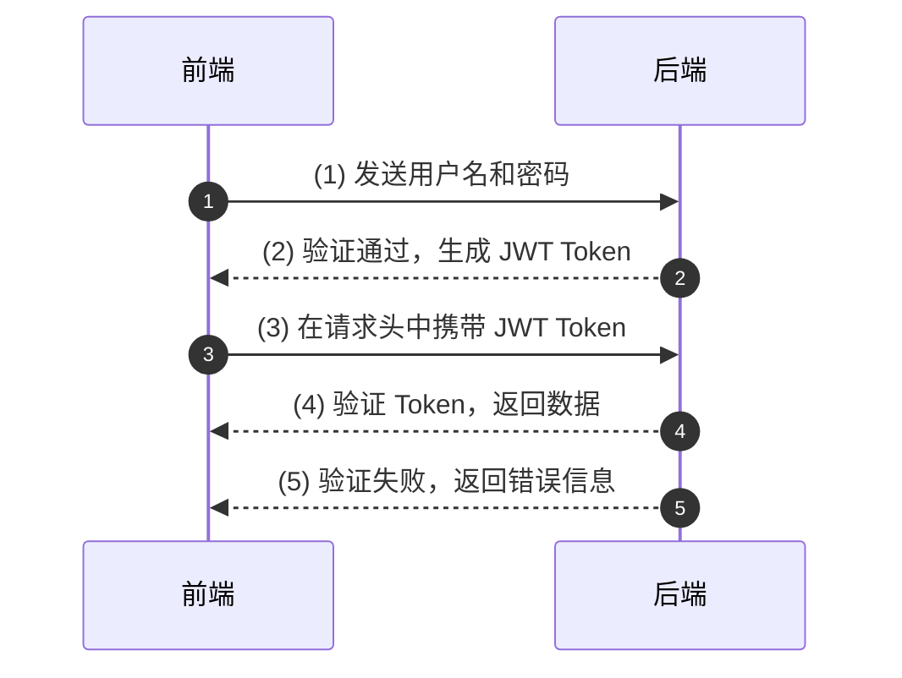

### JWT 认证流程

### Explanation with Flow Numbers:

1. **客户端发送用户名和密码**：  
   客户端向服务端发送登录请求，其中包括用户的凭证信息（如用户名和密码）。

2. **服务端验证并生成 JWT**：  
   服务端验证用户信息，如果验证成功，则生成一个 JWT Token，并返回给客户端。

3. **客户端携带 JWT Token 发起请求**：  
   客户端在后续的请求中，将生成的 JWT Token 放入 HTTP 请求头中发送给服务端。

4. **服务端验证并返回数据**：  
   服务端检查 JWT Token 的有效性（如签名和过期时间），验证通过后返回所需数据。

5. **服务端验证失败返回错误信息**：  
   如果 JWT Token 验证失败（例如 Token 无效或过期），服务端返回相应的错误信息。

This updated diagram with flow numbers makes the process steps explicitly clear and helps identify the sequence of interactions in a JWT-based authentication workflow.
