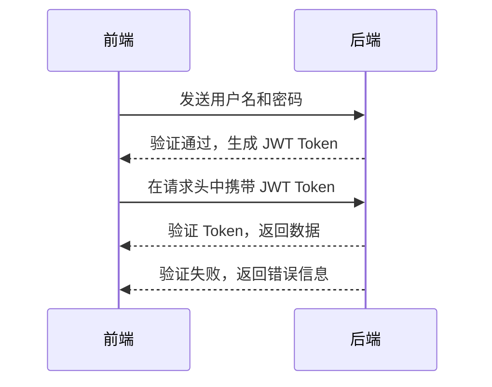
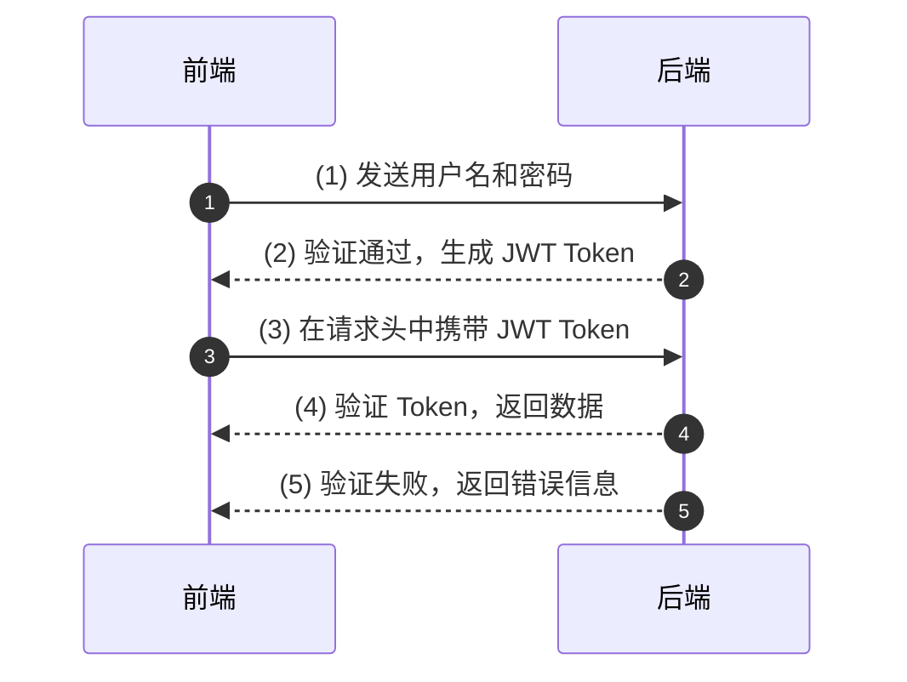

### JWT（JSON Web Token）介绍

JWT 是一种用于安全传输信息的开放标准 (RFC 7519)，它通过 JSON 对象封装声明，并通过签名确保声明的真实性。以下是对 JWT 结构、认证流程和使用场景的详细解析。

---

### JWT 的结构

JWT 由三部分组成：**Header**（头部）、**Payload**（负载）和 **Signature**（签名）。三部分通过“.”分隔。

1. **Header (头部)**  
   包含算法类型和令牌类型，通常是如下格式：
   ```json
   {
       "alg": "HS256", 
       "typ": "JWT"
   }
   ```
   **作用**：声明使用的加密算法，如 HMAC SHA256。

2. **Payload (负载)**  
   包含声明信息（claims），可以是用户信息或元数据。例如：
   ```json
   {
       "sub": "1234567890",
       "name": "John Doe",
       "admin": true
   }
   ```
   **作用**：传递信息，但不加密，敏感数据需要谨慎存储。

3. **Signature (签名)**  
   通过 Header 和 Payload 的 Base64 编码，加上密钥，使用指定算法生成的签名：
   ```
   HMACSHA256(
       base64UrlEncode(header) + "." +
       base64UrlEncode(payload), 
       secret
   )
   ```

---

### JWT 认证流程



1. **用户登录**：客户端通过用户名和密码请求服务端。
2. **服务端认证**：服务端验证用户信息并生成 JWT，返回给客户端。
3. **本地存储**：客户端保存 JWT Token（如 `localStorage`）。
4. **带 Token 请求**：每次请求服务时，客户端在请求头中携带 JWT。
5. **验证和授权**：服务端验证 Token 的有效性并返回对应数据。

---

### JWT 使用场景

1. **身份验证**  
   常用于登录认证，服务端生成 JWT 返回给客户端，客户端通过 JWT 表明身份。

2. **信息交换**  
   在双方之间安全地传递 JSON 格式的信息。

---

### JWT 的优点

- **跨平台**：JWT 是 JSON 格式，前后端通用，易于解析。
- **高效**：无状态（stateless），不需要在服务端保存会话信息。
- **可扩展**：支持自定义声明，灵活满足业务需求。

---

### JWT 认证流程



### Explanation with Flow Numbers:

1. **客户端发送用户名和密码**：  
   客户端向服务端发送登录请求，其中包括用户的凭证信息（如用户名和密码）。

2. **服务端验证并生成 JWT**：  
   服务端验证用户信息，如果验证成功，则生成一个 JWT Token，并返回给客户端。

3. **客户端携带 JWT Token 发起请求**：  
   客户端在后续的请求中，将生成的 JWT Token 放入 HTTP 请求头中发送给服务端。

4. **服务端验证并返回数据**：  
   服务端检查 JWT Token 的有效性（如签名和过期时间），验证通过后返回所需数据。

5. **服务端验证失败返回错误信息**：  
   如果 JWT Token 验证失败（例如 Token 无效或过期），服务端返回相应的错误信息。

This updated diagram with flow numbers makes the process steps explicitly clear and helps identify the sequence of interactions in a JWT-based authentication workflow.
