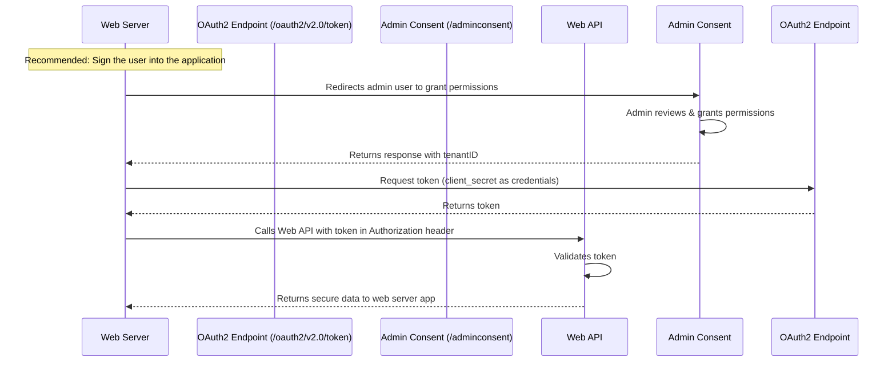

### **Key Components:**
1. **Web Server**  
   - Handles authentication requests and token management.
   
2. **OAuth Endpoints:**  
   - `/oauth2/v2.0/token`: Used to request access tokens.  
   - `/adminconsent`: Used to grant admin consent for application permissions.  

3. **Web API**  
   - Validates tokens and returns secure data to the web server.

---

### **Process Flow:**
1. **Admin Consent Flow:**  
   - The web server redirects the admin user to grant permissions.  
   - The admin reviews and grants permissions.  
   - A response is returned with the `tenantID`.

2. **Token Request:**  
   - The web server requests a token by providing `client_secret` as credentials.  
   - The authentication server returns an access token.

3. **API Call with Token:**  
   - The web server calls the Web API, including the token in the `Authorization` header.  
   - The Web API validates the token.  
   - Upon successful validation, the Web API returns secure data to the web server application.

---

### **Highlighted Recommendation:**
- **"Sign the user into the application"**  
  - This suggests that authentication should involve user sign-in for better security rather than relying solely on client credentials.

 

### **Step 1: Admin Consent Flow**
1. The **Web Server** redirects the **Admin User** to the `/adminconsent` endpoint to grant permissions.
2. The **Admin User** reviews and grants the required permissions.
3. The **Admin Consent Endpoint** returns a response containing the `tenantID` to the **Web Server**.

 

### **Step 2: Request Access Token**
4. The **Web Server** sends a request to the `/oauth2/v2.0/token` endpoint.
   - It includes the **client_secret** as credentials.
5. The **OAuth2 Token Endpoint** processes the request and returns an **access token** to the **Web Server**.

 

### **Step 3: API Call with Token**
6. The **Web Server** makes a request to the **Web API**, including the **access token** in the `Authorization` header.
7. The **Web API** validates the token.
8. If the token is valid, the **Web API** returns **secure data** to the **Web Server**.

 

### **Key Notes:**
- **Recommended Step:**  
  - The system suggests **signing the user into the application** for better security instead of solely relying on client credentials.
  
This structured breakdown aligns with the **Mermaid sequence diagram** and explains each interaction step-by-step. Let me know if you need any modifications! 🚀
