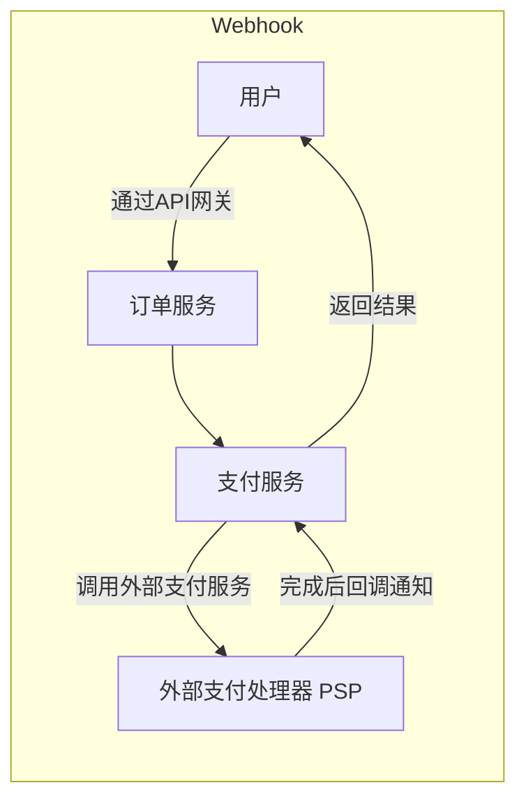
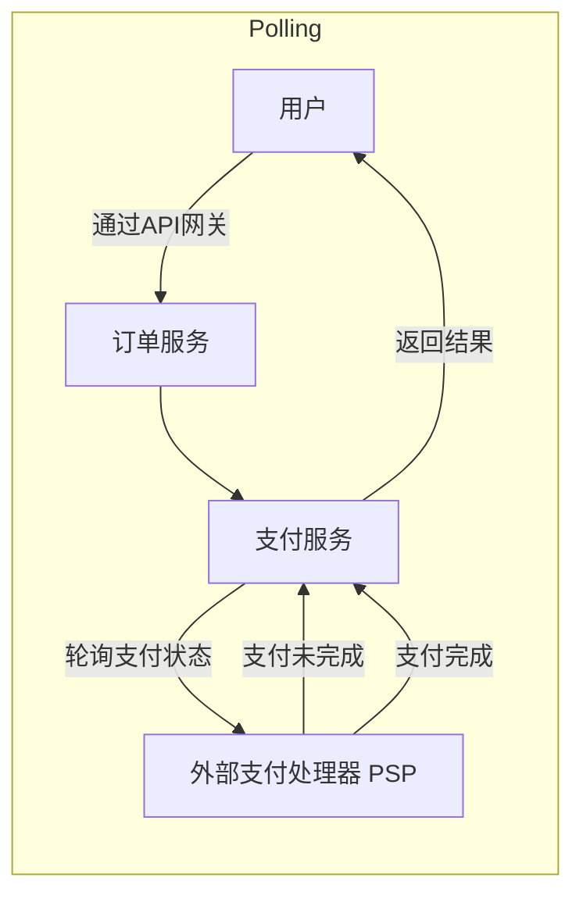

### 什么是 Webhook？

#### 场景假设：
假设我们运行一个电子商务网站，客户通过 API 网关将订单发送到订单服务，订单服务再将请求转发给支付服务以完成支付交易。支付服务与一个外部支付服务提供商（PSP）进行通信以完成交易。

#### Webhook vs Polling 两种与外部支付服务提供商（PSP）通信的方式：




### 说明：
1. **Webhook：**
   - 用户通过 API 网关发送订单请求。
   - 订单服务调用支付服务，支付服务与外部支付处理器（PSP）通信。
   - 当 PSP 完成支付处理时，会通过回调通知支付服务（如调用指定的 URL）。
   - 支付服务收到通知后返回结果给用户。

2. **Polling：**
   - 用户通过 API 网关发送订单请求。
   - 订单服务调用支付服务，支付服务通过轮询方式向 PSP 查询支付状态。
   - 每次查询都需要消耗资源，直到支付状态更新。
   - 支付完成后，支付服务返回结果给用户。

这种表示清晰展示了两种模式的主要区别，Webhook 减少了资源消耗和不必要的轮询，适合高效异步通信的场景。

---

#### 1. **短轮询（Short Polling）**

支付服务向 PSP 发送支付请求后，会不断向 PSP 询问支付状态。经过多轮询问后，PSP 最终返回支付状态。

**短轮询的缺点**：
- **资源消耗**：支付服务需要不断轮询 PSP 状态，这需要消耗大量资源。
- **安全问题**：外部服务直接与支付服务通信，可能带来安全漏洞。

---

#### 2. **Webhook**

通过使用 Webhook，我们可以向外部服务注册一个回调（Webhook）。这意味着：**当外部服务（PSP）有更新时，会在指定的 URL 回调我们的服务**。当 PSP 完成支付处理后，它将调用 HTTP 请求来更新支付状态。

**Webhook 的优势**：
- 编程范式发生了变化，支付服务不需要浪费资源轮询支付状态。
- 降低了服务的复杂性和资源使用量。

---

#### Webhook 的潜在问题：
- **PSP 不回调怎么办？**  
我们可以设置一个定时任务，例如每小时检查一次支付状态，以确保系统的状态一致性。

---

#### 为什么称为 "反向 API" 或 "推送 API"？
Webhook 经常被称为 **反向 API（Reverse API）** 或 **推送 API（Push API）**，因为它是由服务器向客户端发送 HTTP 请求。

---

#### 使用 Webhook 需要注意的 3 个关键点：
1. **设计合适的 API**  
   我们需要为外部服务调用设计一个适当的 API。
2. **设置适当的安全规则**  
   在 API 网关中设置安全规则，例如验证外部服务的来源 IP 或请求签名。
3. **注册正确的 URL**  
   确保在外部服务中正确注册回调的 URL。

---

#### 总结：
Webhook 的使用改变了传统的轮询模型，通过事件驱动的回调方式显著提高了系统的性能和效率。然而，为了保证安全性和可靠性，我们需要在设计和实现时关注以上关键点。

--- 

### 示例代码：
**Webhook 的简单实现：**

```csharp
// Webhook 接收端的实现
using Microsoft.AspNetCore.Mvc;

[ApiController]
[Route("api/webhook")]
public class WebhookController : ControllerBase
{
    [HttpPost("payment-status")]
    public IActionResult UpdatePaymentStatus([FromBody] PaymentStatusUpdate statusUpdate)
    {
        Console.WriteLine($"Received payment update: {statusUpdate.Status}");
        // 处理状态更新逻辑
        return Ok();
    }
}

public class PaymentStatusUpdate
{
    public string PaymentId { get; set; }
    public string Status { get; set; }
}
```

**Webhook 注册示例（模拟）：**
```bash
# 模拟向 PSP 注册 Webhook 回调 URL
curl -X POST https://psp.example.com/api/webhook/register \
    -H "Content-Type: application/json" \
    -d '{
        "callbackUrl": "https://your-ecommerce-site.com/api/webhook/payment-status"
    }'
```

**定时任务（备选方案）：**
```bash
# 每小时检查未完成的支付状态
*/60 * * * * curl -X GET https://your-ecommerce-site.com/api/payment/status-check
```

---

通过 Webhook，支付服务的架构更具弹性，同时大幅减少了不必要的资源消耗。
